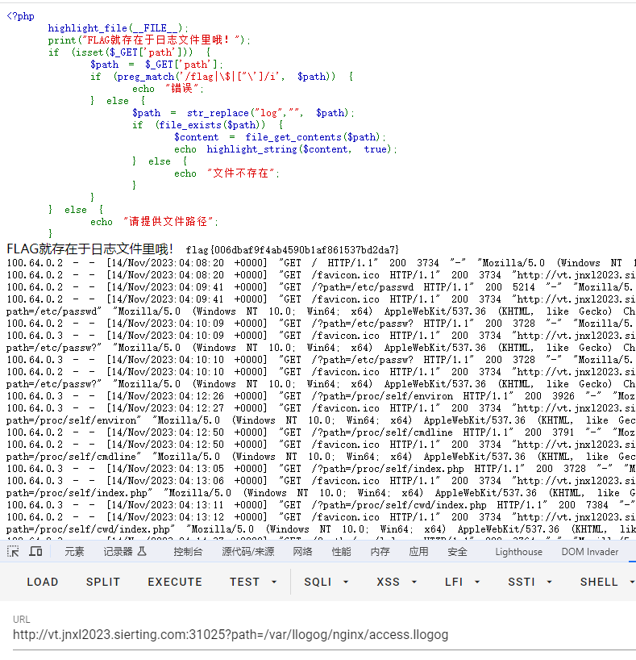
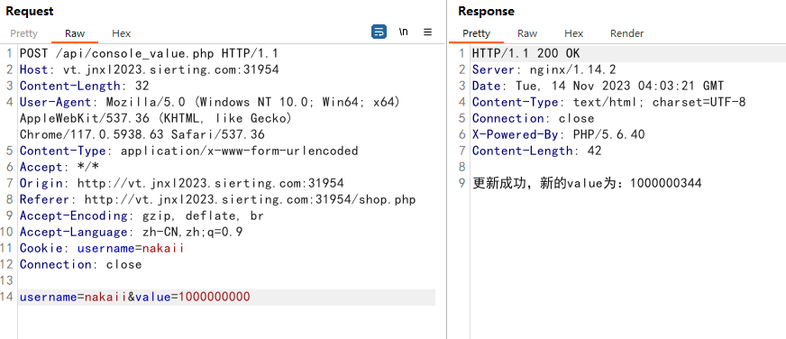
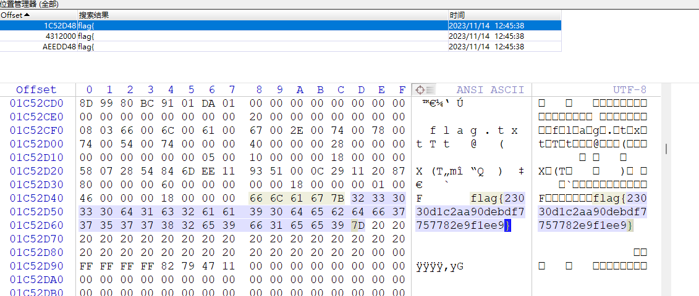

# RE

BabyRe和TEA两道题不多说了，扔进IDA直接出flag

# WEB

## 日志里的FLAG

> 膜拜nakai!佬

双写绕过



## 购买FLAG

更改api中的value值，之后金钱足够直接购买即可。



# MISC

## 时间不多了

第一步，解压文件之后发现有一张日历和很多二维码

批量解码一下

得到这些有用信息

其他的二维码都是无用的

base64解密一下得到数字

这题的关键点在于根据数字对应日历表画画

| qrcode_10.png | MiAzIDQgOSAxNSAxNyAxOCAyMyAzMA==         | QRCode | 2 3 4 9 15 17 18 23 30        | F    |
| ------------- | ---------------------------------------- | ------ | ----------------------------- | ---- |
| qrcode_12.png | NiAxMyAyMCAyNyAyOA==                     | QRCode | 6 13 20 27 28                 | L    |
| qrcode_14.png | MiAxNSAyMiAxNyAyNCAxNg==                 | QRCode | 2 15 22 17 24 16              | A    |
| qrcode_15.png | NiA1IDQgMTEgMTggMjUgMjYgMjcgMjggMjAgMjE= | QRCode | 6 5 4 11 18 25 26 27 28 20 21 | G    |
| qrcode_16.png | MiAzIDkgMTUgMjMgMzAgMzE=                 | QRCode | 2 3 9 15 23 30 31             | {    |
| qrcode_25.png | NSAxMyAyMCAyNyAxNCAyMQ==                 | QRCode | 5 13 20 27 14 21              | D    |
| qrcode_26.png | NiAxOSAyNiAyMSAyOCAyMA==                 | QRCode | 6 19 26 21 28 20              | A    |
| qrcode_27.png | OSAxMCAxMSAxNyAyNCAzMQ==                 | QRCode | 9 10 11 17 24 31              | T    |
| qrcode_35.png | MSAyIDMgOCAxNSAxNiAxNyAyMiAyOSAzMA==     | QRCode | 1 2 3 8 15 16 17 22 29 30     | E    |
| qrcode_36.png | MiAzIDkgMTYgMTcgMjQgMzAgMzE=             | QRCode | 2 3 9 16 17 24 30 31          | S    |
| qrcode_37.png | MiA4IDE1IDIzIDI0IDE4IDExIDM=             | QRCode | 2 8 15 23 24 18 11 3          | O    |
| qrcode_38.png | MSAyIDkgMTcgMjMgMzAgMjk=                 | QRCode | 1 2 9 17 23 30 29             | }    |

前两个字母没画出来，枚举得到flag


```
flag{DATESO}
```

## Datas_secret

扔进winhex直接搜就行



# CRYPTO

## BabyRSA

共模攻击

```Python
#coding:utf-8
import gmpy2
import libnum
c1= 295658788074157816670393593671184451782123605135184996662528766686642109492132533952160456440919197939935742027629210419312032730004032666912404179229952394343569590488768472800784830058534578639706805456277578757250365834591813481786084959844340418320620440636997732915872346619679993987903742079972676425404864295283955565746004124045155664762158516005326368384488346997494926539295740248007606864906884407198601326915643000764477435205579583836917598642053869541648731754384026407310786288997756775232852732033054591953078116290088267188296560877481534143707414153749140670404213262630122369941889862912426176115220410931992046973925991075473656781794097329513119548617920256625579072719981729556158392454956362838720993254919638177786730004086883044525967823454986241038123671907279715773848673713008902432841449556980494600938989397567019338970200872333713986608537678650318511128703055185979834233315117153115613952940778789222515375743186066883492596068186378372611075958909412662251913621375996518671118244409393829141365207153662416265238312206577474940661548038715230313608405518108581922154335405303862701783678336161505643508831482409054761542959278392940037561736468155509922530420964726953308604138731805543997557197893
c2= 219454357017359138238563345020257296433275019950745269658921329153689267055871241202626317639487122341365759606018366576305678949982408366815977617307888894995289951707241009621444691307275542686770303994110416384086739599181934011812163156338859395115724413628620575935425221522079154607411877822646179457455118804970038865452163833416447505142114976758532806787419762250921421272492466133659234602794242531776209324085944417173098820895755851386042954303555790085402616519592065446023510096773546730662074307900123349548340507067971393642039476326402523930789953483843698593104578179169624886357604650615249286150367204109726460230037005175927865466199600272190112483494387929732049738312695796015009178606906549093365261114132002222704510637261038978031857378729856467918978246977163353146981239215886053379980533235786905270211605457443266127512667882149285155542735532327780898540341696557860555884277608448996773250847560675650046440569736010800155992053362696097992699863059686881689842065077997427372972290872427656847223849769329713841670853267584161386494525686204330028142217737052411422895042170169703550774908415280261731967511925122636118468176645781785352430657090024109246103061415446942211482659025722233229083093876
n= 549785700554963543393222974982211136067042846536450239199968863551137077564447156832697813202963334596948298760762991663065504535035143397250208506445202607659676332816610122258862787906629525548439909792727593939957178783466989816894454522630301104349317697612174888605090061231211194974337772507249418567229560145454791075929946332668360553910328900103264562348881791004831033587660163923517440406942993348972589262051083908075790422096042338651001937740085414301019827335549437397656318095919875053213333008551761167437683250592542156348138055482054331330609375930693247365749085041596578748797801601289693449629548744535914348450016287545136436964138806081283470239420969311905998245715160353982174880912315601876305613349276824998688275587308133069178764001924866079232824850209407236694426779262951463035278887804883917516580169051530590466082511045503107508117656821592538792566264160105940730326929474477787053681516844548383814388361089499629312831727731267796167205124844987064389097138747938870221504684958713047985374714612321540288239995935347905120710583169131356970267386562665138437631517802641426575996558648777831102462652517305151412695166331935115971277205305816897886952646432233312318756155702046584205507027737
e1 = 3247473589
e2 = 3698409173

#共模攻击
#共模攻击函数
def rsa_gong_N_def(e1,e2,c1,c2,n):
    e1, e2, c1, c2, n=int(e1),int(e2),int(c1),int(c2),int(n)
    s = gmpy2.gcdext(e1, e2)
    s1 = s[1]
    s2 = s[2]
    if s1 < 0:
        s1 = - s1
        c1 = gmpy2.invert(c1, n)
    elif s2 < 0:
        s2 = - s2
        c2 = gmpy2.invert(c2, n)
    m = (pow(c1,s1,n) * pow(c2 ,s2 ,n)) % n
    return int(m)
m = rsa_gong_N_def(e1,e2,c1,c2,n)
print(m)
print(libnum.n2s(int(m)))
```

## 简单的Python

看这位佬的博客吧，这题被出题人坑了，明白加密原理，但是死活解不出来，看了佬的wp才知道是base100有空格

[“技能兴鲁”职业技能大赛-网络安全赛项-学生组初赛 WP](https://blog.csdn.net/weixin_64422989/article/details/134405587?csdn_share_tail=%7B%22type%22%3A%22blog%22%2C%22rType%22%3A%22article%22%2C%22rId%22%3A%22134405587%22%2C%22source%22%3A%22weixin_64422989%22%7D&fromshare=blogdetail#/)

```
# -*- coding: utf-8 -*-
import time
from tqdm import tqdm
from qsnctf import *

flag = "👍👤🐧👮👛🐩👈👰👌👏👣👍👎🐾👯👎👍🐧👛🐫👍🐨👐👮👑🐻👉👎👄👍👣🐪👎👢👉👊👍🐧🐨👎👙🐻👅👏👘🐨👁👋👍👡🐸👯👍🐩👁🐼👋👣👟👟👄👌👧👌👍👤👧🐹👜🐽👐👰👊👢👍👌👙🐾👟👦👋👍👍👮👍👍👑👫👚🐼👁👣👉👣👣🐬👌🐩👫👎👍👎👁🐿👘🐾🐰👌👍👣👑🐪👍👣👑👘👚👍🐽👫👉👣👉👅👙🐼👧👁👍👤🐨🐧👘🐨👛🐿👊👢👛👡👉👋👣👘👍👡👅👊👉🐨👧👍👎👤🐽👢👉🐧🐬🐾👌🐩🐨🐫👌🐩👁🐿👛👱🐽👎👍🐼👦👮👍👡🐽👘👎🐽👅👩👘🐾👟👊👜👤👯👎👍👤👧👆👋🐧🐧👯👚🐽👑👏👙👌👑👩👌👡🐸🐨👉🐨👧🐽👎👣👅👌👙🐽👧👍👍👤👫👮👍🐩👁👌👉👏👛👎👘👢👑👏👑🐼👑👆👚🐨👛👪👘🐾👣👊👄👤👟👑👍🐨👛🐫👙🐩👀👰👍👥👅👍👙🐽👑👋👐👣👍👘👚👍👑👫👛🐾🐽👅👉👣👑🐧👑👌👑👆👍👎👁👍👚🐼👛👑👄🐽👑🐪👍👡👁👂👍👍👁👐👑🐽👧👎👉👍👧👰👍👋🐹👘👋🐩👅👪👚🐼👟👡👉👣👁👋👍👣👟🐺👎👣👐👯👎👣👅👊👄👣🐽🐬👌👤👫👢👘👣👁👫👌👣👣👑👙🐽👑👟👐🐩👯👎👚🐨👍👩👑🐽👛👠👉👥🐹👑👎👣👍👘👋🐨👑👏👊👣👑👏👍🐼👧👎👐👢👑👂👊🐽👑👨👊👢👑👣👍👣👑👑👎👢👑👮👙🐾🐼👱👈👢👣👏👎🐿🐹🐿👍🐻👁👊👍🐨👑👬👌👤👟👊👘👱👍👱👎👎👯👦👙🐨👛🐾👎👥👉👅👊🐾👉👪👌👡🐹👪👅🐽👌👰👛🐾👫👏👉🐧👧👀👍👎👯👪👎👤👁🐾👎👤👟👑👄👍👧👟👑🐼👛👊👊🐽👁👩👅👍👅👠👉👤🐰🐪👍🐩👯👎👐👍👈👯👎👣👟👋👙🐽👧👐👍👢👍👮👍🐨👣👩👎👢👫👋👉👣👧👯👌👤🐨🐾👌🐩👁👍👙🐻👑👏👘🐨👧👩👐👌👛🐽👜🐾👅🐿👆👍👛👟👘🐧👧👦👍👢👉👂👋🐩👉🐾👊👥👁👟👉🐩👟👋👐👏👧👎👜👣👛👏👜🐾🐰👠👄👎👉🐿👍🐩🐬👊👋👣👛🐿👌👣👑👌👍👣👧🐿👋👋🐽👊👍👤🐽🐿👆👎👟👠👉👏🐹🐭👎👋🐹👘👚🐨👛👫👊👢👛👏👙👎👟👘👋👎🐬👦👎🐽👢👯👎👢👛👎👍👢👧👱👍🐾👪🐨👍🐧🐨👍👙👱🐽👎👙👏🐹👃👋👢👑👉👜🐽👛👪👘🐽👉👠👉👥🐹👯👍👎👯👢👌🐨👣👎👌👣👑👏👙👌👑👆👋👍👑👮👜🐽👌👰👛🐻🐹👎👄👍👧👰👐🐧👑👮👎🐾🐼👯👚🐿👁👑👍👎👉🐾👑👌👛👆👉🐩👁🐾👘🐾👟👅👍👥🐹👭👍👤👫👊👊🐨👉👫👍👢👛👡👉👎👯👍👐👣👛👦👍🐽👉👏👅👎🐰👎👍👤👉👏👍👎👪🐬👌👢🐨👏👌👥👧👎👄👎👟👭👍🐧👛👂👎👍👍👩👆👍👑👟👘🐨👧👀👍🐾👯👘👐👍👛🐽👅👍👑👇👍🐩👟👧👌👣👟🐹👛🐨👑👪👑🐻👉👡👄👎👉🐧👌🐩👫👢👎🐾👁👏👘🐾🐽👌👍👱👍👭👍🐧👑👩👜🐽👛👩👛🐾👫👊👘🐪🐹🐭👍👣👛🐫👋🐩🐽👎👊👏👧👑👄🐩👟👏👐👋🐽👮👘🐽👑👌👉👣👑👣👉👤👉🐨👌🐩👪🐨👎🐽👁👐👈👥👟👎👍🐪👟👩👋👢👛🐾👉🐨👑👐👑🐾👟👊👍👋👍👌👍👎🐨🐫👛🐩👍🐾👍👏👣👢👉🐪👉👦👐👣👍👮👍🐨👑👫👚🐾🐽👏👙🐽👧👏👐🐧👛👦👎👣👑👏👌👢👛👘👍👎👉👇👌🐧👌🐬👍🐨👧🐿👘🐾👟👅👊🐼👁🐩👍👤🐨🐧👌🐨👄👯👌👏👣👍👘🐩👉👌👐👤👫👮👙🐨👍👨👊👤🐰👎👉👤👯👑👐🐧👑👢👙🐾👁🐿👌👣👣👘👍👎👄🐨👐👍👌👯👎🐽👍👩👘🐽👛👅👘👣👑👌👍👢👛🐫👋🐨👅🐿👉👢👛👉👙🐽👧👧👍👢👍👍👛🐨👑👫👚🐼👛👍👄👍👧🐧👌👤👫👦👌🐽👑👫👘🐽👉👌👍👎👟🐻👋👣👑👘👊🐾👍🐿👉👤👧👅👍🐨👀👮👍👋👁🐧👘🐨👛🐿👊👣👟👟👉🐧👑👍👍👥👧👎👛👣👐👮👎👥👁👣👉👤👉👰👎👢👑👢👍🐩🐼👱👈👡👑👎👘🐩👉🐭👋👍👑👢👉🐨👅👪👎👤👧👊👍🐪👟👐👎👎👯👦👈🐨👉🐾👌👥👁👏👙🐼👧👪👌👤🐨👊👜👣👣👍👎👣👅👟👉👋🐽👱👌🐩🐬👦👍🐨👑🐭👉👋🐹👘👉🐼👑👩👌👡👁👂👊👍👉👫👘🐽👅👟👜👣👑👈👍👢👑👘👐👎👈👰👍👢👛👎👎🐾👯👩👌👢👍👂👎🐽👉👎👎👥👛👣👍👤👫🐪👍🐩🐬👢👎🐽👀👮👍👡👉👑👄🐽👁👇👍🐩🐨🐽👜👍👍👩👑🐾🐽👎👄🐩👟👀👎👋👀👯👊🐨👀👯👚🐼👟👠👉👤👟👋👍👣👟🐺👊🐨👑👫👄👋🐹👍👄👌🐨🐫👍👣👟👦👎🐽👛🐿👘🐽👣👑👙👏👟👟👍👡🐽👪👚🐨👧🐿👆👍👛👊👙👏👟👘👎👋🐹👘👘🐩👁🐿👊👢👟👍👙🐾👯👟👍👣👛👅👄👍👣👎👍👏👟👏👉👣👑👰👐👌👑👢👋👤🐽👪👎👣👍👎👘🐩👈🐧👍🐻🐽👆👊🐽👁👩👑🐽👁👠👉👥🐹👮👍👤👫👎👍👤👈👯👎👥👉👡👉👎👉👎👋👍👑👮👄🐽👍👫👛🐾🐰👍👉👣👧🐧👐👌👑👊👍👍👑👏👘🐼👉👌👙🐽👧👟👌🐧👛👎👊🐽👁👫👚🐼🐬👎👄👌👣🐪👍👣👉👂👄🐾🐼👯👑🐼👟👋👙🐾👟👦👌👡🐹👘👍👣👑👬👚🐽👛👢👙🐽👣🐪👍🐩🐬👂👙🐽👁👫👌👥👣👏👘🐨👧👩👍👡👁🐽👜👣🐽👨👎👣👛👟👄👣👀🐩👍🐽👑👘👎👤👈👮👄👍👛👏👙👎👯👪👐👋🐽👮👎👍👛👏👜🐾🐰👉👄👍👁🐿👍👎🐬👂👎🐾👁🐽👚🐿👅👍👙👋🐽👋👑👎👯👪👍👣👛👪👋👤👟👎👘🐪🐸👯👍👍👛🐫👛🐨👐👰👊👣👣👍👙🐾👟👟👌👢👍👘👐👍👧👍👑🐼👫👋👍👢🐬👱👐👌👛👦👋👢🐨👍👚🐽👛👎👙🐾👅🐫👋👢👛👉👜👍👑👩👑🐽👛👠👙🐼👧👇👍👤👯👢👌🐨👐👯👌👣👟👢👊🐾👉👏👋👍👛🐫👜👍👑👏👄👌👛👏👉👢👣🐪👍👤👧👊👎👢🐨🐿👘🐼👯👎👄👥👟👟👍🐧👑👎👚👣👧🐿👉👣👛👎👄👌👧👉👍👣👉🐺👍👢🐬👎👎👏👟👡👉👎👟👦👌👡👁👦👋🐨👌👮👍👢👫👅👙🐽👧🐧👋👍👉🐺👍👢🐨👍👄👋👉👎👍👤👟👱👍👤🐨🐽👜👍👍👪👍👣👧👠👎🐽👀👱👎👎👧🐾👍🐩👅👎👋👥👉👇👍👤👉👋👐👣👟👦👐👍👛👌👈👤🐽👟👄👢👧👀👌🐩👫👦👍👤👁🐿👜🐾👟👎👙🐾👉👆👋👍👑👪👍🐨👑👐👘🐽👟👊👙🐽👧🐬👎👍👍👘👘🐨👉👫👉👥👅👏👙🐽👑👏👐👋👁👉👄🐽👣👌👉👢🐰👊👄👍👧🐨👍🐾👯👦👘👍👁👪👚🐽👣👏👍🐪👉👭👌👋🐽👆👍🐨👛👩👑🐽👑👟👄👣👁👏👍🐽👑👘👛🐧🐨🐾👍👥👉👢👉👱👣👎👌👤👯👪👅👍👣👍👘🐼👅👎👙👌👧👀👐👌👍👊👍👎👁👐👘🐿👁👎👙🐽👧🐿👑🐼👑👂👛🐾👅🐽👅👍👛👅👍👎👮👱👍👤👯👊👊🐧🐨🐿👉👏👟👘👉👎👟👌👐👢👛👦👙🐨👍👨👈👤🐽👎👙🐽👧🐨👐🐧👑👢👘🐩👁🐾👙🐻👅👎👄👡👍👇👍🐻👁👂👉👤👅👀👚🐽👟👟👄👣👀👱👎👍👑👘👋🐨👁👪👋👥👁👠👉👤👉👆👐👤👯👂👜👍👛👐👚🐼👛👎👙👍👑👏👍🐾🐬👎👍🐾👁🐾👊👥🐹👎👙🐽👧🐪👍🐨👑👘👉🐨👣🐭👉👤👣👅👍🐨👁👀👍🐩👫👘👘🐨👛🐿👊👢👑👡👊🐼🐬👎👐👣👉🐾👍🐽👧👏👜🐿👅👎👙🐾👉👱👍🐾🐨👦👍🐩🐼👱👈👏👟👎👍👤👈🐧👑🐻🐽👑👜👍👅👪👙🐽👑👠👉🐩👟👦👍👎👫👎👐👍👣👎👚🐽👑👘👉👏👉👌👍👤👪🐨👜👣👣👍👑🐾🐰👌👘👱🐽👎👐🐧👑👘👍🐩👁🐿👋👡👉👌👘🐩👉👊👑👍👑👘👚👣👧🐾👑🐾👣👊👄👌👧🐩👍👣👚🐨👛🐩👄👰👊👏👟👍👙🐾👉👐👐👤🐨👊👚🐨👣👩👎👥👅👆👍👤👫🐪👍👤🐨🐧👍🐧🐨🐼👉👢👑👍👙👏🐹🐿👍🐩👯👘👎🐽👍👬👎👣👛👅👙👤👟👦👍👡🐹👘👍🐩👅👪👚🐼👟👊👙🐾👉👏👋👍👍👮👌👣👑👪👑🐿👛👋👄👌👣🐫👌🐨👟👪👌🐩🐼👰👘🐿🐹👍👙👏👄👯👐🐧👑👪👍👍🐽👬👑🐼🐬👠👉👥🐸👮👍🐽👑👊👈🐨👑👩👄👍👑👅👍🐽👁👏👍👤🐨👦👜👣👑👫👄👌👑👣👍👣👑👱👍🐩👯👮👘👍👛🐾👊👏👧👏👍👣👑👟👍👡👁👊👊🐽👑👩👎👤👫👊👄🐧👁👌👎👎👫👦👈🐧🐬🐾👎👣👍👋👎🐾👉👇👍👡🐹👮👊👍👌👰👛🐾🐰👎👙👌👧👀👑👌👛👦👍🐩👁🐿👌👢🐰👌👍👣👧👱👍👡🐽👘👎👎🐽🐾👘🐽👅👠👉👥🐸🐩👍🐨👑👎👐👎🐼👯👌👥👅👏👎🐾👯👦👌👢👍👮👎🐽👉👎👎👥👛👟👉👣👐🐩👌👤👫👮👙🐽👁👪👊👡🐽👎👙👏👟👃👐👍👑👂👚🐩👅🐾👙🐽👛👊👙🐼👧👀👍👏👧🐹👄👎👄👯👑🐿👁👘👉👣👧👦👋👎👯👂👎🐽👑🐾👎👤🐽👢👄🐻🐽🐿👍👤🐬👊👘🐨👁🐭👙🐽👛👍👙👏👟👱👋👣👑👪👍👤🐽🐽👋👣👛👠👍👏🐹👁👎👍👍👎👋🐨👣👎👊👢👑👏👙👎👟👘👑👎👫👘👄🐨👍👪👎👣👛👢👉🐧🐬🐾👋👣👑👢👋👣👑👏👛🐪👧👎👙👏👟👋👌👱🐸👯👊🐽👁👐👘🐾🐽👊👍🐩👟👍👎👎👫👢👙🐩👀👯👍👥🐽👉👙👌👑👏👐👢👑👮👄🐽👧👍👘🐾👫👌👘👱🐽👑👌👎👯👪👐👍👑👏👘🐼👯👑👘🐨👧👘👑👌👑👢👚👤👁🐿👉👣👅👎👄👌👐👱👍👤👯👊👊🐨👁👫👍👥👅👊👙🐾👯👟👌👤🐨👦👚🐽👍👫👜🐿👛👠👄👎👉👏👍👎👫🐧👌🐧🐨👎👙🐻👉👏👘🐩👟👏👍👢👛👂👎🐾👍👀👋👣👧👎👉👍👦👱👍👡🐽👘👘🐨👛🐿👍👢👟👇👍👢👧👆👍👣👉🐽👄🐽👑👪👑🐻👉👟👄👎👯👏👌🐩👯👢👘👣👅🐽👅👍👛👑👙🐽👁🐿👍👢👑👑👜👎👍🐿👛🐾👧👠👉👥🐹👎👍👎🐨🐫👘🐨👉👪👎👥👍👉👘👣👧👐👍👢👍👂👘🐽👑👨👉👤👫👊👄👎👉🐨👍🐾👯👊👘🐼🐨👫👘🐾🐰👎👍🐪👉👏👎👍👑👪👍🐩👅🐾👎👤🐽👊👎🐽👁👍👍👤🐨👱👄👎👍👪👙🐽👑👘👉👱👣👍👐👏👧🐾👍🐨👢👮👎👤🐽👎👄👢👧👀👍🐾👧👊👍👎🐼👰👌👣👅👘👍👣👧👟👐🐩👯👮👉🐨👧🐾👘🐽👅👅👄👤👞🐨👍👤👯👢👛🐨🐼👯👙🐽👟👌👘🐩👉👏👐👤👯👂👚🐨👌👮👑🐽👅👡👄👎👯👰👍🐩👯👢👋🐨👑👬👈👣👛👑👍👎👈👮👍🐧👑👁👛🐩👅🐽👘🐽👧👅👉👥🐹🐩👍👡👁👱👜🐽👅🐿👉👢👑👣👉👤👉👦👐👋🐽👮👙🐨👑👏👄👋👉👟👄👢🐬🐧👍👤👫👢👐👍👁👌👍👣👟👑👙👏👉👃👌🐩👯👑👜🐽👍👩👚🐾👯👊👘👱🐼🐧👍👋🐽👦👙🐩🐽👪👊👣👟👟👊🐼👁👎👐👣👉🐾👛👣👑👩👎👤🐽👡👄👢👑🐾👍🐾👯👊👋👣👑👬👈👏👛👎👉👣👧👋👌👋🐽👘👚👢🐨👎👎👢🐬👎👉👢👧👐👎👎👫👢👙🐩👉👪👎👏👛👏👙👏👉👌👌👡🐹👘👊👍👣👍👎👤🐽👌👙🐼👧🐨👌👎🐧🐬👍🐩👁👌👉👋🐹👑👜👢👧👇👐👱🐽👮👊👍👅👫👛🐽👅👅👄🐼👧👍👍🐨👛🐧👙🐨🐼👮👅👌👛👏👙🐽👑👌👍🐧👛👊👌🐽👑👨👈👥👛👋👍👣👍🐬👑🐼👚🐬👍🐩👁👍👚🐼👣👘👍👎👉👭👍👡👁👂👊🐽👍👩👆👍👍👎👙🐿🐹🐭👍👤👧🐾👐👍👛👏👉👢👛👟👉👢🐬👧👌👤🐬🐹👄👣👐👯👎👣👛👑👍🐧👍🐫👍👎🐬👆👎🐽👛🐿👜🐾🐰👍👘🐨👑🐪👍🐧👑👊👍🐨👛👬👑🐾👟👊👙🐽👢👰👍👎🐨🐧👛🐩👁🐾👊👥👅👋👘👢👑👏👌👥👧🐾👊🐽👑👌👊👢👫👊👄👢🐬🐿👐👢👑👦👍🐧🐧👯👊👡👁👎👍👣👁🐺👋👍👛👅👜🐽👧👀👊👤👟👊👄🐨👁👌👍🐽👍👘👛🐨👛👎👑🐽👟👣👉🐧👑👘👍👤🐨👊👎🐽👐👰👜🐾🐰👟👄👌👦🐩👐👢👚🐬👍👍👑👪👎👥👧👌👙🐽👧👱👍👤🐨🐾👉👣👉👪👑🐾👣👎👎🐼👁👂👍🐨👑👎👍🐨👈👯👙🐽👛👋👘🐨👧👐👐👣👛👦👐👍👧👏👛🐾🐽👅👄👍👑👱👍🐩👯👢👘🐨👀👮👅👌👛👌👙🐽👧👩👍🐾👯👘👎🐾👈👱👚🐽👛👠👎🐾👟👌👍👏👧🐹👜🐽👅🐾👋👣👣👠👉👢🐬👦👋👎👯👂👍👣👛👏👄👏👧👅👍👣👧👏👐👢👟👂👐👍👁🐭👙🐽👟👑👘🐨👧🐪👑👎👯👑👜👌🐬👏👛🐽👍👟👜👢👑👐👎👋🐹👦👚🐨👐👮👄👏🐽👊👘🐩👟👘👍👡👅👦👘🐽👢👰👄👌🐰👊👍👢👑🐧👌👤👯👆👍🐧🐨👍👎👏👧👎👙👏👟👋👌👱🐽👂👛🐽👑👬👋👣👅👠👉🐪👟👦👍👎🐧👯👙🐩👅🐾👍👥👉👣👊🐾👉👧👋👍👛👊👎🐽👑👏👛🐻🐹👍👄🐻🐽👏👐👢👉👊👍🐨👁🐭👍👣👟👎👙🐾👉👃👍🐧👛🐾👉👢🐰👎👍👣👛👣👘🐨👦👰👍👤👧🐾👐👎🐼👯👎👏👟👎👙👢👧👟👌👡👅👊👋🐨👣👌👉👥👛👋👍👣👧👯👌🐩👧👊👍🐧🐨👎👍👡👍👍👄👥👉👩👐👎👯👆👉👢🐬👎👑🐽👧👠👉👢👧👀👍👤👫👘👌🐨👐👯👑🐿👅👏👙👏👟👏👋👌👉👉👜👍👑👏👄👋👉👠👄👍👍🐬👌👣👟👮👌👤👁👍👎👣👟👎👙👋🐽👊👋👌👑👪👅👣👁👫👛🐽👅👅👍🐨👀👯👍👣👛🐫👐👍👐👯👊👣👑👡👉👱👣👏👍👡👅👊👎🐽👛👎👎👥👅👎👄👢🐬🐿👍🐩👯👦👘👍👛🐾👊👥👣👎👙👋🐼👮👑🐻👁👎👚🐨👛👬👌👢🐬👏👉👋👍👐👍🐽👑👎👚🐧🐬👪👙🐽👑👍👙👌👑👏👋👌👉🐾👎👍👑👎👘🐾👫👏👉👣👧🐧👍👎👯👆👐👍👑👪👚🐾👟👑👄👥👟🐪👌👡🐽👮👉🐩🐽🐾👋👢🐬👅👙👎👚👯👍👤🐨🐫👘🐩👈👯👌👏👟👎👎🐾👯👌👍🐧👛👦👚🐽👌👮👍👋🐽👏👉👤👯🐧👋👍👑👆👎🐽👁👪👊👣👟👎👄👡👍👩👍🐾👯👂👛🐾👉🐼👋👣👟👟👄👍👧👰👍👡🐹👘👊👤👈👰👋👢👑👟👉👥🐹👆👌👤🐬🐺👄👣👑👨👊👥👧👣👉👢🐬👀👌👤👫👘👙🐽👁👫👌👤🐰👑👍🐼👑🐪👐👡🐽👘👎🐼🐨👌👌👤👟👅👘👱👌👮👍👤🐨🐧👘🐨👣👎👊👏👣👟👉👱👣👍👍👢👍👂👋🐽👑👏👜🐾🐽👡👄👍👑👰👎👢👛👦👋👣👑👌👉👋🐹👎👍🐼👑👭👐👡👁🐾👚🐨👅👪👘🐽👑👠👍🐩👟👏👎👎👯👦👋👤👍🐾👎👏👛👏👙🐿🐹👩👋👍👑👮👜👍👧🐽👍👋🐽👟👍👢👧🐨👌👍👟👢👍🐨👁👪👚🐽👉👍👍🐼👑👟👐🐩👪👯👍🐨👛👩👅👍👛👊👘🐪🐹👑👍👤🐧👮👜🐾👀👰👍👥👅👏👙👣👁👆👍👣👑👮👚🐨👑👫👜🐾🐽👣👙🐽👧🐧👑👌👟👢👘🐽👑👫👌👢👟👍👄👎👟🐪👍🐧👑👑👜👣🐽👩👘🐽👛👟👘🐪🐹👈👍👤👧🐾👌🐩👉👎👍👥👅👉👙🐾👉👧👍👤👫👮👍👣👐👯👑🐻👉👠👄👢👣🐫👐👢👑👢👐👍👁👪👎👣👅👑👙🐽👑👟👐👡🐽👊👎🐾👉👀👑🐽👉👎👙🐽👐🐨👎👢👍👡👅👍👐👰👊👣👑👡👉👎👯👟👍👣👛👊👛👣👑👨👊👢👫👋👉👣👑👰👋🐨👑👎👍🐩👁👀👈👡👑👎👙👏🐹🐿👎👍👑👢👎🐽👁👩👑🐾👟👊👘👱👍👮👍👎🐧🐨👈👢🐨👎👎👏👟👏👙🐾👉👘👍👡🐹👎👅🐽👑👏👅👍👅👍👄👢👧👰👋👣👑👪👎👤🐼👯👚🐾👟👎👄🐽👧👱👍👣👑👆👚🐨👅👩👅👍👅👠👉👤👫🐬👍👣👚👯👄🐼🐨🐿👉👥👁👅👍👤👯👊👐👋👅🐺👎🐽👣👪👘🐾🐰👎👉👤👯👏👍🐩👫🐧👘👢🐨👩👅👌👟👑👘🐨👧👭👍👡🐸👮👜🐽👅👫👆👍👟👟👄👌👧🐻👍🐽👑👢👋👤👍🐾👚🐼👣👋👙👎👟👋👋👋👁👦👍👍👑🐾👍👤🐽👢👄👢👑🐿👍🐩🐬👊👋👣👅🐿👘🐽👛👌👍👣👑👱👋👢👑👘👎🐼🐬👍👆👍👟👊👄🐿🐹👏👍👡👁🐫👘🐨👑👫👊👣👣👟👉🐼🐬👍👍👣👑👮👘🐽👐👮👍👋🐽👎👙🐽👁👱👎👢👌🐨👘🐼🐧👮👊👢👫👎👄👍👧👏👍👡🐽👍👜🐽👛👪👘🐽👉👠👉🐪👟👭👍👎👧👂👙🐨👛🐾👙🐿👁👏👙👤👉👎👌👤👯👮👜👣👐👰👛🐻🐹👟👘👱🐽👏👐🐧👟👪👍👎👁🐾👚🐿👁👑👍👤👉🐾👑🐻🐽👢👎👎👅🐾👑🐾👣👏👉🐩👟🐫👍🐩👫👊👈👤👍🐾👎👏👟👍👙🐾👯👦👌👤👯👮👎👍👍👨👊👤🐰👏👙🐾👉👐👋👍👟👮👋👣👑👪👚🐽👟👑👘🐩👟👃👎👍👑👂👅👤👁🐾👘🐽👧👟👄👏🐸👱👎👣👛🐫👎👤👍👍👅👍👟👢👉👣👑👦👑👎👫👘👎👍👛👌👈👤🐰👡👄👍👣🐪👋👍👟🐾👌🐩🐼👰👘🐾🐽👎👘👢🐬👭👐👌👑👩👜👌🐨👍👆👍👅👎👘🐪🐹🐭👎👍👍👢👙🐨👉👪👑🐼👑👋👙🐼👧👏👐👣👟👊👚👣👉👩👎👥👅👏👉👣👁🐨👍👎👯👎👘🐼🐨👎👚🐽👣👏👍🐪👉👩👍👋🐽👘👉🐨👍👪👍👣👉👠👍🐾👯👮👍🐽👑👘👛🐩👍👎👎👣👟👢👉🐼👁👎👋👌👉🐾👎🐽👣👩👌👣👅👎👄👌👦🐩👍👤👯👦👍🐩👁👌👉👢👯👍👙👏👟👇👐👱👁🐾👉🐨👛👫👙🐽👅👟👄🐧👁👘👍👤🐨👮👉🐨👣👎👙🐽👛👋👎🐾👟👧👌👢👑👮👍🐽👣👪👑🐻👉👌👄👍👧👯👌👤👫🐧👍🐽👑👫👌👣👣👘👉👎👄🐨👍👋🐸👯👍🐩👅🐽👙🐽👑👠👉🐩👟🐩👎👍👛🐫👋🐨👁👩👅👍👛👘👉👥🐹👧👌👤👫👮👊👍👑👫👛🐾🐽👏👙👍👑👐👍👤👫👦👘🐨👀👱👈👥🐹👍👙👋👍🐻👍👡🐽👘👎🐼🐨👌👌👤👣👅👍👣👐🐨👍👎👯👦👛🐨👍👫👊👣👑👏👙🐾👟👏👐👣👉🐾👌🐨👉👍👎👥👛👊👍👢👧👱👐🐧👛🐫👍🐩🐽🐭👍👡👑👏👍🐪👉👟👎👍👛🐾👍🐨👅👐👙🐾👟👊👜👤👯👐👍👤👧👆👌🐨👛🐾👑🐽👛👘👉👋👣👨👋👍👑👮👄👍👍👫👜🐽👅👟👉👋🐹🐫👌🐩👯👘👍🐩👁👌👉👋🐹👍👜👢🐽🐫👌👡👁👂👉🐨👛👪👘🐾👟👣👙👏👟🐩👍👣👛👮👉🐨👣👏👍👥👅👏👎🐾👯👨👌👡🐹👘👎🐽👉👍👌👢👛👏👍👣👧👏👐👌👛🐧👎🐽👁👪👚🐻🐹👎👍🐪👟👇👎👍👑👘👚🐩👅🐿👘🐽👧👅👙👤👞👱👍👎👧🐾👛🐨👀👰👉👢👛👌👘👱👍👆👐👣👛👡👜🐽👑👫👄👋👉👟👄🐻🐽🐿👍🐨👟👦👍👍👛🐿👘🐾👟👍👙🐾👉👋👍👡🐽👪👚👣👧🐾👋👣👟👎👙👏👞👮👍🐽👑👘👋🐩🐽👩👄👍👛👡👉🐼👁👟👍👣👛👦👌🐽👑🐼👉👤🐽👢👍👢👑👱👎👢👑👮👍🐨👐👯👉👡👅👎👘👢👁👟👌🐩🐨👉👜👍👉👩👎👤👟👊👙👢👁👇👍👎🐧🐨👈🐧🐨👪👎👥🐽👋👙👥🐹👪👌👤👪🐨👊🐽👑👫👅👍👛👏👉🐧👧👀👍👎👪🐬👎👤👁👌👉👥👑👑👘👢👑👟👐🐨👑🐾👛🐽👁👪👑🐼🐬👟👜👣👐🐩👍🐨👉🐺👍🐩👀👯👍👏👣👋👘🐩👟👎👐👢👛👦👍👣👑👫👜🐾🐽👅👄👍👧👐👑👌👛🐾👘👢🐨👐👈👢👧👏👘🐨👧👋👍🐾👯👘👎🐾👉🐭👈👣👛👎👉👍👧🐩👎👏👧🐾👍👤👍👎👊👣👣👠👉🐩👟👌👌👣👍👮👎🐽👛👏👜🐾🐰👌👙👍👑🐿👐👋👅👢👎🐾👁👩👅👍👟👎👙👏👉👟👋👍👑👢👚👣👑👌👉👤👟👎👘🐪🐸👯👍👍👑👦👘🐨👐👯👊👥👅👡👉👣👁👎👍👢👍👘👘🐽👢👰👚🐪👟👎👄👎👉👰👋👣👑👢👌🐩🐼👱👈👣👧👎👙👋🐹🐪👑👌👛👁👜👍👑👬👋👣👟👠👙🐼👧👇👍👤👯👘👛🐩👄👯👎👥👉👣👉🐧👑👪👐👢👑👪👅👍👧👍👘🐾👫👟👉👣👧🐧👍👎👫👦👍👢🐨👏👘🐻👅👎👄🐽👧👟👐👱🐽👢👛🐾🐽🐾👑🐾👟👟👄🐧👁👍👍👣👉🐺👐👍👣👏👋👥👅👘👊🐽👁👩👌👤👪🐨👋🐨👉👍👍👥👛👎👙🐽👣🐫👎👢👉🐺👘👌🐨👍👍👡👅👌👙🐽👑👩👍🐧👛👂👉🐨👛👪👍👣👛👅👉🐨👁👌👍👣👍👘👐👎👅👎👉👥👍👘👉👣👁👏👐👢👑👑👄👍👛👩👍👤👧👆👍👣👣🐬👌🐩👯👘👘👣👁👏👜🐾👟👎👙🐾👉👋👑🐾👯👘👚👍👅👩👛🐽👉👊👙🐽👧🐬👍🐻🐽👘👍🐨👐👰👊👢👣👉👘👣👧👏👐👣👟🐺👊🐽👛👎👎👤👫👏👉👢👧👰👐👌👛👮👌🐧🐨👬👘🐽👣👎👘👢👁👏👌👱🐽👆👉🐨👛👬👌👤👯👊👄🐨👁👈👍👎👧🐺👍🐧🐬🐾👎👣👟👆👍👋👣👐👌👤🐨👊👊👍👧👍👐👱👍👎👙👌👍🐫👍🐩👧👆👍🐧🐨🐾👚🐽👉👎👘👢👑👩👑🐽👑👮👊🐾🐽🐾👋👤👣👊👙👏👈🐨👍👤👯👡👜🐼🐨🐿👌👏👣👋👘🐩👉👌👐👤👪🐨👍👍👣👏👛🐾🐽👏👉👤👯👱👐👌👚🐬👍👍👁👫👜🐽👟👎👄👥👈👮👐👎👪👯👚👢🐬👍👘🐽👧👟👄👏🐹🐩👍👤👧🐹👛🐩👍🐾👋👥🐽👋👙🐾👉👏👐👢👍👮👊👍👛👎👌👢👛👏👙👍👑🐿👐🐧👍👪👍🐾👁👏👘🐽👉👌👍🐼👑👃👍👣👑👘👉🐨👑👫👉👤👫👅👘🐨👧👀👍👡👀🐨👌🐨👉👪👋👢👟👟👉👤👉👍👍👤👯👍👜🐽👐👮👎👣👧👣👍🐨👑👀👋🐨👛👦👋👣👑👏👆🐿👣👏👍🐪👉👨👋👣👑👘👍🐨👛👬👋👣👟👟👘👱👍👎👍👤👯👘👛🐩👍👪👎👥👉👣👉🐪👉👨👋👍👑👂👜👣👛👩👎👤👫👟👍👢🐬🐾👌🐩🐨🐾👍🐧🐨👎👚🐽👟👎👘👢👑👎👑👌👑👢👛👍👅👩👅👍👛👠👍👢👧🐫👍👣👉🐺👍🐩👈👯👑🐼👛👠👊🐼👧👐👐👤🐨👊👍👍👍👫👅👌👅👊👄👍👣🐬👑🐼👉🐺👘🐼🐨👍👙🐻👅👌👙🐽👑👩👍👣👛👂👉🐩👅👀👊👣👛👊👄🐩👟👦👍👡🐹👢👌👤👍👫👋👢👛👘👉🐩👯👐👌👡👁👦👍👣👑👪👘🐿👛👉👙👍👑🐿👍🐾👫👢👍🐾👁🐿👜🐾🐰👍👘👢👁👟👍👢👑👘👚👍👅👫👆👍👛👠👉🐨👁👑👎👢👍👢👄🐾🐽👍👄👏👁👠👉🐽👁👏👐👣👉👎👍🐽👑🐿👜🐾🐽👆👙👌👧👀👌👤👯👢👘👍👛🐿👑🐪👧👏👙🐽👧👟👎👍👛👊👉👢🐨👎👎👤🐽👊👙🐽👧👭👎👣👛🐧👐👍👛👎👑🐽👍👉👙👋👣👨👋👍👑👪👄🐨👉👎👘🐼👛👍👄👢👍🐬👐👌👛🐾👍🐩🐽👩👅👏👑👑👍👍👧👰👑👍👌👯👍👢🐰👎👋👣👛👟👄👎🐰🐪👍👣👚👯👅🐽👈👯👎👏👛👅👍👣👧👐👍🐧👟🐺👎🐽👣👪👘🐾🐰👎👉👣👐🐩👌👤👫🐧👘🐨👁👪👚🐻🐽👎👉🐪👟👇👐👍👑👁👜👤🐽🐿👆👍👛👎👜👢👀🐧👎👎👧👂👋🐨👀👯👎👥👍👍👙👏👟👌👌👡🐽👂👛🐨👑🐾👎👤👫👍👄👎👉🐿👍🐩👯👦👘🐨👁🐽👊👣👛👌👍👍👁🐿👍🐨👑👘👎🐾👉🐿👆👍👛👟👜👢👐👯👎👍👍👦👛🐨👛🐾👎👥👅👡👉👏👉👟👍👡👅👦👊🐽👣🐭👉👣👛👡👄👏🐹👀👐👌👛👦👙🐾👁🐾👙🐻👍👎👙👋🐽🐪👌👡🐽👪👎🐽👁👐👘🐾🐽👊👍🐩👟👐👎👍👉👂👙🐨👍👎👎👥👉👢👊🐾👉👍👋👍👑👮👄🐽👧🐽👘🐾👫👎👉👣👧👱👐🐧👟👮👎🐽👛👀👈👢👟👎👘🐨👍🐫👍🐧👑👎👚👤👁🐾👎👢🐬👠👙🐼👧👭👍🐨👑👢👅🐽👈👯👊👥👁👆👍👤👉👟👌👤🐬🐺👚🐽👍👫👛🐿👛👋👍👣👧🐧👑🐼👛🐾👘🐧🐨👏👌👢👣👎👙👏👉👱👍👣👛👂👊🐽👍👬👈👣👑👟👘🐨👧👄👍🐾🐨🐫👐👎👅👪👘🐪👧👟👉🐩👯👆👍👤👯👑👄🐽👑👨👊👡🐹👑👍👤👉👀👌👤🐬👆👘👣👁👫👘🐽👟👑👍🐼👑👟👑👍👑👮👍👣👛👬👋👣👛👎👘🐪🐹🐭👎👋🐹👢👅🐽👌👰👊👣👛👋👙👌👑👐👍👢👍👂👘🐽👛👎👑🐼👛👎👄👎👉👑👐👢👛👦👌🐩👁👏👘🐽👧👏👍🐪👉👩👍👎🐨👉👜🐽👧🐾👑🐽👟👠👘👱👍👐👍🐽👛👱👄👍👅🐾👎👏👣👣👉👱👣👦👍👤👫👪👅🐽👌👰👅👎🐰👎👄👌👧🐧👍👍👟👢👎🐽👑👪👚🐼👫👘👍👍👧👏👍🐨👛🐾👉🐩🐽🐿👙🐽👟👊👘🐪🐸👱👍👤👯👢👛🐨🐼👰👌👏👟👘👊🐼🐬👧👌👤👯👮👍🐨👣👪👍👤🐽👏👉👣👁👎👍👎👫👢👎🐽👑👪👚🐽👟👑👍👎👈👮👍🐧👑👂👚🐩👅🐼👈👣👛👎👄🐩👟👈👍🐨👑👘👐👎👄👰👋👢👟👟👉👥🐹👆👐👤🐨👥👜👣👑👏👚🐼👛👢👄👌🐬👀👌🐩👫👦👘👍👁👩👅👍👣👍👙🐽👑🐪👍👋🐽👘👛🐼🐨👀👑🐾👯👊👍🐽👑👁👍👎👯👦👙🐨👐👯👑🐼👟👟👉👤👯👘👐👣👟👅👜🐽👑👨👉👥👅👡👙🐿🐹👀👋🐨👛👮👘👍👁👪👎👏👧👎👄👥👉👟👍🐻🐽👑👜🐽👅👬👋👣👉👠👉🐩👟👐👍🐽👛👮👍🐨👍🐾👎👢👍👊👙👌👑👩👍👤👫👘👜👣👛👩👎👥👛👎👄👍👣🐫👌👤👧👆👍🐩🐽👩👊👤👟👍👄👡🐽👊👑👍👑👊👚👣👛👫👘🐽👅👠👘🐧👧👈👍👣👚👮👄👍🐼👮👄👏👅👏👙👢👑👌👐👤🐬🐺👚🐨👍👫👚👱🐽👋👍👣👑🐧👑🐼👛🐾👘👍👁👩👚🐻🐹👎👍🐪👄🐨👍🐩🐨👂👍👍👁👬👎👣👧👟👘🐨👧👦👎👋🐽👘👉🐩👉🐾👊👥👅👘👉👋👍👦👑👎👯👑👄👣👐👯👌👢👅👎👄👢👣🐫👍👣👟👪👍🐾🐼👰👘🐽👛👑👘🐩👉👭👍👤👯👘👛🐾👍🐿👉👢🐬👅👍👥🐹👑👎👣👍👢👉🐩🐽👩👄👍👛👏👙👤👯👐👐👋👁👊👛👣👑🐿👜🐾🐽👎👍👢👧👍👌👎👯👢👍🐨👁👎👚🐻👁👏👍🐪🐹👃👌👡👁👅👜🐽👉👬👋👤👟👊👙🐿🐹👮👍👤👧👂👙🐨👛🐾👑🐽👟👣👉👱👣👍👐👣👑👘👊🐽👐👯👘🐾👫👏👉🐧👧👁👌👎🐬👂👍👍👑👪👚🐻👅👘👍👣👧🐪👌👤👯👘👍👍👁👫👘🐽👛👟👄🐧🐽🐫👍👣👑👘👙🐩🐼👯👑🐼👟👋👘🐩👉👐👐👤👫👘👍👣👣👩👑🐽👅👊👄👏🐹🐽👌👍👟👦👍🐧🐨👏👌👥👣👌👙🐽👧👩👍👋👁🐽👜👣🐽👪👚🐽👛👠👍🐼👀👱👎👣👍👢👊👤👍👎👍👥👍👌👙🐾👟👐👌👡🐽👂👎👣👛👏👜🐾🐰👍👄👍👧👏👍👤🐬🐾👌👤👁👍👎👣👍👑👘🐨👧👟👋👌👑👮👍👣👧🐽👑🐾👟👊👙🐿🐹🐬👎👎👫👊👌🐨👑👫👊👢👟👟👊🐼👧👏👐👎👫👮👋🐽👑👪👎👢👫👎👍👢👑👱👐🐧👛🐫👘🐼🐧👮👊👣🐽👎👄👥👟👏👎👍👛🐽👜👍👍👪👑🐽👛👠👘👱👍👎👎👎👯👢👅🐽👑🐾👌👣👛👎👙👤👉👏👐👢👑👪👅🐽👛👩👌👢👅👎👄🐻🐽👱👌👤👧👊👎🐾🐼👰👘🐽🐹👎👄🐾👉🐾👑👍👛🐾👊👍👉👪👎👤👟👟👜👣👑🐽👍👤👯👎👐👍👣👏👌👢👟👎👘🐩👯👍👐👏👧👪👍🐽👣👩👑🐻👅👅👍👣👧👀👑👌👑👘👋🐨👐👮👎👢👣👍👄👥👉👟👐👎👯👂👛🐾👍🐿👉👣👛👠👉👥🐸👱👎👢👛🐫👐👎👅👎👋👥👁👘👉🐪🐹👦👑👎👯👘👎👍👑👩👐🐪👟👊👄👍👍🐫👌🐩👯👢👘👣👁🐾👚🐽👟👑👙🐾👟🐻👌🐧👑👢👍🐨👛👫👛🐽👟👊👘🐪🐹🐬👍🐩👫👢👙🐨👌👰👉👡👑👎👙👤👉👏👍👥👧🐹👜🐽👍👏👚🐪👟👡👄👎👉👑👐👌👑👦👘👍👀👯👊👤👟👎👙👏🐹🐻👍👡🐸🐨👉🐨👛👪👘🐼🐰👎👍🐾👯👑👍👎🐧👯👌🐨👅👎👚🐽👑👑👜👣👑👏👐👣👍👎👅🐽👐👰👚🐼🐰👎👄🐻🐽🐿👐🐧👑👊👍🐩🐽👩👎👥👁👘👉👣👧🐪👌🐧👛🐾👉🐨👉👫👙🐽👅👠👎🐽🐼👯👍👤🐨🐫👘👤👍🐽👄👌👑👅👍👎👟👋👐👤👫👮👋🐨👑👫👄👍👅👎👍👤👯👐👑🐼👛🐾👎🐽👁👪👚🐿👟👎👉👱🐸🐨👍👤👯👂👛🐾👍🐾👘🐽👛👅👙👣👀👱👎👎👫👘👊🐩👅👩👅👍👍👊👙🐾👟👦👋👍👟🐺👜👍👛👎👎👤🐽👟👄👌👣🐫👍🐾🐬👆👘👍👁👫👌👥🐹👎👘🐨👑👂👋👌👑👘👚🐨👢👱👘🐽👛👅👍👎👮🐧👎👋🐹👎👚🐨👐👰👊👢👑👆👎🐼👁👎👐👢👛👦👉🐽👧🐼👉👤🐽👢👉🐨👑👀👌👤🐨🐧👋👤👁🐽👚🐻👑👎👘👢👦👮👐👋🐽👪👍🐨👉👩👙🐽👁👟👜👤👯👐👎👍👛🐧👐👎🐽🐾👚🐽👟👣👉👥🐹👪👌👡🐹👘👊👣👑🐿👜🐽👛👌👙🐽👧🐨👌👎👧👎👍🐨👀👱👘🐿🐽👌👙🐽👧👟👍👡🐽👢👛👍👉👪👘🐾👟👟👜👣👑👏👍👤🐨🐫👐👎👈👰👉👢👛👏👎🐾👉👏👍👢👍👘👎🐽👣👩👎👢👫👣👙🐾👉👰👍👣👉🐾👘🐽👁👌👈👡👅👍👄👥👈👮👍👡🐸👯👍🐩👅🐾👘🐽👛👟👘🐨👧👏👎👣👍👘👘🐩👄👰👉👢👛👍👙👎👟👆👐👢👍👮👅🐽👑👪👑🐿👛👋👄👢👣🐫👍🐨👟👦👍👤👁🐾👚🐾👟👍👙👏👄👯👍🐨👑👎👛🐾👍🐾👑🐼🐬👅👍👤👮🐨👎👢👍👊👈🐩🐽🐽👄👍👑👠👉🐼🐬👍👐👢👑👘👚👣👑👪👑🐼👫👊👄👢🐬👁👌🐩👯👢👌🐧🐧👰👘🐾🐰👎👘👢👁👩👍👎🐨👎👛🐽👉👩👑🐾🐽👊👄👥👟👑👍👎👧👂👙🐨👑👪👎👥👅👟👊🐾👉👊👐👣👑👘👊🐽👑🐿👛🐾👫👎👉🐧👧👀👑👌👚🐬👍👤🐽👩👊👤👟👎👘🐨👧👟👐🐨👑👆👛🐼🐰👎👑🐾👣👊👄👌👧👘👍🐩👫👎👘🐧🐨🐿👉👣👑👅👎🐼👧👧👌👢👑👂👎🐽👣👪👌👣👛👎👉👣👧👀👑👌👛🐾👋🐩👁👍👚🐼👣👍👙👏👟👩👐👍👑👘👉👣👑👐👑🐽👛👠👍🐼👌👮👍👤👧👂👌🐨👁👩👅👍👛👟👉🐪👉👋👐👢👑👮👛👣👛👪👑🐻🐹👑👍👤👉👏👎👢👑👦👘🐨👁👩👅👍👑👌👍👣👧👱👋👋🐽👊👍🐩🐽🐽👑🐽👛👅👘🐨👐🐩👎👍👍👢👉🐨👛👪👎👢👑👏👘👢🐬👏👌👣👑👮👄🐨👍👫👜🐾👫👡👄👏🐹👀👑🐼👑👢👋👣👅🐽👊👢👫👎👙🐾👅🐫👋👢👑👉👜🐽👛👐👑🐼🐬👎👙🐿🐹👑👍👡🐹👦👈🐨👛🐾👙🐿👅👟👉👱👣👏👌👤👯👑👄👣👍👫👛🐻🐹👟👄👌👧👱👐🐧👉🐾👍🐨👀👱👘🐽🐹👑👍👤👉🐾👑👌👛👆👉🐩👅🐾👘🐽👛👅👄👌👧🐬👍👤👯👊👊🐨👈👯👊👏👟👏👙👣👑👋👐👢👌🐨👙🐨👉👎👘🐼👅👣👍👣👧🐿👍🐩🐨🐧👍👢🐨👏👌👢👟👎👄👥👟👭👐👋🐽👂👉👣👅👪👑🐽👍👎👍👢👧👀👍👡🐹👘👚🐩👅👪👍👥👅👌👙🐾👉👆👍👣👚🐫👜👍👑👫👄👋👉👉👄👎👉🐿👍🐩🐬👆👘👣👁👐👌👤👟👎👙👋🐽👋👌🐧👑👎👛🐾👅🐭👍👣👛👅👍👥🐹🐭👍🐩👫👍👄👍👉👫👊👣👟👟👉👋👣👏👐👣👉🐾👄🐨👍👨👉👥👅👏👉👢👧👑👐👌👛🐾👌🐨👐👰👘🐽👣👏👍👣👁👃👐👡🐽👎👍🐨👛👬👌👤👫👋👉🐨👁👎👍🐽👑👘👛🐧🐨🐾👚🐼👑👟👉🐪👉👏👌👤👯👮👜👣👢👮👘🐿👛👏👉👤👉👁👌👎👫👦👍🐩🐼👯👍👡👉👎👄🐽👧👏👐🐩🐨👂👉🐨👛👩👅👎👣👠👉👏🐹🐩👍👡🐽👘👘🐧🐬🐾👌👏👟👋👙👢👧👇👍👤🐨👊👙🐨👍👫👅👌👅👡👉👣👑👯👌🐩🐧🐬👍🐨👑👪👚🐼👟👎👍🐪👉👩👐👋🐸👯👍🐩👁🐼👌👣👟👟👄👤👟👌👎👍👉🐾👊👤👍👪👉👥👍👉👙🐽👧👦👐👋🐽👮👋👍👑🐿👄👋👉👑👍🐧🐬👱👐🐧👍👎👍👤👁👏👜🐼🐰👎👙👏👟👘👋👍👑👘👎🐾👍🐿👆👎👧👅👘🐨👐🐨👍👤🐧🐨👊🐨👛🐿👊👢👟👣👉👤👟👘👐👢👛👦👛👣👣👍👎👥👅👎👙🐾👉🐨👎👢👑👆👍🐩🐼👱👈👏👛👏👘🐨👑👟👍🐻🐽👊👚🐨👛👐👘🐽👉👟👙🐼👧👐👎👍👛🐧👛👢🐨🐾👍👡👑👊👙👏👉👋👋👍👌🐨👎👣👣👩👑🐾🐰👍👄👢👧👐👐👌👑👪👎🐽👐👱👘🐿👑👎👍🐼👑👩👌👡🐽👮👉🐨👧🐿👉👣👅👎👉🐪👟🐫👍👢👑👘👐👎👈👮👄👍👛👎👙👣👁👪👌👣👉👪👙🐨👑👫👛🐿👅👆👉👣👍🐬👋👣👚🐬👍🐧🐨👍👚🐻🐹👎👍👤👟👩👍🐧👑👘👚🐩👅🐽👛🐾🐽👎👍👥🐹👐👍👡🐽👢👉🐨👀👰👉👢👟👠👉👤👟👋👐👋👅🐹👜👍👑👫👜🐾👫👢👄👌👣🐫👐👢👑👦👍🐩👁👩👅👍👣👎👄🐾👈🐧👐👱🐽👎👚🐨👧🐾👋👣👟👊👙🐼👧👑👎👢👍👘👘🐨👈👯👊👥👉👢👉🐼🐬👐👐👋👁👅👄👍👐👮👎👢👫👡👄👢🐬🐽👌👎👯👢👍🐧🐧👰👘🐽🐽👎👄👍👧👟👎👍👛👅👜👍👉👩👘🐾👟👊👙👢👁👇👎👎🐧👯👙👤👍👪👎👣👟👡👉👎👉👩👋👍👍👪👅👍👍👫👛🐾👫👎👍🐧👐🐩👍👤👪🐬👎👤👁🐿👌👥🐽👘👍👍👧👟👑🐼👌👯👍👍👍👫👘🐼🐬👠👉👍👢👮👍👣👛🐫👙🐩👀👰👉👣👛👋👙👣👁👦👌👤👯👮👐👍👑👩👍👥👛👎👉👣👣🐪👍🐩🐬👆👘🐨👀👯👎👢👛👘👉👎👉🐪👍🐾👯👘👚🐨👛👐👚🐽👛👅👙👣👁👦👍👢👉👂👉🐩👅👩👄👍👛👟👉🐪👟👌👌👡👅👦👎👍👑🐾👐👱🐽👠👄👢🐬👱👍🐩👫👎👌🐩👁👍👎👥👁👎👙👏👉👟👑👎👯👢👚👣👛👬👑🐽👛👅👍👤👮🐧👍👎🐨👮👋🐨👐👰👉👥👁👋👙👎👟👎👋👎👧🐾👌🐨👧👎👎👣👅👡👙🐾👉🐧👐👌👑👆👘👎🐼👮👚🐽🐽👎👙🐾👅🐪👋👍👑🐽👛🐧🐨👐👋👣👟👠👘🐨👧👍👎👎🐧🐨👈🐩👄👯👍👥👉👡👜👢👑👌👍👤👯👘👄🐽👧🐽👑🐼👛👟👍👢👧👰👐🐧👉🐺👍🐨👑🐭👈👋🐽👎👄👥👟👟👌👤👪🐨👍👣👍👪👎👢🐬👎👙👢👁🐬👍👤🐨🐫👐👍👈👰👋👣👛👎👙👣👁👦👌👣👉👎👙🐨👧👏👜🐽👛👅👄👍👧🐧👋👌👟👦👋👣👀👮👍👡👉👑👘🐨👧👩👍👢👑👢👊🐾👍🐿👆👍👑👠👙👢👁🐭👍👤🐨🐫👐👎👅👪👎👥👁👢👉👣👑👋👐👢👟🐺👎👣👛👪👍👤👫👊👄👢👑👰👋👍👑👪👌👤🐼👱👈👣👣👑👍🐼👑🐪👍👌👑👘👊🐾👍🐿👉👤👫👊👄👌👢👰👍👎🐨🐫👘🐩🐽🐽👄👍👣👉👘👢👧👐👍🐧👟🐺👊🐽👑👫👄👍👛👎👄👌🐬👱👐👢👛👪👌🐧🐨👫👘🐽👑👎👍🐪👟👏👑🐻🐽👢👉🐨👧🐾👘🐾👯👊👜👤👯👎👎👎👯👘👐👍👅🐾👙🐽👍👌👙👏👉👐👌👡🐹👮👊🐽👢👮👘🐼👫👎👍👣👧👱👐🐧👉👆👐👍👑👪👚🐻👅👍👙👏👟👟👍👣👑👂👛🐾🐽🐾👑🐾👟👅👄🐼👐🐧👍👤👯👘👘🐩👈👯👍👏👟👏👎🐾👟👐👐👋🐽👮👚👍👍👩👍👋🐽👎👄👍👧👰👍👤🐨🐾👘🐽👁👫👛🐻👍👑👜👢🐬👭👍👡🐸👯👎🐽👍👨👈👣👧👟👄👏🐹👈👍👣👉👂👉👤👍👪👉👥👅👡👉👤👉👧👌👡🐸🐧👜👣👛👪👍👤👫👋👙👍👑👏👍🐩🐬👎👍👎👁🐿👘🐿🐹👑👎🐿🐹👏👍🐩👯👢👎🐾👍🐿👆👍👑👅👍👥🐹👐👍👤🐧🐨👉🐨👌👰👊👣👑👏👙🐽👑👎👐👣👟👦👜👣👉👪👎👥👛👎👙👌👑👀👑🐼👑👢👋👣👁🐽👎👣👟👏👍🐼👁👟👐👡🐽👢👛🐽👁👬👊👢🐰👎👉👋👍👐👍🐽👍👘👛🐨👣👎👚🐽👟👣👉👎👉👨👐👣👍👘👊🐽👛👩👑🐾🐰👟👉👋🐹🐪👌🐩👯👂👍🐩👁👌👉👡👅👍👘👢👑👘👑👍👑👎👚🐨👧🐾👍👤👣👟👜👣👑👑👍🐨👛🐫👘🐧🐬🐾👎👢👛👍👙🐾👉👏👐👤🐨👊👎🐽👣👩👎👥👅👆👉👤👉👰👍👎👯👆👘🐽👑👌👉👥👣👑👘🐨👁👇👍👣👛👂👉🐩👅👀👊👣👛👅👉🐨👁👄👎👏👧🐾👋🐩👅👩👆👍👛👏👙👎👟👆👍👤🐬🐺👛👣👐👯👑🐿👛👊👄👍👍🐫👍🐨👟👦👐👍👅🐾👎👣👑👑👎🐿🐹👱👍👢👑👪👚👣👧🐼👋👢🐬👎👙🐿🐹👁👎👣👍👘👐👍👈👯👎👏👛👏👘🐩👯👎👋👎🐬👊👘🐽👣👏👜🐼👫👏👉👣👑👱👎👢👑👎👍🐧🐧👮👊👢👣👏👘🐩👈🐧👎👍👛👊👉👢🐨👎👎👤👫👊👙🐼👧👌👎👎👫👘👛🐧🐬👪👎👥👅👘👉🐽👁👘👍👤👯👂👜👣👌👰👅👍👛👍👙👌👧👐👐👌👑👪👎👤🐼👯👚🐻👅👑👄👥👟👟👐🐨👑👂👚👢🐰👎👋👢🐬👎👍🐽👍🐫👍👤👯👡👜🐼🐨🐾👍👏👣👊👘👣👧👏👐👤🐨👊👎🐽👑👬👚🐼👁👣👉👣👑👐👐👱👅👦👍🐧🐨👏👌👣👧👑👍👍👧👭👐👍👑👁👜🐽👅👫👘🐽👛👠👎🐼👁🐼👍👤👧🐹👄👍👀👯👑🐿👅👟👉👋👣👏👐👏👧👎👎🐽👑🐾👑🐻🐹👢👄👣👑👏👍👎🐬👆👎🐾👁👩👅👍👣👑👙🐽👑👏👋👢👑👩👛🐨👧🐿👆👍👛👅👉🐼👑👀👎👋🐹👦👛🐨👐👰👊👢👛👡👉👢👁👘👑👎👫👘👌🐽👢👰👚👱🐽👎👄👍👁🐧👐👢👑👆👘👍👛🐾👉👏👟👎👙👋🐼🐧👐👎🐨👎👉👢🐨👍👎👢🐬👎👍🐩👟👌👎👎🐨🐧👛🐨👈👯👎👥👉👅👍🐽👁👎👋👍👛🐫👍👣👑🐿👛🐼🐰👏👉👢👧🐧👑👌👟👮👎👣👑👏👋👋🐽👎👘👢👑👃👑🐼👛👎👉🐩🐽🐾👑🐼🐬👠👙🐼👐👱👍🐨👑👢👜👤👍🐿👋👥👁👆👍👣👧👦👌👤🐬🐺👙🐨👉👎👘🐼👅👅👙🐽👧🐧👐🐧👍👂👘🐧🐨👪👎👢👟👎👉👱👍🐿👍👢👛👂👊🐽👍👪👘🐽👧👟👄👍👦👱👍👎👫👘👐👍👀👯👑🐿👉👢👉👣👑👧👍👤👯👮👊👍👛👌👈👣👛👡👄👍👧👀👌🐩👯👦👘🐽👁👪👊👣👑👎👘🐨👑🐪👑🐾👯👘👚🐨👛👫👉👣👅👅👍👥🐸👮👍👎🐧👯👄🐽👉👫👉👏👟👡👉👎👯👏👐👎👫👩👜🐽👑👌👉👣👅👡👄👍👁👰👐👌👛👦👌🐩👁👎👊👣👛👎👙👋🐼🐧👎👍👛👎👚🐨👍👬👊👣👟👠👍👍👧👑👍👎👯👊👍🐨👐👯👌👏👟👏👙👋👣👎👋👌👉🐾👊👣👍👏👜🐾🐰👎👄👢👑👰👐👥👧🐺👎👣👑🐽👎👤👟👘👉👍👧👇👐👱👁👂👊🐾🐽🐾👋👣👅👎👉👣👧👐👍👤🐧👯👅🐽👣👏👌👏👣👊👘🐩👉👐👍🐧👛👊👎🐽👑👩👍👤🐽👏👉👤👯👰👍🐩👫🐧👙🐾👁🐿👌👥👣👎👙🐽👁🐿👐👌👑👂👍👍🐽👨👋👣👑👅👙👣🐽🐪👍👤👧🐹👜🐽👐👰👋👢👛👟👉👤👉👦👐👋🐽👮👎🐽👛👪👍👤🐽👟👄👢🐨🐬👌👤👫👢👍👤👁👏👘🐼🐰👑👘🐨👑🐪👋👢👑👘👚🐨👧👀👑🐽👉👅👘🐩👮🐧👍👡🐽👦👙🐨👑👫👊👢👛👡👉🐩👟👎👐👣👟👅👜🐽👐👯👎👣👛👢👉🐨👑🐿👎👢👌🐨👋👣👑👫👛👱🐽👏👘🐨👑👋👌👋👁🐾👉👢🐨👎👎👤👣👊👉👋👍👎👎👎👫👘👐👎👅👪👎👥👅👘👉👏👉👋👋👎👪🐨👊👣👌👰👜🐾👫👍👄🐻🐹🐬👐👌👚🐬👍🐩🐽👩👊👥👁👎👍👱🐽👏👑🐼👑👊👚👣👧🐿👉👣👅👅👙👤👟👘👍👣👛👮👊🐩👀👯👎👥👅👏👙👢🐬👦👌🐧👛👊👌🐨👣👪👎👤🐽👋👉👣👧👀👑🐼👛🐧👍🐨👐👮👚🐼👣👘👍👎👟🐻👍👤🐨👂👎👍👉👐👘🐽👧👟👘🐨👧👌👍👡🐹👢👍🐨👁👫👌👢👛👘👉🐩👯👋👋👍👍👮👐👍👑👩👎👤🐽👠👄👣🐽🐫👍👎🐬👆👎🐾👁👩👅👏🐽👍👙👋🐽👭👎👍👑👪👍👍👅👫👆👍👑👊👙🐿🐹🐫👍👋👁🐧👄🐽👐👰👊👢👟👍👙👥🐹👘👍👣👑👮👄🐨👣👍👍👏👟👏👍👢👑👑👐🐧👑👢👌🐩👁🐾👚🐾🐰👏👘🐨👁🐿👎👍👛👊👉🐨👅👬👊👤👟👊👄🐨👁👌👎👎👫👘👛🐩👉👪👑🐿👅👘👉🐼👁👘👍👤🐨👊👜👣👛👩👘🐼🐰👎👄👢👧👎👍🐩🐧🐬👍👍👑👪👚🐿👧👌👍🐼👑👋👍👡👁🐾👉👣👧🐾👑🐼🐬👟👄🐧👀🐨👍🐨👉🐺👐👎👀👯👎👏👣👊👎🐾👟👐👐👎👪🐨👎🐽👍👪👎👥👛👎👄👏🐹👎👍🐩🐨🐧👘👤👁👀👈👢👣👑👄🐾👉👱👍👢👑👂👍👤👅🐽👚🐽👛👠👍🐼👀🐧👎👣👛👱👜🐽👐👯👑🐽👣👠👉👣👁👦👋👎👯👂👎👍👛👎👑🐻👉👋👄👎👉🐿👍👎👯👢👎🐾👁👫👌👤🐰👍👙👋🐽👋👍🐧👑👑👜👎👅🐭👉👤👣👊👘🐪🐸👯👍👍👛🐧👙🐨👛🐿👉👏👟👡👉👢👁👘👍👤🐨👊👉🐨👧👍👑🐼🐰👊👄👢🐬🐿👐👌👑👢👋👢🐨👍👚🐻👍👎👄👎👉🐪👌👡👁🐽👜🐽👅👐👙🐽👉👟👄👥👟👍👎👎👫👢👙🐩👅🐾👙🐿👅👏👘🐪👉👪👐👢👑👮👄🐽👉👍👘🐾🐰👎👘👱🐽👐👍👎🐬👮👎👣👑🐽👅👏👁👎👘👢👧👃👍🐨👑👎👚🐩🐽🐾👍👣👛👅👄👌👣🐭👍👤👧🐺👐👍👐👰👌👢👟👌👘🐨👧👈👍👤🐨👊👎🐽👣👩👘🐼👅👆👙🐾👉👍👌👎🐧🐬👍🐼🐨👎👙🐻👅👌👍👣👑👭👍👤🐨🐽👜👤🐽🐾👘🐽👍👎👍🐨👁👌👍👡🐹👘👍👤👍🐾👑🐿👅👌👙👏🐹👆👐👏👧👎👊👍👐👰👛🐾🐽👌👄👍👣🐬👌🐩👯👎👘🐾👍👩👚🐽👟👑👙🐽👁🐿👋👋🐽👎👚👍👁👬👋👣👟👊👘🐪🐹👘👎👍👍👢👉🐨👌👯👎👏👣👟👉👤👯👐👍👤👯👂👋🐽👣👨👉👣👛👎👄👎👉🐨👍👎🐨🐧👍🐽👀👯👊👣👛👎👉👣👧👟👑🐻🐸👯👉🐩👅🐽👎👤👟👊👄🐨👁👐👍👎🐨🐫👛🐩👍👪👘🐪👛👟👊🐾👉👐👌👡🐹👎👅🐽👌👰👜🐽👅👎👄🐻🐽🐨👐👌👛👦👐👍👁👏👌👣👟👍👘👢👧🐿👌👡🐽👢👚👢🐬👏👙🐾👣👎👄👤👚👯👍👤👧🐾👐👎🐼👮👅👌👛👍👎🐾👟👌👐👤👫👮👌🐽👑👫👄👍👅👟👉👣👑🐧👋👣👍👆👘👣👁👪👎👡🐹👘👉👎👟👩👍👢👑👘👚🐩👅🐼👈👤🐽👊👍🐨👁👀👍👡🐹👢👊🐨👐👯👑🐿👅👠👉👤👉👧👍🐧👑👂👅👣👑👫👜🐾👫👋👄👎👉👏👌👤🐬👎👌👤👁🐾👚🐾🐰👑👍🐼👑🐪👍🐽👑👘👊🐼🐨👌👌👣👧👎👄🐻👍🐭👎👍👉👆👛🐩🐽🐾👊👏👣👣👉👋👣👏👐👣👟👦👐👍👉👍👎👤🐽👡👍👢🐬👯👌👎👯👮👍🐩👁👎👊👢👧👎👍👱🐸👯👍🐻👁🐾👚🐨👅👬👌👤👟👊👙👎👟👟👍👤👫👎👐👎🐽🐾👚🐽👛👏👙👤👉👏👐👢👛👊👄👍👑🐿👄👏👛👎👄👢👍🐭👌👎👧👘👎🐽👑🐽👊👥👁👌👘🐨👧👎👑👍👑👆👚🐨👧🐾👌👤👣👎👍👥🐹👘👍👤🐨🐧👍🐨👄👰👋👥👅👠👊🐼👑👋👐👢👑👮👚👣👉👍👌👢👛👏👙🐽👧👐👋👍👚🐬👍👢🐨👪👎👡🐹👘👍👍👧👱👍👡👁👂👎👍🐽👪👈👣👛👎👉👍👧👰👍👎👧🐾👛🐨👀👯👚🐼👛👟👉🐩👯👦👑👎👯👘👎👣👑👩👎👤👫👣👘👱🐽👏👍🐾👫👢👎🐽👛🐿👜🐿👅👍👙👥🐹👱👐👡🐽👘👛🐼🐨👎👋👣👉👊👙🐽👐🐨👍🐾👯👦👋🐨👐👮👄👏👁👡👉👣👧👎👐👢👑👂👉🐽👐👮👎👤🐽👡👄👍👧👯👍👎👯👘👘🐾🐼👱👈👣🐽👎👍🐪🐹🐿👐👋👁👅👜👍👁👩👘🐾👟👊👄🐩👟👮👍👡🐹👢👙🐩🐽🐾👎👥👉👣👉🐪🐹👪👌👣👉🐾👊👍👑👎👘🐿👅👎👄👢👧👀👍👎🐧🐬👍👍👑🐽👚🐽👉👎👄👍👧👱👑🐼👌👯👍🐨👉👪👘🐽👅👠👉👏🐹👘👍🐩👫👎👐👎🐼👯👌👏👟👋👙👣👁👩👌👢👌🐨👎👍👣👌👊👢🐬👅👍👣👣🐪👍🐩👫🐧👘👢🐨👩👅👌👧👑👄🐽👧🐪👍🐾👯👁👜👍👦👱👚🐽👛👠👎🐼👁👄👍👎👧👂👋🐩👄👯👚🐼👣👌👙🐽👧👧👌🐧👍👂👌🐽👛👏👄🐿👟👠👙👍👑👱👍🐩👯👦👘👣👁👏👌👥👁👌👍👣👌👯👌🐨👑👍👜👎👉🐿👆👎👟👊👘🐩👮🐩👎👍👍👦👈🐨👑👫👊👣👍👎👘🐨👁👐👍👤👯👮👘🐽👧🐽👑🐼🐰👊👙🐿🐹👀👐👌👛👪👍🐩👁👀👈👢👫👎👙👋🐹🐪👋👍👑👅👜🐽👍👬👋👣👟👠👙🐼👧👏👎👎👫👢👅🐽👛🐾👌👣👑👘👉👢🐬👩👐👢👑👪👅🐽👐👰👅👌🐰👟👄👌👣🐫👍🐩👫👢👐👍👁👏👌👡👅👎👉🐪👟👟👐👱👁👆👉👍👍👪👑🐽👛👠👍👋👈👮👍👣👛👮👉🐩🐼👯👊👏👟👌👙👣👑👎👐👣👟👦👍👍👍👨👋👤🐰👏👍👣👧🐿👎👏👧🐾👍👤👁👎👉👡👉👎👄👡👍🐿👍👎👯👢👊🐾🐽🐾👘🐽👍👎👄🐧🐨🐫👍👋🐹👘👚🐩👅👪👑🐿👅👘👉🐩👟👏👐👋👅🐺👅👣👛👏👛🐽👅👌👄👍👣🐬👌🐩👯👎👌🐨👑🐽👊👣👣👎👙👋🐽👋👍🐻🐽👮👍👣👛👬👑🐽👉👎👙🐼👧🐭👎👍👍👢👚🐨👌👰👊👢👣👉👙🐿🐹👏👐👣👉🐺👅🐽👉👍👑🐽👁👢👄🐻👍👏👎👢👑👦👘👍👁👬👈👣👧👏👍👣👁🐿👑🐻🐽👎👍🐨👛👬👌👤👫👊👎🐽👁👏👍🐽👑👘👐👍👅🐾👎👣👛👟👉🐪👉👎👍👤👯👘👍👣👉👍👌👥👁👈👌👋🐧🐰"


# 逆向Base100解码
flag = base100_decode(flag)

# 逆向20次Base64解码
for i in tqdm(range(20)):
    flag = base64_decode(flag)

# 逆向阿特巴什密码解密
flag = atbash_cipher(flag)

# 逆向21次字符串反转
for i in tqdm(range(21)):
    flag = string_reverse(flag)

# 逆向凯撒密码解密，偏移量为8
flag = caesar_decrypt(flag, 8)

# 打印最终的解码结果
print(flag)


```

