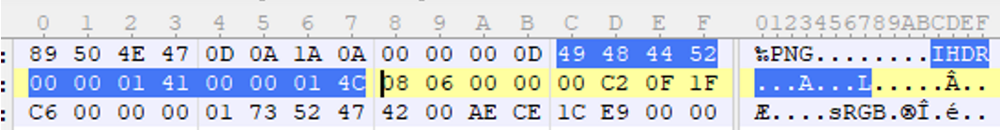

> 转自https://blog.csdn.net/Ahuuua/article/details/109165473#/

文件头文件尾汇总：

| 文件类型                         | 文件头                       | 文件尾      | 特征    |
| -------------------------------- | ---------------------------- | ----------- | ------- |
| JPEG (jpg)                       | FFD8FF                       | FF D9       | ÿØÿà    |
| PNG (png)                        | 89504E47                     | AE 42 60 82 | .PNG... |
| GIF (gif)                        | 47494638                     | 00 3B       | GIF89a  |
| ZIP Archive (zip)                | 504B0304                     | 50 4B       | PK..    |
| TIFF (tif)                       | 49492A00                     |             |         |
| Windows Bitmap (bmp)             | 424D                         |             | BM      |
| RAR Archive (rar)                | 52617221                     |             | Rar!... |
| Wave (wav)                       | 57415645                     |             |         |
| AVI (avi)                        | 41564920                     |             |         |
| MPEG (mpg)包含音频数据和视频数据 | 000001BA                     |             |         |
| MPEG (mpg)只包含视频数据         | 000001B3                     |             |         |
| 7Z                               | 377ABCAF271C                 |             | 7z¼¯'   |
| CAD (dwg)                        | 41433130                     |             |         |
| Adobe Photoshop (psd)            | 38425053                     |             |         |
| Rich Text Format (rtf)           | 7B5C727466                   |             |         |
| XML (xml)                        | 3C3F786D6C                   |             |         |
| HTML (html)                      | 68746D6C3E                   |             |         |
| Email [thorough only] (eml)      | 44656C69766572792D646174653A |             |         |
| Outlook Express (dbx)            | CFAD12FEC5FD746F             |             |         |
| Outlook (pst)                    | 2142444E                     |             |         |
| MS Word/Excel (xls.or.doc)       | D0CF11E0                     |             |         |
| MS Access (mdb)                  | 5374616E64617264204A         |             |         |
| WordPerfect(wpd)                 | FF575043                     |             |         |
| Adobe Acrobat (pdf)              | 255044462D312E               |             | %PDF    |
| Quicken (qdf)                    | AC9EBD8F                     |             |         |
| Windows Password (pwl)           | E3828596                     |             |         |
| Real Audio (ram)                 | 2E7261FD                     |             |         |
| Real Media (rm)                  | 2E524D46                     |             |         |
| Quicktime (mov)                  | 6D6F6F76                     |             |         |
| Windows Media (asf)              | 3026B2758E66CF11             |             |         |
| MIDI (mid)                       | 4D546864                     |             |         |
| Win PE                           | 4D5A                         |             | MZ      |
| ELF                              | 7F 45 4C 46                  |             | .ELF    |
| VMDK                             | 4B 44 4D                     |             | KDM     |
| Java-class                       | CA FE BA BE                  |             | Êþº¾    |

另外附一些小知识：

## PNG (png)

摘于：https://blog.csdn.net/bisword/article/details/2777121
文件头：89504E47　　　　　　　　　　　　　　　　　　　　　　文件尾：AE 42 60 82
PNG文件，我们会发现，文件的结尾12个字符看起来总应该是这样的：00 00 00 00 49 45 4E 44 AE 42 60 82
不难明白，由于数据块结构的定义，IEND数据块的长度总是0（00 00 00 00，除非人为加入信息），数据标识总是IEND（49 45 4E 44），因此，CRC码也总是AE 42 60 82。

给大家举个例子：

PNG图像：321*332分辨率  321->00 00 01 41  332->00 00 01 4C (也可以搜索十六进制找到标志位)

也可以根据位直接找到标志位，就是IHDR的后面4字节00 00 01 41为宽度 再后4字节00 00 01 4C为长度

 89 50 4E 47 0D 0A 1A 0A 是PNG头部署名域，表示这是一个PNG图片
00 00 00 0D 描述IHDR头部的大小。

 

## zip文件

摘于：https://blog.csdn.net/qq_26187985/article/details/83654197

压缩源文件数据区： 
50 4B 03 04：这是头文件标记
压缩源文件目录区： 
50 4B 01 02：目录中文件文件头标记
压缩源文件目录结束标志： 
50 4B 05 06：目录结束标记

无加密
压缩源文件数据区的全局加密应当为00 00  （504B0304两个bytes之后）4位二进制数<=>1位十六进制数 16bit<=>4位16进制
且压缩源文件目录区的全局方式位标记应当为00 00（504B0304四个bytes之后）
一个字节表示两个16进制数

假加密
压缩源文件数据区的全局加密应当为00 00 
且压缩源文件目录区的全局方式位标记应当为09 00

真加密
压缩源文件数据区的全局加密应当为09 00 
且压缩源文件目录区的全局方式位标记应当为09 00

全局方式位标记的四个数字中只有第二个数字对其有影响，其它的不管为何值，都不影响它的加密属性！ 
第二个数字为奇数时 –>加密 
第二个数字为偶数时 –>未加密
意思是08 00也是未加密 可以改为00 02 04 06 08
改为01 03 05 07 09会被加密