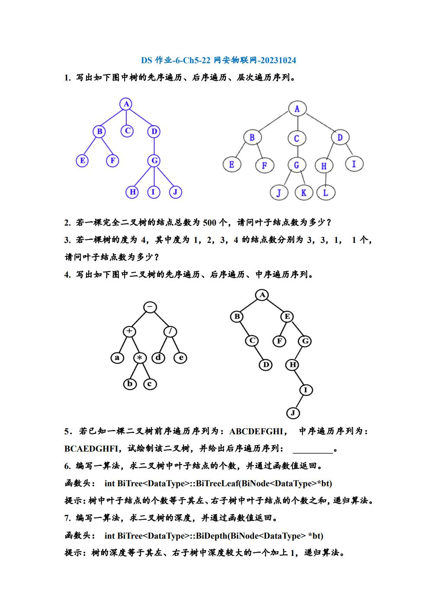

# 题目

这次老师直接用PDF发题，我直接搬过来了，加密环境下图片加载不出来直接点开看



# 题解

题解懒得打字了，直接把图搬过来，除了最后两个题，前面题目不能保证准确率，因为是我自己做的

## 第一题


## 第二题


## 第三题


## 第四题


## 第五题


## 第六题

这是一个使用递归的方法来计算二叉树中叶子节点的个数的算法。在这个算法中，我们首先检查当前节点是否为空，如果为空则返回0。然后，我们检查当前节点是否是叶子节点，如果是，则返回1。否则，我们递归地对左子树和右子树进行相同的操作，并将结果相加。

```cpp
template <typename DataType>
class BiTree {
public:
    struct BiNode {
        DataType data;
        BiNode* left;
        BiNode* right;
    };

    int BiTreeLeaf(BiNode<DataType>* bt) {
        if (bt == nullptr) {
            return 0;
        }
        if (bt->left == nullptr && bt->right == nullptr) {
            return 1;
        }
        return BiTreeLeaf(bt->left) + BiTreeLeaf(bt->right);
    }
};
```

这个函数`BiTreeLeaf`接收一个指向`BiNode`的指针作为参数，并返回一个整数，表示二叉树中叶子节点的个数。请注意，这个函数是`BiTree`类的成员函数，所以你需要在一个`BiTree`对象上调用它。例如，如果你有一个`BiTree<int>`对象`tree`，你可以这样调用它：`tree.BiTreeLeaf(root)`，其中`root`是指向树根的指针。这个函数会递归地遍历整棵树，并计算叶子节点的个数。当它访问到一个叶子节点时，它就会返回1；否则，它就会返回其左右子树中叶子节点的个数之和。这就是递归的魅力！

## 第七题

这是一个使用递归的方法来计算二叉树的深度的算法。在这个算法中，我们首先检查当前节点是否为空，如果为空则返回0。然后，我们递归地对左子树和右子树进行相同的操作，并返回结果中的最大值加1。

```cpp
template <typename DataType>
class BiTree {
public:
    struct BiNode {
        DataType data;
        BiNode* left;
        BiNode* right;
    };

    int BiDepth(BiNode<DataType>* bt) {
        if (bt == nullptr) {
            return 0;
        }
        int leftDepth = BiDepth(bt->left);
        int rightDepth = BiDepth(bt->right);
        return max(leftDepth, rightDepth) + 1;
    }
};
```

这个函数`BiDepth`接收一个指向`BiNode`的指针作为参数，并返回一个整数，表示二叉树的深度。请注意，这个函数是`BiTree`类的成员函数，所以你需要在一个`BiTree`对象上调用它。例如，如果你有一个`BiTree<int>`对象`tree`，你可以这样调用它：`tree.BiDepth(root)`，其中`root`是指向树根的指针。这个函数会递归地遍历整棵树，并计算树的深度。当它访问到一个节点时，它就会返回其左右子树中深度较大的一个加上1。这就是递归的魅力！