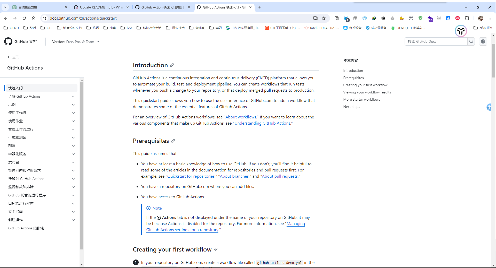

## 前言

事情是这样的，在昨天，也就是 2024 年 4 月 20 日，我突然发现了探姬师傅的[Hello-CTF 中的工作流](https://github.com/ProbiusOfficial/Hello-CTF/blob/main/.github/workflows/ghdeploy.yml)，虽然我看不懂，但是能大概猜出是什么意思，凑巧我又刷到了另一位大佬的项目，[爱飞的鸟的博客的友链申请仓库](https://github.com/aFlyBird0/blog-friends)，也是一个应用的 Github actions 工作流，于是我想我能不能也做一个工作流，实现我全自动化的博客部署和友链申请，再者，我手里还有个[Easy-QFNU](https://github.com/W1ndys/Easy-QFNU)的项目，我也可以借鉴一下，毕竟我现在的刷新时间操作还是需要半人工操作的，虽然有很方便的脚本，但是我还想用工作流，实现全自动化，这样就不用人工来启动脚本了。

## 正文

说干就干，今天早上我起床吃饭之后就来实验室了，折腾了一下午，毫无进展，我一开始向 ChatGPT 求助，企图让他帮我直接写出脚本来，他的能力我还是挺认可的，但是结局不尽人意，我几乎一整天都在折腾这个 Github actions 工作流，从 12 点搞到晚上八点，没有任何进步。

已经不想说什么了，放几张图吧

这些差不多是十分之一的 ChatGPT 的输出，我已经不想再继续了，除此之外，我还问了 copilot，Gemini，Claude3。。。n 个 AI，都没有帮上忙，我只能自己摸索了。

## 开始看文档

无奈之下我只好回归了本心，自己看文档自己动手

映入眼帘的英文啊，这对我一个四级都没过的人来说是莫大的痛苦，没办法，看呗

看了半天，大体看懂，但是不会写。

去搜一点别的，找到了[ithub 中文社区](https://www.github-zh.com/getting-started/hello-github-actions#/)，这里有一个 Github actions 的教程，看了一下，跟着来了一遍，成功了，测试要通过了。

> 说到底，还得是实操，光有理论啥也不是，只有实践才能学会。

目前的话是已经能正常输出语句了，但是中间的算法还没实现，只能等到下次有空再继续了

> 哎，今天因为这个，浪费了大量时间，不过好在学到了一些东西，也不算白浪费。
