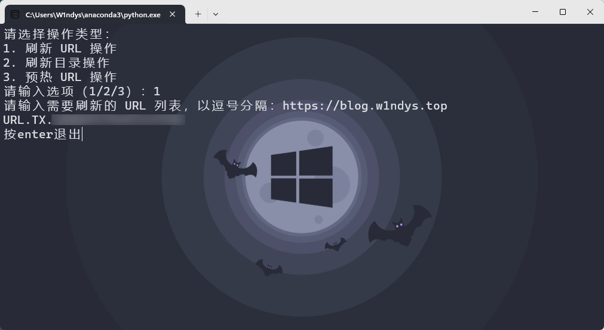

把下面代码复制之后，修改自己的key，直接跑就行

在大佬的代码基础上增加了可选择的刷新形式

```py
from hashlib import sha1
import hmac
import requests
import json
import urllib


def dogecloud_api(api_path, data={}, json_mode=False):
    """
    调用多吉云API

    :param api_path:    调用的 API 接口地址，包含 URL 请求参数 QueryString，例如：/console/vfetch/add.json?url=xxx&a=1&b=2
    :param data:        POST 的数据，字典，例如 {'a': 1, 'b': 2}，传递此参数表示不是 GET 请求而是 POST 请求
    :param json_mode:   数据 data 是否以 JSON 格式请求，默认为 false 则使用表单形式（a=1&b=2）

    :type api_path: string
    :type data: dict
    :type json_mode bool

    :return dict: 返回的数据
    """

    # 这里替换为你的多吉云永久 AccessKey 和 SecretKey，可在用户中心 - 密钥管理中查看
    # 请勿在客户端暴露 AccessKey 和 SecretKey，否则恶意用户将获得账号完全控制权
    access_key = "XXXXXXXX"
    secret_key = "XXXXXXXX"

    # 构造请求正文和 MIME 类型
    if json_mode:
        body = json.dumps(data)
        mime = "application/json"
    else:
        body = urllib.parse.urlencode(data)
        mime = "application/x-www-form-urlencoded"

    # 构造签名字符串并计算签名
    sign_str = api_path + "\n" + body
    signed_data = hmac.new(secret_key.encode("utf-8"), sign_str.encode("utf-8"), sha1)
    sign = signed_data.digest().hex()

    # 构造 Authorization 头部
    authorization = "TOKEN " + access_key + ":" + sign

    # 发起请求
    response = requests.post(
        "https://api.dogecloud.com" + api_path,
        data=body,
        headers={"Authorization": authorization, "Content-Type": mime},
    )

    # 返回响应的 JSON 数据
    return response.json()


def select_operation():
    """
    用户选择操作类型

    :return string: 用户选择的操作类型
    """
    print("请选择操作类型：")
    print("1. 刷新 URL 操作")
    print("2. 刷新目录操作")
    print("3. 预热 URL 操作")
    choice = input("请输入选项（1/2/3）：")
    if choice in ["1", "2", "3"]:
        return choice
    else:
        print("无效的选择")
        return None


# 获取用户选择的操作类型
rtype_choice = select_operation()
if rtype_choice:
    # 根据操作类型构造数据
    if rtype_choice == "1":
        rtype = "url"
        urls_input = input("请输入需要刷新的 URL 列表，以逗号分隔：")
    elif rtype_choice == "2":
        rtype = "path"
        urls_input = input("请输入需要刷新的目录列表，以逗号分隔：")
    else:
        rtype = "prefetch"
        urls_input = input("请输入需要预热的 URL 列表，以逗号分隔：")

    url_list = urls_input.split(",")

    # 调用多吉云API刷新 CDN 缓存
    api = dogecloud_api(
        "/cdn/refresh/add.json", {"rtype": rtype, "urls": json.dumps(url_list)}
    )

    # 处理响应结果
    if api["code"] == 200:
        print(api["data"]["task_id"])
    else:
        print("API 失败：" + api["msg"])

```



借鉴了大佬的思路以及代码

致谢

> https://www.zxma.top/posts/9a06f4c1/
>
> https://console.dogecloud.com/
>
> https://chat.openai.com/
