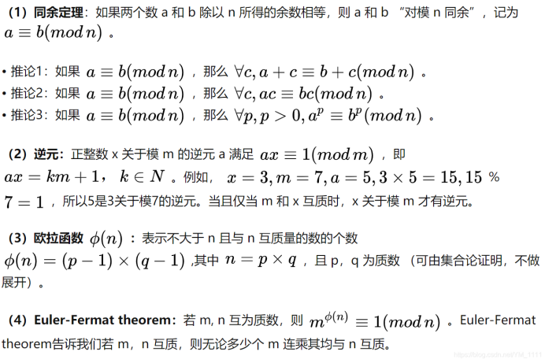

# 目录

1.[已知(p,q,e),求d](#1.已知(p,q,e),求d)

2.[已知(p,q,e,c)，求m](#2.已知(p,q,e,c)，求m)

3.[已知(p,q,dp,dq,c)，求m](#3.已知(p,q,dp,dq,c)，求m)

4.[已知(e,dp,n,c)，求m](#4.已知(e,dp,n,c)，求m)

5.[已知(n,e1,e2,c1,c2)，求m](#5.已知(n,e1,e2,c1,c2)，求m)

6.[已知(e,n1,c1,n2,c2)，求m](#6.已知(e,n1,c1,n2,c2)，求m)

7.[已知(p+q,p-q,e,c)，求m](#7.已知(p+q,p-q,e,c)，求m)

8.[已知(e,n,c)，求m](#8.已知(e,n,c)，求m)

9.[已知(e,n,c)，求m（e极小，如3，低加密指数攻击）](#9.已知(e,n,c)，求m（e极小，如3，低加密指数攻击）)

10.[已知(e,n,c)，求m（e很大，低解密指数攻击）](#10.已知(e,n,c)，求m（e很大，低解密指数攻击）)

11.[已知(c,n,p(q-1),q(p-1))，求m](#11.已知（c,n,p（q-1）,q*（p-1）），求m)

参考：[CTF中关于RSA的常见题型_abtgu的博客-CSDN博客_ctf rsa题目](http://t.csdnimg.cn/YEnxe)

**1、RSA算法需要的基础知识：**



（5）判断互质数：	

1）两个质数一定是互质数。

2）一个质数如果不能整除另一个合数（合数是指在大于1的整数中除了能被1和本身整除外，还能被其他数（0除外）整除的数），这两个数为互质数。例如，3与10、5与 26。

3）1不是质数也不是合数，它和任何一个自然数在一起都是互质数。

4）相邻的两个自然数是互质数。如 15与16。

5）相邻的两个奇数是互质数。如 49与 51。

6）大数是质数的两个数是互质数。如97与88。

7）小数是质数，大数不是小数的倍数的两个数是互质数。如 7和16。

8）两个数都是合数（二数差又较大），小数所有的质因数，都不是大数的约数（因数），这两个数是互质数。如357与715，357=3×7×17，而3、7和17都不是715的约数，这两个数为互质数。

等等。。。

（6）什么是模运算与模指数运算？

模运算是整数运算，有一个整数m，以n为模做模运算，即m mod n。让m被n整除，只取所得的余数作为结果，就叫做模运算。例如，10 mod 3=1；26 mod 6=2；28 mod 2 =0等等。

模指数运算就是先做指数运算，取其结果再做模运算。如(5^3) mod 7 = (125 mod 7) = 6。

**2、RSA加解密**

（1）RSA加密算法由五个部分组成：

原文(Message)、密文(Ciphertext)、公钥(Public Key)、私钥(Secret Key)、加密算法(Encryption)、解密算法(Decryption)。

（2）RSA求公钥私钥步骤如下：

1）随机选择两个不相同的素数 p,q 。

2）将p,q相乘，记为 n = p × q 。

3）计算n的欧拉函数φ(n)，当p,q为不相同的素数时，φ(n)=(p−1)(q−1)。

4）随机选择一个整数e，满足两个条件：φ(n)与e互质，且 1 < e <φ(n)。

5）计算e对于φ(n)的模反元素d，也就是说找到一个d满足ed = 1modφ(n)。这个式子等价于ed = kφ(n) + 1，实际上就是对于方程ed − kφ(n) = 1求(d,k)的整数解。这个方程可以用扩展欧几里得算法求解。

6）最终把(e,n)封装成公钥，(d,n)封装成私钥。

（3）RSA加密与解密


（4）RSA算法的破解

1）由于公钥中n已知，只需计算出d，便可通过M=Cd mod n计算出明文M。

2）由于方程ed − kφ(n) = 1，公钥中e已知，我们只需要知道φ(n)的值便可求出(d,k)的整数解。

3）由于φ(n) = （p - 1）(q - 1)，我们需要求出p，q的值。

4）由于n = p  q，我们需要对n做因数分解。

只要n可以被因数分解为p，q，我们便可反推破解私钥，从而破解密文。

-------------------------------------------------------------------------------------------------------------------------------

#### 1.已知(p,q,e),求d

```
import gmpy2
p = 
q = 
e = 
phi = (p-1)(q-1)
d = gmpy2.invert(e,phi)
print(d)
```

#### 2.已知(p,q,e,c)，求m

密文c，明文m

```
import gmpy2 
import binascii
 
c = 
e =  
p = 
q = 
 
# 计算私钥 d
phi = (p-1)*(q-1)
d = gmpy2.invert(e, phi)
 
# 解密 m
m = gmpy2.powmod(c,d,p*q)
print(binascii.unhexlify(hex(m)[2:]))
```

#### 3.已知(p,q,dp,dq,c)，求m


```
import gmpy2
import binascii
p =
q =
dp =
dq =
c =
 
I = gmpy2.invert(p,q)
mp = gmpy2.powmod(c,dp,p)
mq = gmpy2.powmod(c,dq,q)
 
m = ((I*(mp-mq))%q)*p+mp
print(binascii.unhexlify(hex(m)[2:]))
```

#### 4.已知(e,dp,n,c)，求m


```
import gmpy2
import binascii
e = 
n =
dp =
c =
for i in range(1,e):
    if (e*dp-1)%i == 0 and n%((e*dp-1)//i+1)==0:
        q = n//((e*dp-1)//i+1)
        phi = (q-1)*((e*dp-1)//i)
        d = gmpy2.invert(e,phi)
        m = gmpy2.powmod(c,d,n)
 
print(binascii.unhexlify(hex(m)[2:]))
```

#### 5.已知(n,e1,e2,c1,c2)，求m


```
import gmpy2
import binascii
 
n =
c1 = 
c2 = 
e1 = 
e2 = 
 
s = gmpy2.gcdext(e1,e2)
a = s[1]
b = s[2]
 
if a<0:
    a = -a
    c1 = gmpy2.invert(c1,n)
else:
    b = -b
    c2 = gmpy2.invert(c2,n)
 
m = (gmpy2.powmod(c1,a,n)*gmpy2.powmod(c2,b,n))%n
 
print(binascii.unhexlify(hex(m)[2:]))
```

#### 6.已知(e,n1,c1,n2,c2)，求m

**解题思路：** 两组数中e相同，n，c不同，求出n1与n2的最大公因数即为p，之后就可以得到q和d，从而求解m。

```
import gmpy2
import binascii
 
e = 
n1 = 
c1 = 
n2 = 
c2 = 
 
p1 = gmpy2.gcd(n1,n2)
q1 = n1 // p1
phi1 = (p1-1)*(q1-1)
 
d1 = gmpy2.invert(e,phi1)
m1 = gmpy2.powmod(c1,d1,n1)
 
print(binascii.unhexlify(hex(m1)[2:]))
 
p2 = gmpy2.gcd(n2,n1)
q2 = n2 // p2
phi2 = (p2-1)*(q2-1)
 
d2 = gmpy2.invert(e,phi2)
m2 = gmpy2.powmod(c2,d2,n2)
 
print(binascii.unhexlify(hex(m2)[2:]))
```

#### 7.已知(p+q,p-q,e,c)，求m

```
import gmpy2
import binascii
e=
a=
b=
c=
 
p = (a+b)//2
q = (a-b)//2
 
phi = (p-1)*(q-1)
d = gmpy2.invert(e,phi)
 
m = gmpy2.powmod(c,d,p*q)
print(binascii.unhexlify(hex(m)[2:]))
 
```

#### 8.已知(e,n,c)，求m

解题思路：
可以分解n得到p,q

在线分解大整数网址:

http://www.factordb.com/index.php

分解质因数工具 - 整数分解最多为70位

注意：在factordb中因为数过大而显示不全时，可以点击show查看完整数据，但是在复制数据时注意它的每一行都有空格，粘贴后要去掉


若以上都不好用，则用yafu计算

```
import gmpy2
import binascii
 
e = 
n = 
c = 
p = 
q = 
 
phi = (p-1)*(q-1)
d = gmpy2.invert(e,phi)
m = gmpy2.powmod(c,d,n)
 
print(binascii.unhexlify(hex(m)[2:]))	
```

#### 9.已知(e,n,c)，求m（e极小，如3，低加密指数攻击）


```
import gmpy2
import binascii
 
e =
n =
c =
 
i = 0
while True:
    if gmpy2.iroot((c+i*n),3)[1] == True:
        m = gmpy2.iroot((c+i*n),3)[0]
        break
    i += 1
 
print(binascii.unhexlify(hex(m)[2:]))
```

#### 10.已知(e,n,c)，求m（e很大，低解密指数攻击）

**解题思路：** 题中e很大，故可知是**低解密指数攻击**。

可以使用破解脚本：求出d的值，文件下载地址[GitHub - pablocelayes/rsa-wiener-attack: A Python implementation of the Wiener attack on RSA public-key encryption scheme.](https://gitcode.com/mirrors/pablocelayes/rsa-wiener-attack/overview?utm_source=csdn_github_accelerator)

（注意，这里要将破解脚本和rsa-wiener-attack的py文件放在同一个目录下）

```
import gmpy2
import binascii
import RSAwienerHacker
 
e =
n =
c =
 
d = RSAwienerHacker.hack_RSA(e,n)
m = gmpy2.powmod(c,d,n)
 
print(binascii.unhexlify(hex(m)[2:]))
 
```

#### 11.已知（c,n,p（q-1）,q*（p-1）），求m

```
import gmpy2
from Crypto.Util.number import *
#pq = p*(q-1)
#qp = q*(p-1)
c= 
n= 
pq= 
qp= 
 
e = 65537
p = n - pq
q = n - qp
phi = (p - 1)*(q - 1)
 
d = gmpy2.invert(e,phi)
m = gmpy2.powmod(c,d,n)
print(long_to_bytes(m))
 
```

