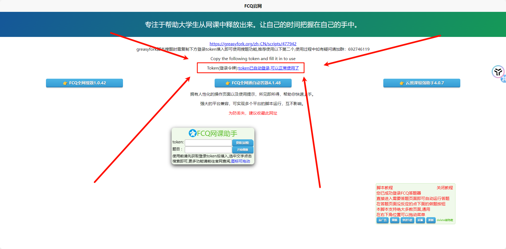
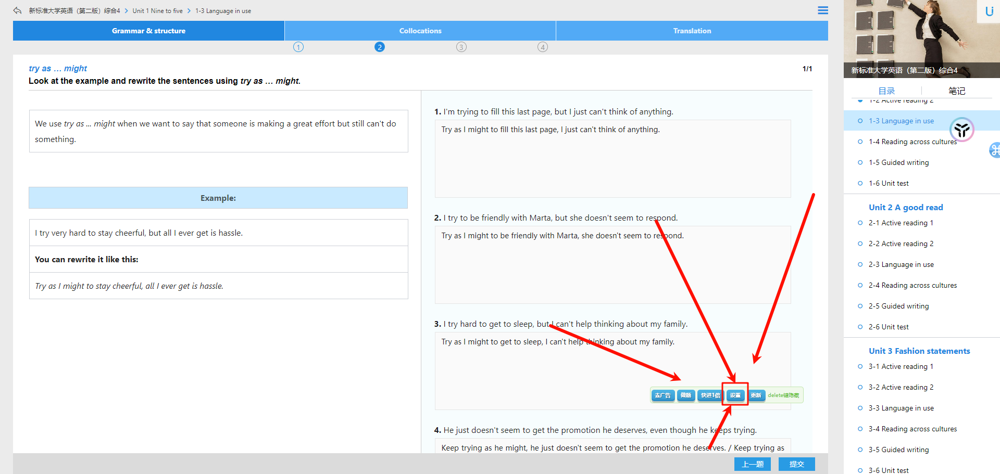

# U 校园/Welearn/智慧树/雨课堂/学习通/问卷星/腾讯问卷等 196 平台自动答题通杀脚本的安装教程

> 本教程旨在帮助你节省时间，去做有意义的事情，切勿因小失大，工具是为了进步，而不是偷懒！！！！！！！
>
> 脚本有概率无法做，非选择填空题，如连线题，图片题等
>
> 图片加载较慢请用浏览器打开本网址

## 免责声明

1. 本刷题脚本仅供个人学习和研究之用，任何商业用途均不被允许。用户在使用本脚本时，应遵守所在国家或地区的法律法规。
2. 本刷题脚本提供的题目及答案信息来源于公开的资源和第三方网站，我们尽最大努力确保信息的准确性和完整性，但不对其真实性、准确性、可靠性和完整性做出任何明示或暗示的保证。
3. 使用本刷题脚本所导致的一切后果和责任由用户自行承担，包括但不限于因使用本脚本而引发的任何损失、损害、纠纷、法律责任等。本刷题脚本的开发者和提供者不承担任何责任。
4. 本刷题脚本可能会涉及到对第三方网站的访问和数据获取，若因此产生的任何纠纷或损失，本刷题脚本的开发者和提供者不承担任何责任。
5. 本刷题脚本可能随着题库更新而需要不定期的更新和维护，我们将尽量保证更新和维护的及时性和有效性，但不对由于更新和维护造成的任何不便和损失承担责任。
6. 本刷题脚本的安装和使用即表示用户已充分阅读、理解并接受本免责声明的全部内容。如果用户对免责声明的任何内容存在异议，应立即停止使用本刷题脚本。

## 脚本的优势

1. 支持高达约 200 个教育平台， 覆盖率高 
2. 题库十分  完善 ，正确率高达 99.9%
3. 价格  低廉 ，最适合中国大学生体质

## 前排提醒

 如果你觉得教程麻烦 ，可以联系→ [w1ndys@outlook.com](mailto:w1ndys@outlook.com)，几块钱（具体看题量）付费代刷题，但本人不对后果负任何责任

本教程所用的脚本与教程编写者无任何关系，教程只是一个引导作用，实际出任何问题请联系脚本开发者

 脚本的使用规则：每天每个 IP 有 免费 10 积分，积分售价 10 元 1000 积分，测试发现，可以看做是 1 积分 1 个答案，综合下来就是 10r 大约能买 1000 道题的答案 

此收费项目与教程编写者  无任何关系 ，如果你介意此费用，请立即退出此页面，阅读本教程即代表你同意本教材的全部用户协议以及免责声明

## 开始操作

我们推荐 `Microsoft Edge`，因为这个浏览器安装插件不需要魔法，另外如果有需要魔法的，推荐用 [我正在用的](https://blog.w1ndys.top/posts/80f8b1da)，平均 40r 可以用一年多，延迟在 200ms 左右，很稳。

### 插件安装

1. 打开浏览器，进入下面地址

[https://microsoftedge.microsoft.com/addons/detail/scriptcat/liilgpjgabokdklappibcjfablkpcekh](https://microsoftedge.microsoft.com/addons/detail/scriptcat/liilgpjgabokdklappibcjfablkpcekh)

点击 `获取`，这边我已经安装过了，所以是显示 `删除`

2. 进入下面地址，点击 `安装脚本`

[https://scriptcat.org/zh-CN/script-show-page/1338#/](https://scriptcat.org/zh-CN/script-show-page/1338#/)

3. 刷新一下页面

点击 `确认`

出现中间登陆成功的字样，代表成功登陆

## 配置插件

1. 进入你要刷课的平台，我这里以 [U 校园](https://u.unipus.cn/user/student?school_id=9541#/) 为例, 登上你的账号，看到右下角（不一定），有个悬浮窗，点击设置

点击账号操作

如果你是 U 校园，输入邀请码 `VGKTEW` 领取 50 积分

如果你是智慧树知到，输入邀请码 `6FB7S7 ` 领取 50 积分

如果你是超星学习通，输入邀请码 `P7KSHM `，领取 50 积分

如果你是其他平台，联系作者获取邀请码，免费赠送 50 积分，作者邮箱 [w1ndys@outlook.com](mailto:w1ndys@outlook.com)

2. 之后点击 `自动答题	`

点击 `搜索推荐答题配置`，显示【生效】代表生效成功，点击 `展开所有配置` 可以看到支持的所有平台，推荐 `答题间隔` 不要太低，建议 `打开`【手动搜题模式】，避免浪费积分

3. 刷新页面，点击做题

等待填完答案，就可以提交了

## 刷题结果

放一下我自己刷的正确率，我个人觉得，这是我用过的题库最正确的脚本了，刷了十几套题，没有错的

