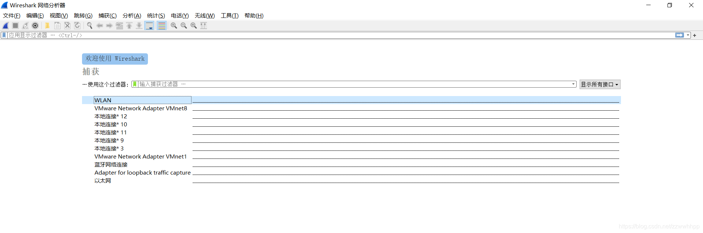
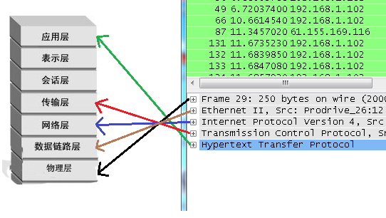
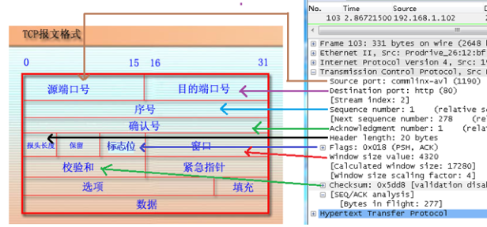
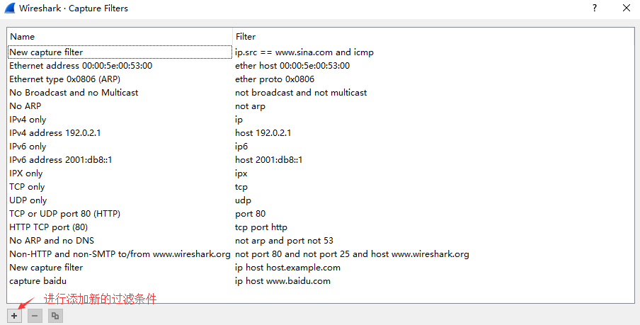
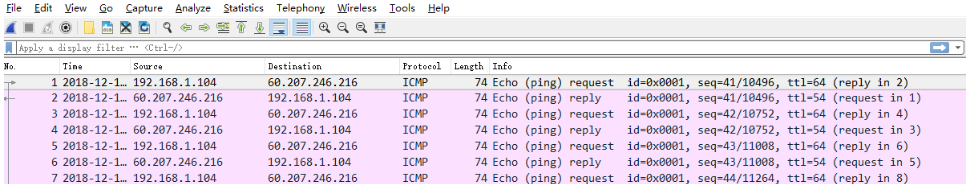
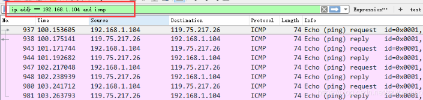
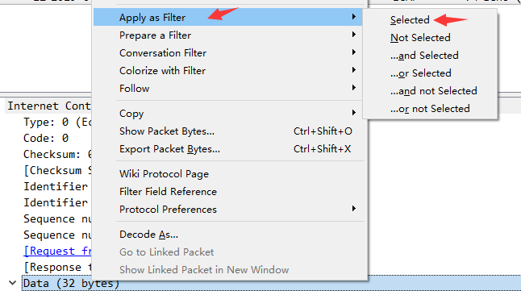

# Wireshark 使用教程

## Wireshark 开始抓包示例

先介绍一个使用 Wireshark 工具抓取 ping 命令操作的示例

1. 打开 Wireshark ，主界面如下：

2. 选择对应的网卡，右键，会出现 Start Capture(开始捕获)，点击即可进行捕获该网络信息，开始抓取网络包

3. 执行需要抓包的操作，如 ping www.baidu.com。

4. 操作完成后相关数据包就抓取到了。为避免其他无用的数据包影响分析，可以通过在过滤栏设置过滤条件进行数据包列表过滤，获取结果如下。

> 说明：ip.addr == 180.101.49.11 and icmp 表示只显示 ICPM 协议且源主机 IP 或者目的主机 IP 为 119.75.217.26 的数据包。

Wireshark 抓包完成。

## Wireshark 抓包界面

说明：数据包列表区中不同的协议使用了不同的颜色区分，可以在视图>着色规则里查看

### Display Filter(显示过滤器)

用于设置过滤条件进行数据包列表过滤。菜单路径：分析>显示

### Packet List Pane(数据包列表)

显示捕获到的数据包，每个数据包包含编号，时间截，源地址，目标地址，协议，长度，以及数据包信息。 不同协议的数据包使用了不同的颜色区分显示。

### Packet Details Pane(数据包详细信息)

在数据包列表中选择指定数据包，在数据包详细信息中会显示数据包的所有详细信息内容。数据包详细信息面板是最重要的，用来查看协议中的每一个字段。各行信息分别为

1. Frame: 物理层的数据帧概况

2. Ethernet II: 数据链路层以太网帧头部信息

3. Internet Protocol Version 4: 互联网层 IP 包头部信息

4. Transmission Control Protocol: 传输层 T 的数据段头部信息，此处是 TCP

5. Hypertext Transfer Protocol: 应用层的信息，此处是 HTTP 协议

## TCP 包的具体内容

## Wireshark 过滤器设置

### 抓包过滤器

捕获过滤器的菜单栏路径为`捕获 --> 捕获过滤器`,**用于在抓取数据包前设置。**

如何使用？可以在抓取数据包前设置如下。

ip host 60.207.246.216 and icmp 表示只捕获主机 IP 为 60.207.246.216 的 ICMP 数据包。获取结果如下：

### 显示过滤器

显示过滤器是用于在抓取数据包后设置过滤条件进行过滤数据包。通常是在抓取数据包时设置条件相对宽泛，抓取的数据包内容较多时使用显示过滤器设置条件过滤以方便分析。同样上述场景，在捕获时未设置捕获规则直接通过网卡进行抓取所有数据包，如下

执行 ping www.huawei.com获取的数据包列表如下

观察上述获取的数据包列表，含有大量的无效数据。这时可以通过设置显示器过滤条件进行提取分析信息。ip.addr == 211.162.2.183 and icmp。并进行过滤。

上述介绍了抓包过滤器和显示过滤器的基本使用方法。**在组网不复杂或者流量不大情况下，使用显示器过滤器进行抓包后处理就可以满足我们使用**。下面介绍一下两者间的语法以及它们的区别。

### Wireshark 过滤器表达式的规则

#### 抓包过滤器语法和实例

抓包过滤器类型 Type（host、net、port）、方向 Dir（src、dst）、协议 Proto（ether、ip、tcp、udp、http、icmp、ftp 等）、逻辑运算符（&& 与、|| 或、！非）

1. 协议过滤

   比较简单，直接在抓包过滤框中直接输入协议名即可。

   TCP，只显示 TCP 协议的数据包列表

   HTTP，只查看 HTTP 协议的数据包列表

   ICMP，只显示 ICMP 协议的数据包列表

2. IP 过滤

   host 192.168.1.104

   src host 192.168.1.104

   dst host 192.168.1.104

3. 端口过滤

   port 80

   src port 80

   dst port 80

4. 逻辑运算符&& 与、|| 或、！非

   src host 192.168.1.104 && dst port 80 抓取主机地址为 192.168.1.80、目的端口为 80 的数据包

   host 192.168.1.104 || host 192.168.1.102 抓取主机为 192.168.1.104 或者 192.168.1.102 的数据包

   ！broadcast 不抓取广播数据包

#### 显示过滤器语法和实例

1. 比较操作符

   比较操作符有== 等于、！= 不等于、> 大于、< 小于、>= 大于等于、<=小于等于。

2. 协议过滤

   比较简单，直接在 Filter 框中直接输入协议名即可。注意：协议名称需要输入小写。

   tcp，只显示 TCP 协议的数据包列表

   http，只查看 HTTP 协议的数据包列表

   icmp，只显示 ICMP 协议的数据包列表

3. ip 过滤

   ip.src ==192.168.1.104 显示源地址为 192.168.1.104 的数据包列表

   ip.dst==192.168.1.104, 显示目标地址为 192.168.1.104 的数据包列表

   ip.addr == 192.168.1.104 显示源 IP 地址或目标 IP 地址为 192.168.1.104 的数据包列表

4. 端口过滤

   tcp.port ==80, 显示源主机或者目的主机端口为 80 的数据包列表。

   tcp.srcport == 80, 只显示 TCP 协议的源主机端口为 80 的数据包列表。

   tcp.dstport == 80，只显示 TCP 协议的目的主机端口为 80 的数据包列表。

5. http 模式过滤

   http.request.method==“GET”, 只显示 HTTP GET 方法的。

6. 逻辑运算符为 and/or/not

   过滤多个条件组合时，使用 and/or。比如获取 IP 地址为 192.168.1.104 的 ICMP 数据包表达式为 ip.addr == 192.168.1.104 and icmp

7. 按照数据包内容过滤。假设我要以 IMCP 层中的内容进行过滤，可以单击选中界面中的码流，在下方进行选中数据。如下

右键单击选中后出现如下界面（作为过滤器应用）

选中 Select 后在过滤器中显示如下

后面条件表达式就需要自己填写。如下我想过滤出 data 数据包中包含"abcd"内容的数据流。**包含的关键词是 contains 后面跟上内容。**

#### 常见用显示过滤需求及其对应表达式

**数据链路层**：

筛选 mac 地址为 04:f9:38:ad:13:26 的数据包

eth.src == 04:f9:38:ad:13:26

筛选源 mac 地址为 04:f9:38:ad:13:26 的数据包----

eth.src == 04:f9:38:ad:13:26

**网络层**：

筛选 ip 地址为 192.168.1.1 的数据包

ip.addr == 192.168.1.1

筛选 192.168.1.0 网段的数据

ip contains "192.168.1"

**传输层**：

筛选端口为 80 的数据包

tcp.port == 80

筛选 12345 端口和 80 端口之间的数据包

tcp.port == 12345 &&tcp.port == 80

筛选从 12345 端口到 80 端口的数据包

tcp.srcport == 12345 &&tcp.dstport == 80

**应用层**：

特别说明: http 中 http.request 表示请求头中的第一行（如 GET index.jsp HTTP/1.1） http.response 表示响应头中的第一行（如 HTTP/1.1 200 OK），其他头部都用 http.header_name 形式。

筛选 url 中包含.php 的 http 数据包

http.request.uri contains ".php"

筛选内容包含 username 的 http 数据包

http contains "username"

> 参考链接：
>
> https://www.cnblogs.com/linyfeng/p/9496126.html#/ > https://blog.csdn.net/zzwwhhpp/article/details/113077747#/
