# Wireshark 使用教程

> W1ndys

## Wireshark 开始抓包示例

先介绍一个使用 Wireshark 工具抓取 ping 命令操作的示例

1. 打开 Wireshark ，主界面如下：

2. 选择对应的网卡，右键，会出现 Start Capture(开始捕获)，点击即可进行捕获该网络信息，开始抓取网络包

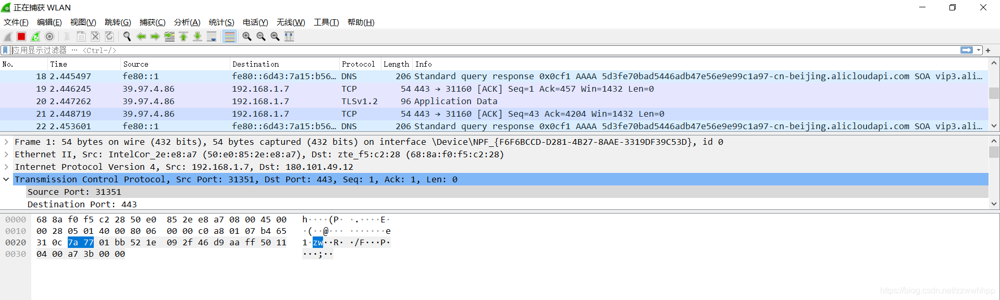

3. 执行需要抓包的操作，如 ping www.baidu.com。

4. 操作完成后相关数据包就抓取到了。为避免其他无用的数据包影响分析，可以通过在过滤栏设置过滤条件进行数据包列表过滤，获取结果如下。

> 说明：ip.addr == 180.101.49.11 and icmp 表示只显示 ICPM 协议且源主机 IP 或者目的主机 IP 为 119.75.217.26 的数据包。

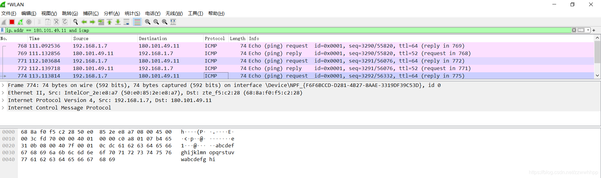

Wireshark 抓包完成。

## Wireshark 抓包界面

菜单栏：用于调试、配置

工具栏：常用功能的快捷方式

过滤栏：指定过滤条件，过滤数据包

数据包列表：核心区域，每一行就是一个数据包

数据包详情：数据包的详细数据

数据包字节：数据包对应的字节流，二进制

### 基础操作

#### 调整界面大小

工具栏中的三个「放大镜」图标，可以调整主界面数据的大小。

从左到右依次是：放大、缩小、还原默认大小。

#### 设置显示列

数据包列表是最常用的模块之一，列表中有一些默认显示的列，我们可以添加、删除、修改显示的列。

1. 添加显示列

   想要在数据列表中显示某一个字段，可以将这个数据字段添加至显示列中。

   左键选中想要添加为列的字段，右键选择「应用为列」。

   

   选中字段，按 Ctrl + Shift + I ，也可以实现同样的效果。

   添加为列的字段会在数据列表中显示。

   

2. 隐藏显示列

   暂时不想查看的列，可以暂时隐藏起来。

   在显示列的任意位置右键，取消列名的「勾选」，即可隐藏显示列。

   

3. 删除显示列

   要删除某一列，可以将其从显示列中删除。

   右键需要删除的列，点击最下方的「Remove this Column」 。

   

   注意：隐藏字段时，在列名栏的任意位置右键即可；而删除字段时，需要在指定的列名位置右键，以防误删。

#### 设置时间

数据包列表栏的时间这一列，默认显示格式看起来很不方便，我们可以调整时间的显示格式。

点击工具栏的「视图」，选择「时间显示格式」，设置你喜欢的格式。

#### 标记数据包

对于某些比较重要的数据包，可以设置成高亮显示，以达到标记的目的。

选中需要标记的数据包，右键选择最上面的「标记/取消标记」。

选中数据包，按 Ctrl + M 也可以实现同样的效果，按两次可以取消标记。

#### 导出数据包

演示快速抓包时，我们讲过保存数据包的操作，保存操作默认保存所有已经抓取的数据包。但有时候，我们只需要保存指定的数据包，这时候可以使用导出的功能。

1. 导出单个数据包

   选中数据包，点击左上角的「文件」，点击「导出特定分组」。

   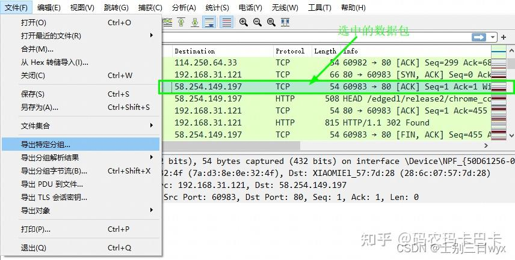

   在「导出分组界面」，选择第二个 「Selected packets only」，只保存选中的数据包。

   

2. 导出多个数据包

   有时候我们需要导出多个数据包，Wireshark 有一个导出标记的数据包的功能，我们将需要导出的数据包都标记起来，就可以同时导出多个数据包。

   点击左上角的「文件」，点击「导出特定分组」。

   

   在「导出分组界面」，勾选第三个 「Marked packets only」，只导出标记的数据包。

   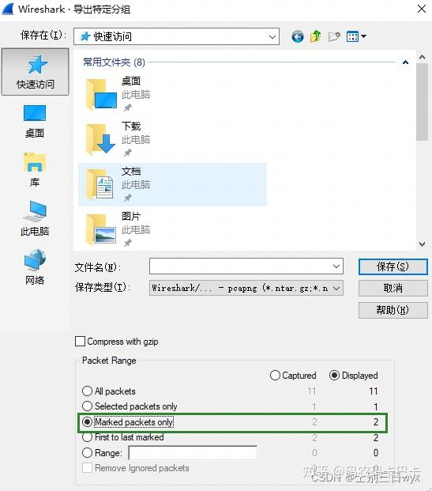

#### 开启混杂模式

局域网的所有流量都会发送给我们的电脑，默认情况下，我们的电脑只会对自己 mac 的流量进行解包，而丢弃其他 mac 的数据包。

开启混杂模式后，我们就可以解析其他 mac 的数据包，因此，我们使用 Wireshark 时，通常都会开启混杂模式。

点击菜单栏的「捕获」按钮，点击「选项」。

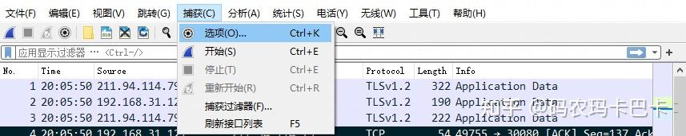

勾选 在所有接口上使用混杂模式。

### 界面

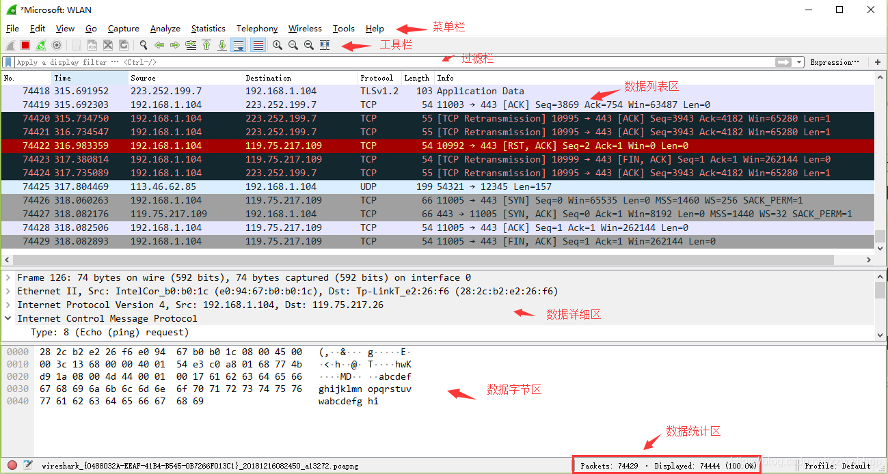

说明：数据包列表区中不同的协议使用了不同的颜色区分，可以在视图 > 着色规则里查看

### Display Filter(显示过滤器)

用于设置过滤条件进行数据包列表过滤。菜单路径：分析 > 显示

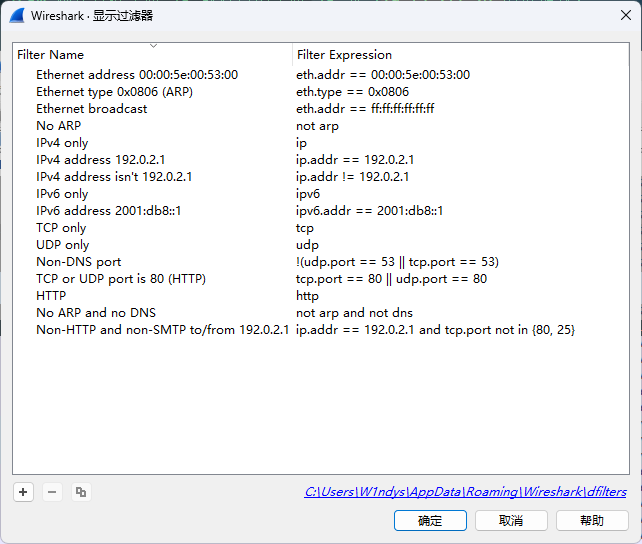

### Packet List Pane(数据包列表)

显示捕获到的数据包，每个数据包包含编号，时间截，源地址，目标地址，协议，长度，以及数据包信息。 不同协议的数据包使用了不同的颜色区分显示。

### Packet Details Pane(数据包详细信息)

在数据包列表中选择指定数据包，在数据包详细信息中会显示数据包的所有详细信息内容。数据包详细信息面板是最重要的，用来查看协议中的每一个字段。各行信息分别为

1. Frame: 物理层的数据帧概况

2. Ethernet II: 数据链路层以太网帧头部信息

3. Internet Protocol Version 4: 互联网层 IP 包头部信息

4. Transmission Control Protocol: 传输层 T 的数据段头部信息，此处是 TCP

5. Hypertext Transfer Protocol: 应用层的信息，此处是 HTTP 协议

## TCP 包的具体内容

## Wireshark 过滤器设置

### 抓包过滤器

捕获过滤器的菜单栏路径为 `捕获 --> 捕获过滤器`, **用于在抓取数据包前设置。**

如何使用？可以在抓取数据包前设置如下。

ip host 60.207.246.216 and icmp 表示只捕获主机 IP 为 60.207.246.216 的 ICMP 数据包。获取结果如下：

### 显示过滤器

显示过滤器是用于在抓取数据包后设置过滤条件进行过滤数据包。通常是在抓取数据包时设置条件相对宽泛，抓取的数据包内容较多时使用显示过滤器设置条件过滤以方便分析。同样上述场景，在捕获时未设置捕获规则直接通过网卡进行抓取所有数据包，如下

执行 ping www.huawei.com 获取的数据包列表如下

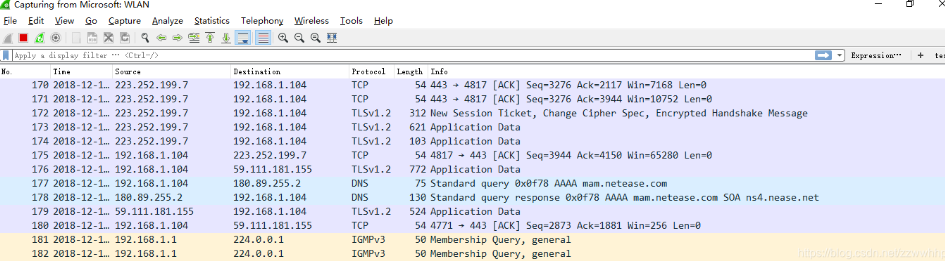

观察上述获取的数据包列表，含有大量的无效数据。这时可以通过设置显示器过滤条件进行提取分析信息。ip.addr == 211.162.2.183 and icmp。并进行过滤。

上述介绍了抓包过滤器和显示过滤器的基本使用方法。**在组网不复杂或者流量不大情况下，使用显示器过滤器进行抓包后处理就可以满足我们使用**。下面介绍一下两者间的语法以及它们的区别。

### Wireshark 过滤器表达式的规则

#### 抓包过滤器语法和实例

抓包过滤器类型 Type（host、net、port）、方向 Dir（src、dst）、协议 Proto（ether、ip、tcp、udp、http、icmp、ftp 等）、逻辑运算符（&& 与、|| 或、！非）

1. 协议过滤

   比较简单，直接在抓包过滤框中直接输入协议名即可。

   TCP，只显示 TCP 协议的数据包列表

   HTTP，只查看 HTTP 协议的数据包列表

   ICMP，只显示 ICMP 协议的数据包列表

2. IP 过滤

   host 192.168.1.104

   src host 192.168.1.104

   dst host 192.168.1.104

3. 端口过滤

   port 80

   src port 80

   dst port 80

4. 逻辑运算符&& 与、|| 或、！非

   src host 192.168.1.104 && dst port 80 抓取主机地址为 192.168.1.80、目的端口为 80 的数据包

   host 192.168.1.104 || host 192.168.1.102 抓取主机为 192.168.1.104 或者 192.168.1.102 的数据包

   ！broadcast 不抓取广播数据包

#### 显示过滤器语法和实例

1. 比较操作符

   比较操作符有 == 等于、！= 不等于、> 大于、< 小于、> = 大于等于、<= 小于等于。

2. 协议过滤

   比较简单，直接在 Filter 框中直接输入协议名即可。注意：协议名称需要输入小写。

   tcp，只显示 TCP 协议的数据包列表

   http，只查看 HTTP 协议的数据包列表

   icmp，只显示 ICMP 协议的数据包列表

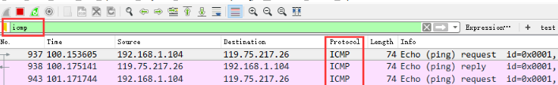

3. ip 过滤

   ip.src == 192.168.1.104 显示源地址为 192.168.1.104 的数据包列表

   ip.dst == 192.168.1.104, 显示目标地址为 192.168.1.104 的数据包列表

   ip.addr == 192.168.1.104 显示源 IP 地址或目标 IP 地址为 192.168.1.104 的数据包列表

4. 端口过滤

   tcp.port == 80, 显示源主机或者目的主机端口为 80 的数据包列表。

   tcp.srcport == 80, 只显示 TCP 协议的源主机端口为 80 的数据包列表。

   tcp.dstport == 80，只显示 TCP 协议的目的主机端口为 80 的数据包列表。

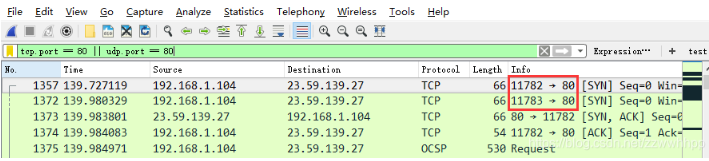

5. http 模式过滤

   http.request.method ==“GET”, 只显示 HTTP GET 方法的。

6. 逻辑运算符为 and/or/not

   过滤多个条件组合时，使用 and/or。比如获取 IP 地址为 192.168.1.104 的 ICMP 数据包表达式为 ip.addr == 192.168.1.104 and icmp

7. 按照数据包内容过滤。假设我要以 IMCP 层中的内容进行过滤，可以单击选中界面中的码流，在下方进行选中数据。如下

右键单击选中后出现如下界面（作为过滤器应用）

选中 Select 后在过滤器中显示如下

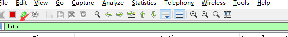

后面条件表达式就需要自己填写。如下我想过滤出 data 数据包中包含 "abcd" 内容的数据流。**包含的关键词是 contains 后面跟上内容。**

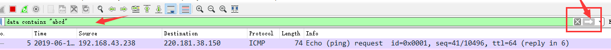

#### 常见用显示过滤需求及其对应表达式

**数据链路层**：

筛选 mac 地址为 04: f9:38: ad: 13:26 的数据包

eth.src == 04: f9:38: ad: 13:26

筛选源 mac 地址为 04: f9:38: ad: 13:26 的数据包----

eth.src == 04: f9:38: ad: 13:26

**网络层**：

筛选 ip 地址为 192.168.1.1 的数据包

ip.addr == 192.168.1.1

筛选 192.168.1.0 网段的数据

ip contains "192.168.1"

**传输层**：

筛选端口为 80 的数据包

tcp.port == 80

筛选 12345 端口和 80 端口之间的数据包

tcp.port == 12345 &&tcp.port == 80

筛选从 12345 端口到 80 端口的数据包

tcp.srcport == 12345 &&tcp.dstport == 80

**应用层**：

特别说明: http 中 http.request 表示请求头中的第一行（如 GET index.jsp HTTP/1.1） http.response 表示响应头中的第一行（如 HTTP/1.1 200 OK），其他头部都用 http.header_name 形式。

筛选 url 中包含.php 的 http 数据包

http.request.uri contains ".php"

筛选内容包含 username 的 http 数据包

http contains "username"

## Wireshark 抓包分析 TCP 三次握手过程

### TCP 三次握手连接建立过程

Step1：客户端发送一个 SYN = 1，ACK = 0 标志的数据包给服务端，请求进行连接，这是第一次握手；

Step2：服务端收到请求并且允许连接的话，就会发送一个 SYN = 1，ACK = 1 标志的数据包给发送端，告诉它，可以通讯了，并且让客户端发送一个确认数据包，这是第二次握手；

Step3：服务端发送一个 SYN = 0，ACK = 1 的数据包给客户端，告诉它连接已被确认，这就是第三次握手。TCP 连接建立，开始通讯。

### Wireshark 抓包获取访问指定服务端数据包

Step1：启动 wireshark 抓包，打开浏览器输入 http://www.baidu.com。

Step2：使用 ping http://www.baidu.com 获取 IP。

Step3：输入过滤条件获取待分析数据包列表 ip.addr == 183.232.231.172

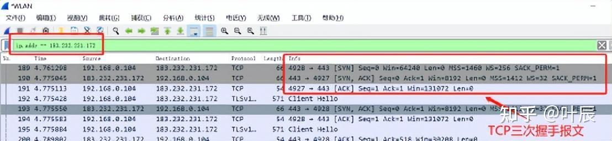

图中可以看到 wireshark 截获到了三次握手的三个数据包。第四个包才是 HTTPS 的， 这说明 HTTPS 的确是使用 TCP 建立连接的。

#### 第一次握手数据包

客户端发送一个 TCP，标志位为 SYN，序列号为 0， 代表客户端请求建立连接。

数据包的关键属性如下：

SYN ：标志位，表示请求建立连接

Seq = 0 ：初始建立连接值为 0，数据包的相对序列号从 0 开始，表示当前还没有发送数据

Ack = 0：初始建立连接值为 0，已经收到包的数量，表示当前没有接收到数据

#### 第二次握手的数据包

服务器发回确认包, 标志位为 SYN，ACK。将确认序号(Acknowledgement Number)字段+1，即 0+1 = 1。

数据包的关键属性如下：

SYN + ACK: 标志位，同意建立连接，并回送 SYN+ACK

Seq = 0 ：初始建立值为 0，表示当前还没有发送数据

Ack = 1：表示当前端成功接收的数据位数，虽然客户端没有发送任何有效数据，确认号还是被加 1，因为包含 SYN 或 FIN 标志位。（并不会对有效数据的计数产生影响，因为含有 SYN 或 FIN 标志位的包并不携带有效数据）

#### 第三次握手的数据包

客户端再次发送确认包(ACK) SYN 标志位为 0，ACK 标志位为 1。并且把服务器发来 ACK 的序号字段+1，放在确定字段中发送给对方，并且在 Flag 段写 ACK 的+1：

数据包的关键属性如下：

ACK ：标志位，表示已经收到记录

Seq = 1 ：表示当前已经发送 1 个数据

Ack = 1 : 表示当前端成功接收的数据位数，虽然服务端没有发送任何有效数据，确认号还是被加 1，因为包含 SYN 或 FIN 标志位（并不会对有效数据的计数产生影响，因为含有 SYN 或 FIN 标志位的包并不携带有效数据)。

就这样通过了 TCP 三次握手，建立了连接。开始进行数据交互

## Wireshark 分析常用操作

### 导出数据包

调整数据包列表中时间戳显示格式。调整方法为 视图 --> 时间显示格式 --> 日期和时间。调整后格式如下：

> 参考链接：
>
> https://blog.w1ndys.top/posts/2d075872
>
> https://zhuanlan.zhihu.com/p/631821119#/
>
> https://www.cnblogs.com/linyfeng/p/9496126.html#/
>
> https://blog.csdn.net/zzwwhhpp/article/details/113077747#/
