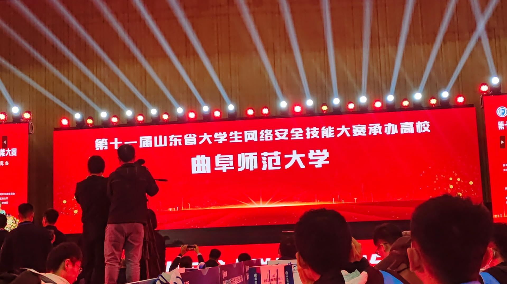

# START

咕咕咕……好吧，比赛在10月22日就打完了，打完比赛就想写来着，但是一直咕到现在才有时间写这个心得体会

太忙了啊啊啊啊啊~！！！

收获还是很多的

嘿嘿嘿被两位师哥带飞，满满的安全感

10月21号下午跟两个师哥坐高铁，从曲阜到章丘，没走过远门的我还以为那是地铁，高铁来的声音很响我，轰隆隆的。

高铁很快，不到三个小时我们就到章丘站了，下高铁之后有山东警察学院的志愿者带我们进学校，坐他们的志愿者大巴车去学校里面，大巴车嗡嗡的响

做网络安全的，也有不少女生，但是也就几个，车上都在讨论学术知识，第一次到这种贤士云集的地方。

到学校门口，我随手拍了几张照片

非常好看！

到了里面，学校已经为大赛准备的很好，我们先去报到处报道，领了参赛的东西

**一个参赛服，一个参赛选手证，一个鼠标垫，一个无线鼠标，还有一本参赛手册，两张餐券。**

然后进赛场调试设备，工作人员让我看看IP就行，当时我脑子就乱了，IP？什么IP，怎么看来着？急中生智想到了上周计网实验课刚学的ipconfig，好险，要不然就丢人了，好尴尬，当时工作人员就看着我。

然后等报道完我们三个坐大巴车去酒店准备吃饭了

酒店的饭，其实也还行，给餐券随便吃，也不算多豪华也还行倒是，(毕竟组委会包吃住，乐)

吃完饭我们就去卧室准备睡觉了

那边酒店在山脚下，信号贼差，发个消息发半天，当晚我们下载了网络安全法，数据安全法，密码法，国家安全法，个人信息保护法，反间谍法等条文，我在车上听到了别的师傅说一个**随波逐流工具**，我下载了发现非常好用，一把嗦。点赞这个工具

然后就准备睡觉了，第二天要早起

等第二天起来之后吃完饭就坐车走了，去了先去签到处放下书包，手机不能进场。领取了标签我就进场了

考试时间从上午九点到下午四点，中途不间断，午饭在现场吃

 

再说一下赛题吧，web题全场0解，一开始我看到签到题就蒙圈了，不过幸好，好在做出来了，不至于一个题也不会给队伍拖后腿

然后过了半天，才做出简单编码，二进制八进制

还有一个题是变异凯撒，那个题也应该会做的，但是当时只顾着用工具了，脑子没反应过来那是变异凯撒，不然早就知道了其实，这题不该失分，然后我应该去爱你这个题也不该失分，吃了没做过频谱图的题的亏，如果我当时做过频谱图的题就不至于不会做了，这几个题都是大部分人都会做的

到了比赛后期就没什么新解出的，一直是老题在上升趋势，（不会是py吧（雾

---

最后四点比赛结束，三等奖，差点二等奖了唉，唉三等奖，唉CTF，唉科来杯。

然后遇到了王老师和李老师，两位带队老师，臧老师有事不能带了

最后颁奖典礼宣布

第十一届科来杯在**曲阜师范大学主办**，下一届我们就是主力军了，加油！

# 总结

还是得练！

认识了日照校区的师傅（爷

明年真是线下丹砂了

练练练练，卷起来

# END