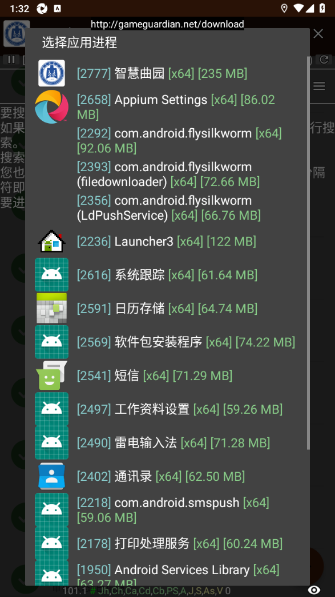
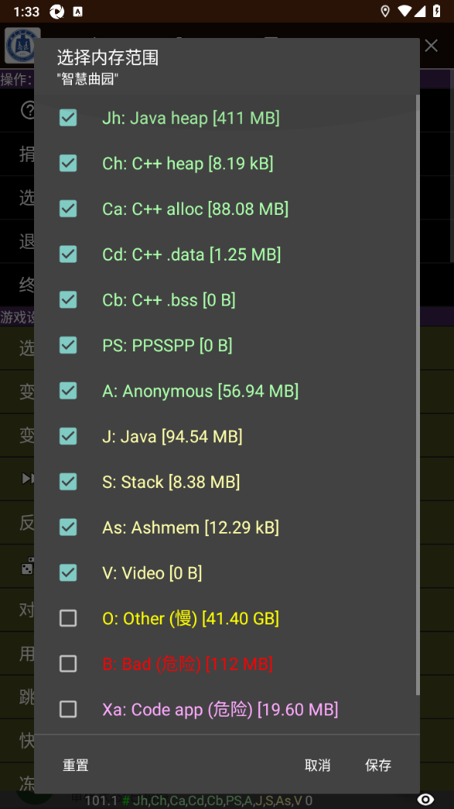
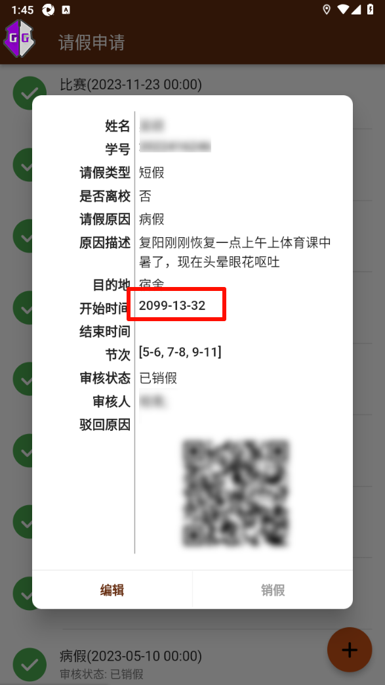

# 研究背景

首先，我知道你曾经用过 P 图软件对假条截图进行修改，但是你好像发现，始终找不到与修改后的与原来的假条字体完全匹配的方法，本教程旨在通过 <span style="color:#FF0000;"> 程序内存 </span> 进行修改，实现 <span style="color:#FF0000;"> 无损替换文字 </span>。

<span style="border:1px solid #00FF00; color:#00FF00;"> 首先，请认真阅读本文文末的 [免责声明](#免责声明) </span>

# 必备工具

1. 雷电模拟器
2. 智慧曲园
3. GameGuardian 修改器

雷电模拟器下载地址 https://www.ldmnq.com/

GameGuardian 修改器下载地址 https://dmod.3dmgame.com/mod/Download/196410

# 具体操作

## 打开工具

1. 打开 GG 修改器（software 版本的）点击开始
2. 打开智慧曲园转到假条界面，如图


3. 打开修改器选择智慧曲园



4. 选择内存范围

   

   5. video 往上全部勾选（具体是作用在哪个空间我还没测试出来，所以全部勾选）

      

      保存之后开始搜索

      6. 找到一个你想改的假条，尽量改好改的

      
      
      6. 搜索类型选择 `文本 UTF16LE` 类型或者 `文本 UTF8`，哪个可以就用哪个
      
      
      
      7. 这里以修改时间为例
      
      
      
      修改为你想改的时间
      
      
      
      
      
      时间修改成功
      
      8. 审核状态也是一个道理，但是需要注意的是，<span style="color:#FF0000;"> 修改后的文本长度不能超过原来的文本长度 </span>，所以是 <span style="color:#FF0000;"> 已销假只能改成审核通，而不是审核通过 </span>
      9. 正因如此，我们选择的假条应是以前请过的 <span style="color:#FF0000;"> 全天假条 </span>，且 <span style="color:#FF0000;"> 未销假的假条 </span>
      
      

# 看看成品


# 进阶修改

无损改了文字之后，可能有人就要问了，二维码怎么办

这里继续讲一下二维码的模拟原理。

随便找个正常的假条扫一下，复制链接打开后发现，链接是未加密状态

```html

<!DOCTYPE html>
<html lang="zh-CN">
<head>
    <meta charset="utf-8">
    <meta http-equiv="X-UA-Compatible" content="IE=edge">
    <meta name="viewport" content="width=device-width, initial-scale=1">
    <link href="/assets/bootstrap-3.3.7/css/bootstrap.min.css" rel="stylesheet">
    <!-- HTML5 shim 和 Respond.js 是为了让 IE8 支持 HTML5 元素和媒体查询（media queries）功能 -->
    <!-- 警告：通过 file:// 协议（就是直接将 html 页面拖拽到浏览器中）访问页面时 Respond.js 不起作用 -->
    <!--[if lt IE 9]>
    <script src="/assets/html5shiv.min.js"></script>
    <script src="/assets/respond.min.js"></script>
    <![endif]-->
    <style>
        h3 {
            color: #333;
        }
        table {
            width:90vw;
            /* border-left:#C8B9AE solid 1px;
            border-top:#C8B9AE solid 1px; */
            /* border: #dad3d2 solid 1px; */
            border: #e3e3e3 solid 1px;
            box-shadow: 5px 5px 16px #c7c5c5;
            margin: 0 auto;
            border-collapse:collapse;
            text-align: center;
        }

        /* table thead tr th {
            padding: 5px 20px;
            background-color: blue;
            font-weight: 400;
            color: #fff;
            border-right:#C8B9AE solid 1px;
            border-bottom:#C8B9AE solid 1px;
        } */

        table tbody tr td {
            /*padding: 5px 20px;*/
            /*border-top: 1px solid blue;*/
            /* border-right:#C8B9AE solid 1px;
            border-bottom:#C8B9AE solid 1px; */
            /* padding:10px 10px 6px; */
            padding: 1vh 2vw;
        }
        table tbody tr th {
            width: 20vw;
            color: #212121;
            padding: 1vh 2vw;
        }

        table tbody tr:nth-child(2n) td {
            /* background-color: lightblue; */
            background-color: rgb(245 240 240);
            /* border-right:#C8B9AE solid 1px;
            border-bottom:#C8B9AE solid 1px; */
            /* padding:10px 10px 6px; */
        }
        table tbody tr:nth-child(2n) th {
            background-color: rgb(233, 224, 224) ;
        }


        table tbody tr:last-child td {
            /* border-right:#C8B9AE solid 1px;
            border-bottom:#C8B9AE solid 1px; */
            /* padding:10px 10px 6px; */
        }
    </style>
</head>
<body>
<table rules="all">
    <caption><h3 style="text-align: center">智慧曲园学生假条</h3></caption>
    <!--对表格中的列进行组合，以便对其进行格式化-->
    <colgroup>
        <col span="2" >
<!--        <col style="background-color:yellow">-->
    </colgroup>

    <!--表格主体分组-->
    <tbody>
    <tr>
        <th>请假人</th>
        <td>XX</td>
    </tr>
    <tr>
        <th>学号</th>
        <td>2022XXXXXX</td>
    </tr>
    <tr>
        <th>请假类型</th>
        <td>短假</td>
    </tr>
    <tr>
        <th>是否离校</th>
        <td>false</td>
    </tr>
    <tr>
        <th>请假原因</th>
        <td>病假</td>
    </tr>
    <tr>
        <th>原因描述</th>
        <td>复阳刚刚恢复一点上午上体育课中暑了，现在头晕眼花呕吐</td>
    </tr>
    <tr>
        <th>目的地</th>
        <td>宿舍</td>
    </tr>
    <tr>
        <th>开始时间</th>
        <td>2023-06-01</td>
    </tr>
    <tr>
        <th>结束时间</th>
        <td></td>
    </tr>
    <tr>
        <th>节次</th>
        <td>5-6 7-8 9-11 </td>
    </tr>
    <tr>
        <th>审核状态</th>
        <td>已销假</td>
    </tr>
    <tr>
        <th>审核老师姓名</th>
        <td>XX; </td>
    </tr>
    </tbody>
</table>


<script type="application/javascript" src="/assets/jquery-1.12.4.js"></script>
<script type="application/javascript" src="/assets/bootstrap-3.3.7/js/bootstrap.min.js"></script>
<script type="application/javascript">

</script>
</body>
</html>
```

通过HTML代审发现，这就是一个纯前端代码，把里面的关键信息改了之后，再上传到自己的服务器上（静态页面生成服务也可以实现比如GitHub pages，Gitee pages等），模拟一下文件名

然后把模拟之后的链接生成二维码贴到假条上

扫一下看看效果


# 免责声明

本教程旨在提供技术交流目的。使用本教程中的信息和示例所造成的任何行为或后果由使用者自行承担责任。

本教程提供的是模拟学校请假条的示例，仅供参考和学习之用。任何使用本教程生成的虚拟请假条与真实情况无关，不得用于实际学校或其他机构。请在实际情况下遵循相应机构的规章制度和规定。

作者和相关团队力求确保本教程提供的信息准确可靠，但不保证信息的绝对准确性和完整性。使用者应审慎对待并自行承担使用本教程信息可能带来的风险。

本教程作者不对因使用本教程而引发的任何直接或间接损失或损害承担责任，包括但不限于任何利润损失、数据丢失或业务中断。

使用本教程即表示您同意遵守此免责声明。如果您不同意此免责声明，请不要使用本教程提供的信息和示例。

