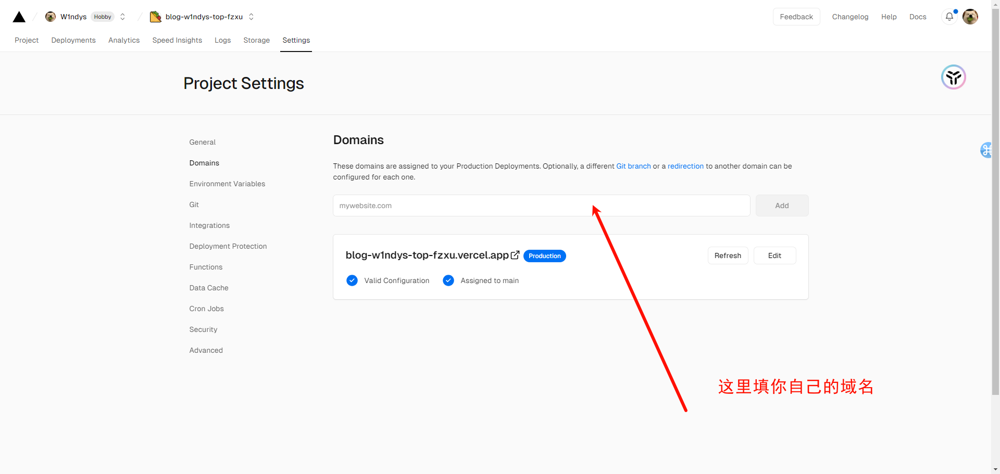
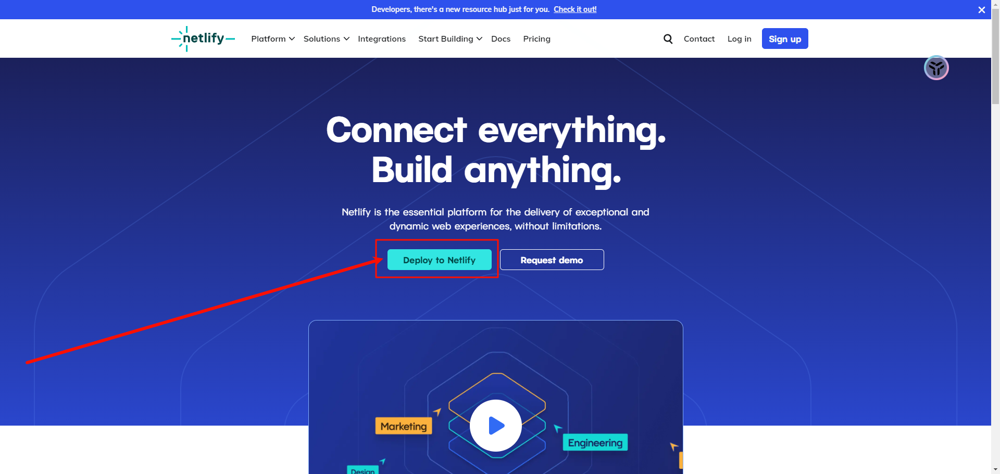
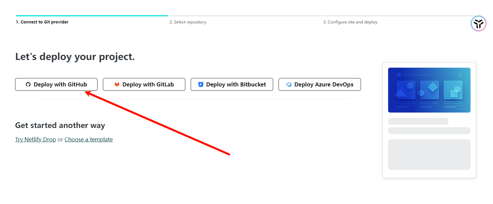
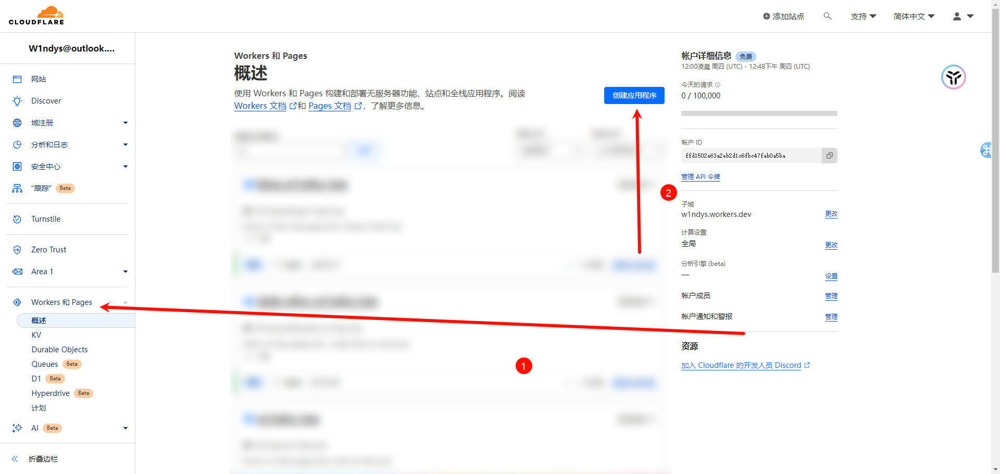

# 使用 Netlify，cloudflare pages，GitHub pages , Vercel 部署你的 Hexo

Hexo 博客，在我从一开始的 GitHub pages 转到 Netlify，如今又搭建了 cloudflare，但万变不离其宗，我们没有服务器，没有经济实力支持服务器，于是选择静态部署平台，pages 给我们提供了很好的平台途径，我也是踩了不少的坑，下面将从 Netlify，cloudflare 讲解如何部署。

首先说明一下用这个方法的好处：

1. Hexo 源码基于 Github 仓库构建
2. 源码文件全部云端存储
3. 多设备无缝衔接同步编辑
4. 四端站点，择优部署
5. 部署方法基本一致，一通三通

> 前排提醒
>
> 1. 本教程适合有 Hexo 搭建基础搭建经验的大佬
> 2. 本教程适合有 GitHub 仓库创建经验的大佬
> 3. 本教程适合知道如何解决 GitHub 仓库连接问题的大佬（科学上网）
> 4. 本教程适合有耐心，知道看完文档再问问题的用户
> 5. 如果没了解过 Hexo，没有搭建经验，请移步糖果屋大佬的 [Hexo 部署教程](https://akilar.top/posts/6ef63e2d/#/)

## 前期准备

首先在 GitHub 开一个 repo，用来存放你的 Hexo 源码，名字随便填（即有\_config.yml 文件的目录内所有文件）

比如我的（[已开源](https://github.com/W1ndys/blog.w1ndys.top#/)）：

## GitHub pages

这个我就不提了，用过 Hexo 的基本都是从 GitHub pages 起步的

## 如何在 Vercel 部署

进入 [Vercel 官网](https://vercel.com/)

> 如果进不去，请用魔法

用 Github 登陆

点击 new project

选择你的 Github 存储库，点击 import 导入

Vercel 给出了 Hexo 模板，直接默认即可，点击 deploy

等待部署完毕即可，这里可以看日志，部署完毕之后就会自动跳转，一般日志里出现绿色的 `info` 就基本没什么问题了

成功之后会出现庆祝特效，点击去面板

三个按钮

之后点击 add 添加域名

在你的域名后台添加 CNAME 记录，记录值为 name-china.vercel-dns.com

等待部署即可

## 如何在 Netlify 部署

进入 [Netlify 官网](https://www.netlify.com/)

点击中间的 `Deploy to Netlify`

选择 `用GitHub登陆`

授权之后找到 `添加新站点`，再点击 `导入存在的项目` 由于这里我已经添加过了，界面可能和你的不一样

选择 GitHub

选择你的 repo，这里以我的为例

下面按照我的参数填

- `site name` 填你的站点地址，假设你填了 xxx，你的站点就是 **xxx.netlify.app**
- `branch to deploy` 就是你的 Github 分支，一般默认是 **main**
- `base directory` 空着
- `build command` 填 **默认（npm run build）** 的就可以，不要修改
- `publish directory` 同上（**public**）

完成之后点击绿色的按钮 **deploy**

等待 **building**

状态为 `published` 之后就部署完成了

点进去看一下，如果你的博客资源比较多的话，首次加载可能比较慢，此处可以挂个科学上网

## 如何在 cloudflare 上部署

进入 [cloudflare pages 官网](https://www.cloudflare-cn.com/)

右上角登陆，登陆之后

点击左侧的 pages，然后点击 `创建应用程序`

点击 pages，然后连接到 Git，选择你的 Github 仓库

`项目名称` 自定义

`构建命令`：npm run build

`输出目录`：public

点击构建等待构建即可，步骤与前两个基本类似

当然这个也支持自定义域名

## 如何在 Render 上部署

这里先不写了，基本都是一个样的跟之前的

Render 官网：[https://dashboard.render.com/](https://dashboard.render.com/)

---

现在你有四个博客站点了，可以设置一个主站，另外俩当做镜像站

比如我的

- 主站：[https://blog.w1ndys.top/](https://blog.w1ndys.top/)
- Vercel 镜像站：[https://v.blog.w1ndys.top/](https://v.blog.w1ndys.top/)
- Netlify 镜像站：[https://n.blog.w1ndys.top/](https://n.blog.w1ndys.top/)
- cloudflare 镜像站：[https://c.blog.w1ndys.top/](https://c.blog.w1ndys.top/)
- Render 镜像站：[https://r.blog.w1ndys.top/](https://r.blog.w1ndys.top/)
