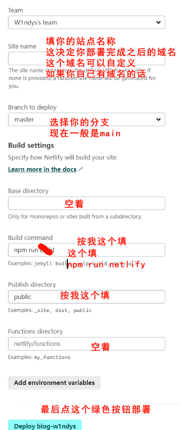
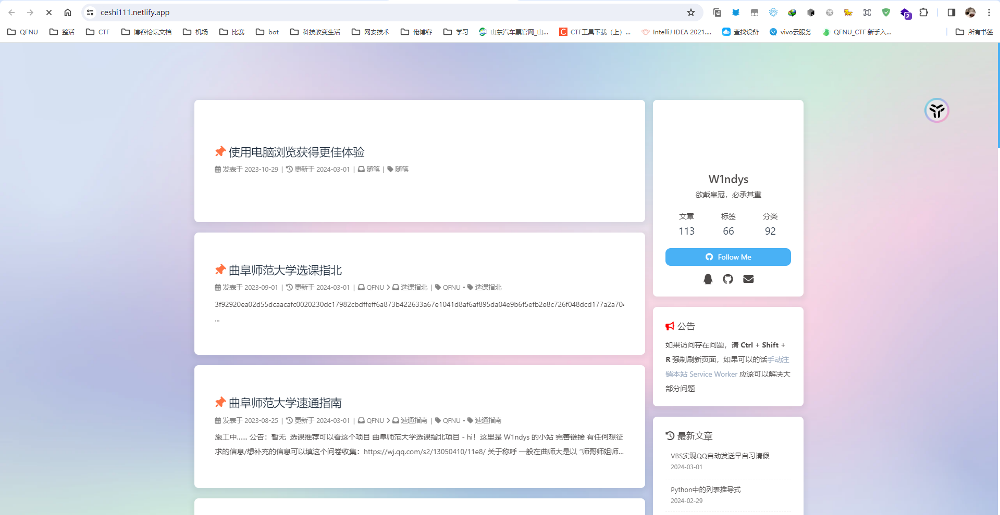

# 使用 Netlify，cloudflare pages，GitHub pages , Vercel 为你的博客配置多端镜像站

Hexo 博客，在我从一开始的 GitHub pages 转到 Netlify，如今又搭建了 cloudflare，但万变不离其宗，我们没有服务器，没有经济实力支持服务器，于是选择静态部署平台，pages 给我们提供了很好的平台途径，我也是踩了不少的坑，下面将从 Netlify，cloudflare 讲解如何部署。

> 前排提醒
>
> 1. 本教程适合有 Hexo 搭建基础搭建经验的大佬
> 2. 本教程适合有 GitHub 仓库创建经验的大佬
> 3. 本教程适合知道如何解决 GitHub 仓库连接问题的大佬（科学上网）
> 4. 本教程适合有耐心，知道看完文档再问问题的用户
> 5. 如果没了解过 Hexo，没有搭建经验，请移步糖果屋大佬的 [Hexo 部署教程](https://akilar.top/posts/6ef63e2d/#/)

## 前期准备

首先在 GitHub 开一个 repo，用来存放你的 Hexo 源码，名字随便填（即有_config.yml 文件的目录内所有文件）

比如我的（[已开源](https://github.com/W1ndys/blog/)）：


## GitHub pages

这个我就不提了，用过 Hexo 的基本都是从 GitHub pages 起步的

## 如何在 Netlify 部署

首先在你的 Hexo 源码文件里找到 `package.json`

把下面代码加入到 `script`

```json
"netlify": "npm run clean && npm run build", 
```

加入后应该是类似长这样

```json
"scripts": {
    "build": "hexo generate",
    "clean": "hexo clean",
    "server": "hexo server",
    "netlify": "npm run clean && npm run build",   //这是添加进去的
    "cloudflare": "npm run clean && npm run build",   //下面这俩不用管，这是在其他平台的部署命令，实际上用一个就行，我是为了规范，区分开来
    "vercel": "npm run clean && npm run build"
  },
```

进入 [Netlify 官网](https://www.netlify.com/)

点击中间的 `Deploy to Netlify`


选择 `用GitHub登陆`


授权之后找到 `添加新站点`，再点击 `导入存在的项目` 由于这里我已经添加过了，界面可能和你的不一样


选择 GitHub


选择你的 repo，这里以我的为例


下面按照我的参数填

注意在 `build command` 的参数是 `npm run netlify`，我截图的时候忘记改了



等待 building


状态为 `published` 之后就部署完成了


点进去看一下，如果你的博客资源比较多的话，首次加载可能比较慢，此处可以挂个科学上网



## 如何在 cloudflare 上部署
