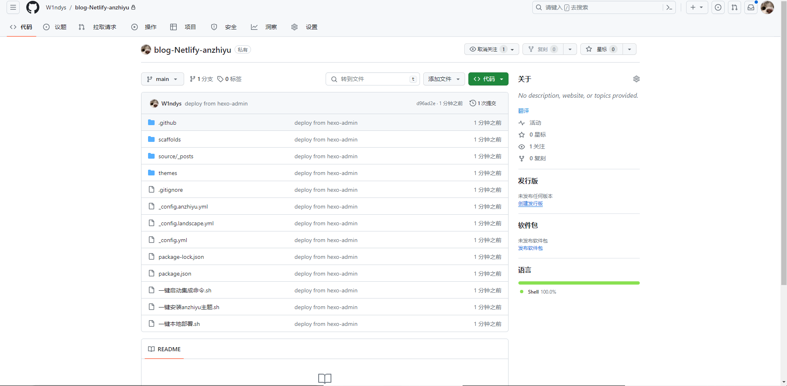

# 使用 Hexo + GitHub + Netlify + Cloudflare 提高博客的访问速度

今天也是看大佬的教程改了自己的配置发现访问速度确实快了许多，遂自己写一份教程加深一些理解。

> 大佬的教程：https://blog.grin.cool/blog/hexo-blog#/

> 注意本教程不适合纯 Hexo 小白（其实只要略微了解过一丢丢 hexo 的就能看懂这篇教程），适合前期有过 GitHub pages 建立经验的进阶用户
>
> 食用本教程若有进不去网站等情况请检查你的代理或者开魔法再进


> 食用本教程请确保
>
> 1. 使用过 Hexo 等博客框架，略微了解使用方法
> 2. 了解 GitHub，Git 的一些基本操作
> 3. 了解 [《提问的智慧》](https://w1ndys.top/posts/fb3832f5.html) 以及 [《如何像一个弱智一样提问》](https://blog.arisa.moe/blog/2022/220428-how-to-ask-questions-like-a-retard/#/)
> 4. 在没有错误日志下诊断问题无异于闭眼开车

首先，本教程相对于 GitHub pages 的优势

1. 本方法不再局限于只有一个仓库可以生成静态页面
2. 国内访问速度飞快
3. 每月有 100G 流量带宽额度，300 分钟的构建时间，对于个人博客记录来讲完全够用甚至还余下很多
3. 静态页面生成速度高于 GitHub pages 至少一倍
3. Netlify可以启用免费的 TLS 证书,启用 HTTPS

<br/>

用久了 GitHub pages 发现，在国内的访问速度确实是有点慢，这是因为 GitHub pages 的服务器是在国外，所以在国内访问慢是正常的

这个方法 <span style="color:#FF0000;"> 不需要云服务器，不需要备案，全部免费 </span>

也是看到了某大佬的博客才用这种方法 0 成本（时间成本不计入）提高博客访问速度

需要注意的是，本方法与原先的 GitHub pages 部署方法并不同

> GitHub pages 是本地编译然后把编译好的前端页面推送到 GitHub repo
>
> 这里采用的改进方法是直接把 hexo 源码推送到 GitHub repo，用 Netlify 进行自动编译

这里的好处就是

1. 不占用原来的 github.io 域名，也就是说这两个可以共存
2. 源码直接在 GitHub repo 仓库里，不用担心数据丢失
3. 如果换了电脑，可以直接从 GitHub 拉取源码在进行操作

废话不多说直接开始操作

## 准备魔法工具（如已有可绕过）

### 工具介绍

<font color="#FF3333"> 这些你都不需要记，看看就行 </font>

- 虚拟专用网络(Virtual Private Network，VPN)是专用网络的延伸，它包含了类似 Internet 的共享或公共网络链接。通过 VPN 可以以模拟点对点专用链接的方式通过共享或公共网络在两台计算机之间发送数据。

- 如果说得再通俗一点，VPN 实际上是 "线路中的线路"，类型于城市大道上的 "公交专用线"，所不同的是，由 VPN 组成的 "线路" 并不是物理存在的，而是通过技术手段模拟出来，即是 "虚拟" 的。不过，这种虚拟的专用网络技术却可以在一条公用线路中为两台计算机建立一个逻辑上的专用 "通道"，它具有良好的保密和不受干扰性，使双方能进行自由而安全的点对点连接，因此被网络管理员们非常广泛地关注着。

- 通过虚拟专用网，我们在家就可以轻松安全的登录到公司的内部网络上，这样可以实现我们在家办公的梦想了。

### 账号注册

有了这个工具，你不只是能进 ai，还可以高速浏览 GitHub 等网站，以及............

点击下方任意链接跳转注册界面↓（有进不去的换一个）

<span style="font-size:1.3em;"> [链接 1](https://sakuracat.shop/user/#/register?code=Fo7cS2WA)          [链接 2](https://sakuracat-cdn02.com/user/#/register?code=Fo7cS2WA)             [链接 3](https://sakuracat-cdn01.com/user/#/register?code=Fo7cS2WA)          [链接 4](https://sakuracat-004.com/user/#/register?code=Fo7cS2WA)          [链接 5](https://sakuracat-003.com/user/#/register?code=Fo7cS2WA)         [链接 6](https://sakuracat-b.com/user/#/register?code=Fo7cS2WA)          [链接 7](https://sakuracat-a.com/user/#/register?code=Fo7cS2WA) </span>

输入邮箱密码注册账号，注册完成后登陆


然后点击左侧购买订阅


根据需求选择你合适的方案，如果你只是想尝鲜的话，毫无疑问，选最便宜的，能用就行


我本人用的是 <font color="#FF0000"> 38.8 巨量不限时，推荐这个 </font>，大约可以用 2 年左右，平均下来大约 0.6/天，而且是实打实的买多少用多少，不会出现超时浪费

买完之后点击左上方仪表盘可以看到你的已订阅


然后点击仪表盘下方的使用文档


选择你的系统安装客户端

安装完之后登陆客户端就可以看到这样


### 连接节点

目前为止已经基本结束了，点击连接，点进去选个绿色的节点，点全局，<font color="#FF0000"> 如果后续出现连接失败就换个节点 </font>


## GitHub 操作

首先进入 [GitHub](https://github.com/) 建立一个空仓库

这里仓库名随便写就行，不再被 github.io 限制

我这里以 blog-Netlify-anzhiyu 为例，公有私有都行，你不想公开源码的话就私有


直接 git clone 刚刚那个 repo

```
git clone 你的仓库地址
```

然后在目录下初始化 hexo，由于不是新手向教程，这里不过多赘述

> 有关于 hexo 的安装可以看这位大佬的博客 https://akilar.top/posts/6ef63e2d/#/

初始化完成之后，安装你想安装的 hexo 主题，我这里以 anzhiyu 主题为例

下面是可供参考的 shell 脚本    **一键安装 anzhiyu 主题.sh**

```shell
printf "\033[32mINFO \033[0m 正在安装主题...\n"
npm install hexo-theme-anzhiyu
printf "\033[32mINFO \033[0m 主题安装完成\n"

printf "\033[32mINFO \033[0m 正在安装依赖...\n"
npm install hexo-renderer-pug hexo-renderer-stylus --save
printf "\033[32mINFO \033[0m 依赖安装完成\n"

printf "\033[32mINFO \033[0m 正在停顿10s可供查看情况！无异常可Ctrl+C退出\n"
sleep 10s
```

主题安装完成后别忘了在你的_config.yml 文件里改掉主题，并且复制主题配置到博客根目录

>  _config.anzhiyu.yml
>  _config.yml
>
>  就是这俩文件

然后改一下 package.json 里面 script 的内容，涉及到后面的参数填写

```
// package.json
"scripts": {
  "build": "hexo generate",
  "clean": "hexo clean",
  "server": "hexo server",
  "netlify": "npm run clean && npm run build"
}
```

然后就可以推送到仓库了

```
git add .
git commit -m "deploy from hexo-admin"
git push
```

可以用 Hexo 命令在本地部署一下看看有没有 bug

```shell
hexo clean
hexo generate
hexo s
```

刷新一下看看有没有推送上去



至此 GitHub 上的操作就告一段落了，继续往下走

## Netlify 操作

来到 [Netlify 官网](https://app.netlify.com/)


直接以 GitHub 注册便于导入仓库，然后点击继续，等待重定向


然后点击左侧的 site，再点击 new site

然后点击 Import an existing project

然后 Deploywith GitHub


然后找到刚刚创建的 repo

配置就按照我这个来写，注意分支，如果你是 master 填 master，如果你是 main 就填 main


然后点击 deploy

创建完成之后就可以访问了


如果空白或者是啥也没有，请检查主题配置，一般是主题配置问题


点击左侧的 domain 可以配置域名


点击 add 可以添加自己的域名，点击右侧红框里可以自定义 Netlify 里的子域名

## 配置域名以及 cloudflare 的 DNS 配置

从第四步开始就需要域名了，没有自己私人域名的可以不用看了

这里以阿里云域名控制台为例

首先进控制台 CNAME 指向 Netlify 的域名


然后进入 [cloudflare 官网](https://www.cloudflare-cn.com/)


添加站点，把你自己的域名填上，注意不要带 www.，填纯域名

比如 www.w1ndys.top 只填 w1ndys.top 就可以

填写之后会看到让你改 DNS 服务器，我这里已经改过了


这里就去控制台把域名的 DNS 服务器改掉就可以了

修改之后会等待一段时间审查，一般十分钟左右，但不会超过 24 小时

审核完之后如图 


然后我们进入到 DNS 记录


这里就根据你自己的域名，改成形如我这样的就可以了


到这里已经结束了。

等待一段时间，访问你自己的域名试试

---

如有疑问欢迎邮箱私信我 ： w1ndys@outlook.com
