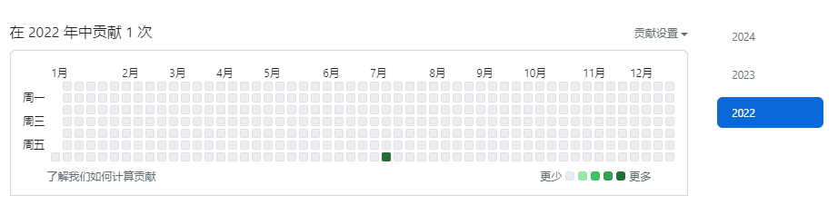
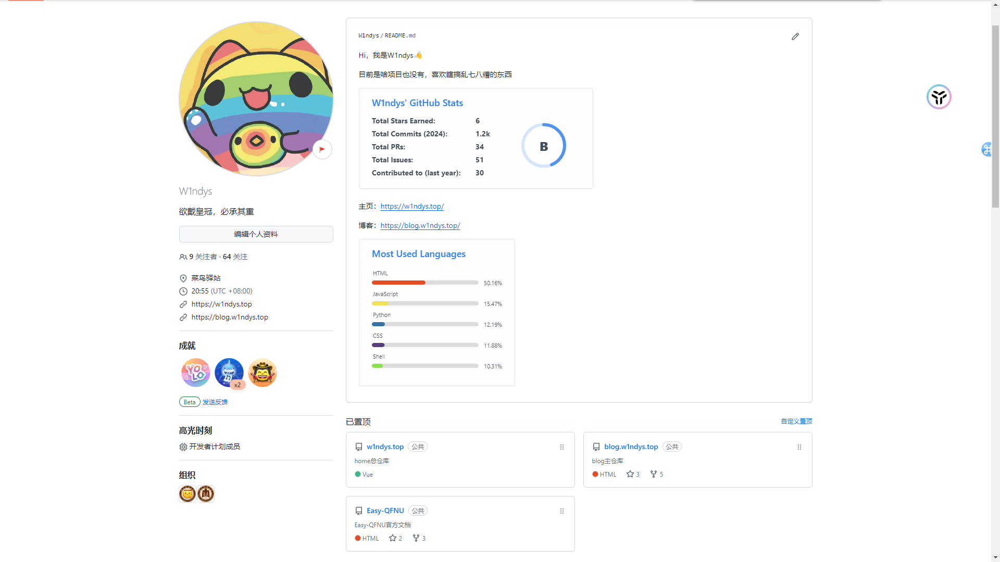

# 回忆我的 Github

今天晚上突然想整顿一下自己的 Github pages，把以前的博客清算一下，不知怎么的就开始回忆了，给 Github 写了一大段小作文。

用 Github Pages 搭建博客已经有一段时间了，一共写了 120 多篇文章，其中有些是技术文章，有些是生活感悟，也有些是随笔。

也记录了选课指北和速通指南，起初这些只是一个普通的 README，后来开发了 2.0 版本，并且改名为 [Easy-QFNU](https://ezqfnu.w1ndys.top/)，已经成为一个正式的文档站。

从最开始的看教程搭建博客，搞了三整天，还跟我妈咪炫耀，说我做了一个网站（实际上也是 **搬运工** 吧），到现在写过无数脚本（什么你写的，实际上都是 **ChatGPT** 写的吧）来提高工作效率，也实现了源码+静态页面同时备份，实现多端同步，也有了很多收获，也有很多想法。**还帮我的同学，教同学搭建了自己的 Hexo 博客**

在这期间，我对 Github 也有了更深的了解

## 2022/2023 年 Github 生涯

为什么我要把 22 年和 23 年放在一起说呢，因为我这两年时间还不如 24 年三天的活动多。没啥好回忆的。

回望过去，2022 年 7 月 16 日，我第一次加入 Github, 那时候还是个小白，啥也不懂，也不懂什么是源代码托管。

2023 年 07 月 03 日，我创建了我的第一个 repo，那时候还不是代码，我只是写了一个 README，用来收集常用的网站。

2023 年 07 月 22 日我发出了我的第一个 [issues](https://github.com/goldze/Anti-Android-KM/issues/7)，没想到那竟然是与安卓逆向相关的，我已经没有任何印象了。

2023 年 07 月 28 日，创建了算是自己的第一个代码仓库，是我写的用 C++演奏音乐，演奏的 [犁牛之子歌](https://github.com/W1ndys/QFNU_music)，当时还给校新媒体的师姐沟通，发到曲师大官方抖音了，看的人其实也不多， 毕竟也不是什么能吸引人的东西 。

2023 年 09 月 11 日，在 fluid 仓库里发了一个 [issues](https://github.com/fluid-dev/hexo-theme-fluid/issues/1003#/)，那应该是我真正了解什么是 issues 之后的第一个 issues。

2023 年 12 月 03 日，我开始尝试使用 ChatGPT 写脚本来提高我的日常工作效率，生成了第一个脚本，[九宫格切图](https://github.com/W1ndys/1to9-image)，并开源到了 Github。

2023 年 12 月 10 日，我在统计表格的时候突发奇想，既然我做的都是机械化的工作，能不能用脚本来提高效率，于是我上传了我第二个脚本，[Excel 日期更新](https://github.com/W1ndys/Excel-date-update/)。

我 2023 年的 Github 生涯已经基本接近尾声了。

## 2024 年 Github 生涯

  1314次，还挺浪漫的

真正让我对 Github 了解程度突飞猛进的时间是 2023-2024 年的寒假。因为我本来就打算换博客主题了，但是没想到两个主题的依赖有冲突，这让我不得不删库，重新建立博客，于是我又重新开始了我的博客之旅。从安装 Hexo 到配置主题，到部署，再到域名绑定，到评论系统的切换，到网站的镜像备份，我花了大量的时间，部署完毕之后还有一大堆 bug 要修。就因为这个我整整一个月都在搞博客。

因此还对 `VScode、Typora、Git、Markdown、Github、Hexo、HTML、CSS、JavaScript` 等等都有了更深入的了解。

还记得大一刚来的时候，舍友问我 zx（某挺好的教育系统） 支不支持 Markdown，那时候我连 Markdown 是什么都不知道，根本就没听说过，但是现在我已经每天都离不开 Markdown 了，写博客，做 Easy-QFNU，全是 Markdown 和 HTML，跟吃饭一样，比吃饭还勤快，我吃饭还有时候会忘了呢。

2024 年 03 月 04 日，我学会了 Pull Request，第一次给公开仓库发起了 PR，还记得当时我还不知道什么是 PR，就像现在一样，我已经习惯了。

2024 年 04 月 03 日，第一次成功的 Pull Request，给探姬的[Hello-CTF](https://github.com/ProbiusOfficial/Hello-CTF)提交了两个 Pull Request，一个因为效果适配性不太好，[另一个](https://github.com/ProbiusOfficial/Hello-CTF/pull/104)还行，被合并了

2024 年 04 月 06 日，创建了两个 Github 组织，一个是[QFNU](https://github.com/QFNU-Archives)，致力于收集 QFNU 的优秀 repo，一个是[Easy-QFNU](https://github.com/Easy-QFNU)，致力于维护 Easy-QFNU 文档站。

此外我还获得了几个成就，看起来还蛮好看的，还学会了调用 API 美化自己的 Github 主页，蛮不错的

到此也基本结束了

2024 年也就这么多，等 25 年看看我整个 24 年会 commit 多少次吧。(目前最多的是我在维护 Easy-QFNU，在正式发布之前，截止到现在就已经 500+ commits 了)

硕神，继续努力啊！

别忘了你的[关于](/about/)页面是怎么写的

END
