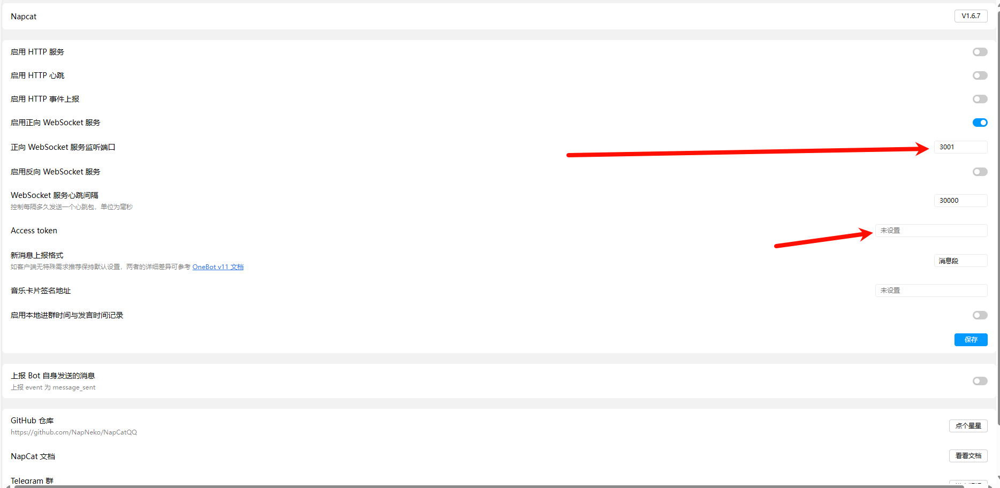

## 开发背景

> 也是我与 QQbot 之间的羁绊吧，作者的一些碎碎念

久违了啊，老友，说不出的感觉涌上心头 😇

还记得那会是初中，忘了上几年级了，大概在 17 年左右认识了酷 Q，只能用别人的插件不会自己开发功能，学了一段时间苦于环境不会配置放弃了，后来 18，19 年左右认识了 QRspeed（-dic），基于关键词的词库程序，看着语法文档自己写出来一套（大概 4000 行左右吧）自己用的源码（严格来说应该叫词库称不上是源码），这是我第一次自己写自己想要的功能。但苦于 qrspeed 词库算不上真正的编程语言，所以一直拿不出手。后来因为寄宿学校，版本更新很快，逐渐跟不上了语法的变化了。

后来，晨风机器人作者喝茶，酷 Q 关站，qrspeed 也停运，受 tx 打压 QQ 机器人几乎死路一条。高中了解到 nonebot2，环境不会搭，放弃了上大学之后了解到 mirai，这是我第三个用了很久一段时间的机器人框架，可惜的是，我认识他的时候他就已经到寒冬了，随处可见的 code = 45，封过 n 次的 QQ 号.....不过我依旧想自己开发自己想要的功能，由于 mirai 基于 kotlin，学了一段时间 kotlin 没学会，环境也没搭好，又放弃了，还因此认识了小白师傅。（电脑也因此中了一次蠕虫）

大二，认识了 koishi 和 napcatQQ，一开始不懂 Websocket 协议，也没深入了解 napcatQQ 的工作原理，仍然是只会安装别人写好的 koishi 插件，奈何我 2c2g 的服务器跑 koishi 很慢，基于 TypeScript 的 koishi，本来打算这次暑假学一学自己开发 TS 插件。

但是，今天忽然想起来先前 Liu 提到过一次基于 Python 和 napcatQQ 的，他已经实现了，我也可以试试，看看套神 mumuzi 的博客基于 http 协议处理消息，借助 ChatGPT 实现了和他完全不一样的 WebSocket 协议，搞了整整一下午一个晚上，基本实现了敏感词监控，禁言解禁，撤回等功能。（github.com/W1ndys/bot）感觉还是 ChatGPT 牛逼，我一个从来没听说过 Python 异步的小白都能写出来想要的功能。

真正的编程语言实现，真正方便的环境搭建一切都得益于开箱即用的 Python 和万能的 ChatGPT 四年，终于找到当年的感觉了。

## 基础准备

1. 安装环境：[NapCatQQ (napneko.github.io)](https://napneko.github.io/zh-CN/)

   我这里基于 Linux 服务器运行的机器人，所以下面环境几乎都是基于 Linux 命令行的，如果你用 Windows 的话，应该也能看懂，Windows 图形化比 Linux 命令行简单一些

2. 对于 Linux 服务器来说，你需要拥有一个公网 IP，可以在腾讯云或者阿里云购买一个 win 服务器或者 linux 服务器，我用的是在阿里云的 2c2g 的 Ubuntu

3. 我默认你阅读过提问的智慧、有基本的 Linux 操作系统经验、有对 Github 基本的认识、有 pip 安装的基础，不会可以问我

### 安装运行环境

请仔细阅读 [NapCatQQ (napneko.github.io)](https://napneko.github.io/zh-CN/)，写的已经很详细了

这里详细说一下一些细节

#### 安装 QQ

安装必要的依赖

```bash
sudo apt install libgbm1 libasound2
```

进入 [NapCatQQ 文档](https://napneko.github.io/zh-CN/guide/version)，文档提供了可用的 LinuxQQ 的下载

这里以 `linuxqq_3.2.7-23361_amd64.deb` 为例

下载安装包

```bash
wget https://dldir1.qq.com/qqfile/qq/QQNT/8b4fdf81/linuxqq_3.2.7-23361_amd64.deb
```

下载完成后给予权限并运行安装

```bash
chmod +x linuxqq_3.2.7-23361_amd64.deb
sudo apt install./linuxqq_3.2.7-23361_amd64.deb -y
```

#### 安装 NapCatQQ

下载地址: https://github.com/NapNeko/NapCatQQ/releases

由于服务器对于 Github 的连接性不稳定，魔法也不好开，建议在本机下载之后上传到服务器

#### 启动 NatCatQQ

在 `NapCat.linux.x64` 目录下能看到 `napcat.sh` 文件，添加权限并启动

```bash
chmod u+x ./napcat.sh
./napcat.sh
```

此时让扫码登录，用手机 QQ 登录上提前准备好的 QQ 小号，上号之后扫描二维码，推荐扫描保存到本地的二维码

#### 后续启动该 QQ

使用-q 重新登录即可无需扫码，例如 `napcat.sh -q 1234567`

#### 配置通信连接

安全组放行 `6099` 端口

访问你的 `http://IP:6099/webui/login.html`，token 密码可在 `./config/webui.json` 下找到

进入后到以下界面

我是基于 `正向 WebSocket 协议`（以下简称 `ws、ws协议`） 进行通信，你也可以选择基于 `http 协议` 进行通信

**这一步至关重要，这决定了以后脚本的书写方法的实现**

> 有关于 `http 协议` 的通信实现，可以看套神的博客 [使用 NapCatQQ 搭建 QQ 机器人 | mumuzi 的 blog (mumuzi7179.github.io)](https://mumuzi7179.github.io/docs/Blog/QQBot/使用NapCatQQ搭建QQBot)



这里我设置的 3001 端口，可以自定义，只要是不冲突的即可，如果你是在内网的话，可以不设置 AsscessToken，可以留空（但是不要在安全组开放这个端口），如果你是公网通过外部公网进行通信，安全起见一定要设置 AccessToken，这样别人就无法直接访问你的机器人了，需要通过你的 AccessToken 才可以访问。

## 实现功能

我自己用的机器人的所有代码都开源在 [W1ndys/W1ndys_QQ_Bot: 基于 Python 和 NapcatQQ 的 QQ 机器人 (github.com)](https://github.com/W1ndys/W1ndys_QQ_Bot#/)，可以参考更方便理解

### API 接口

NapCatQQ 实现了 [OneBot 11](https://11.onebot.dev/) 以及 [go-cqhttp](https://docs.go-cqhttp.org/api) 的大部分 API，可以直接点击查看 API，详细可查看 https://napneko.github.io/zh-CN/develop/api

### 测试消息发送

假设小号与大号创建了一个群聊，这里测试的是群聊中是否出现指定字符串，出现则发送一条消息，以“测试”和“测试成功”为例

```Python
import json
import logging
import asyncio
import websockets
import re
import colorlog

# 全局配置
global owner, ws_url, token

owner = [123456789]  # 机器人管理员 QQ 号
ws_url = "ws://127.0.0.1:3001"  # napcatQQ 监听的 WebSocket API 地址
token = None  # 如果需要认证，请填写认证 token

# 日志等级配置
handler = colorlog.StreamHandler()
handler.setFormatter(
    colorlog.ColoredFormatter(
        "%(log_color)s%(levelname)s:%(name)s:%(message)s",
        log_colors={
            "DEBUG": "cyan",
            "INFO": "green",
            "WARNING": "yellow",
            "ERROR": "red",
            "CRITICAL": "red,bg_white",
        },
    )
)
logging.basicConfig(level=logging.DEBUG, handlers=[handler])

# 连接到 QQ 机器人
async def connect_to_bot():
    logging.info("正在连接到机器人...")
    async with websockets.connect(ws_url) as websocket:
        logging.info("已连接到机器人。")
        # 发送认证信息，如果需要的话
        await authenticate(websocket)

        async for message in websocket:
            logging.info(f"收到消息: {message}")
            await handle_message(websocket, message)

# 发送认证信息
async def authenticate(websocket):
    if token:
        auth_message = {"action": "authenticate", "params": {"token": token}}
        await websocket.send(json.dumps(auth_message))
        logging.info("已发送认证信息。")
    else:
        logging.info("未提供 token，跳过认证。")

# 发送群消息
async def send_group_msg(websocket, group_id, content):
    message = {
        "action": "send_group_msg",
        "params": {"group_id": group_id, "message": content},
    }
    await websocket.send(json.dumps(message))
    logging.info(f"已发送消息到群 {group_id}: {content}")

async def handle_message(websocket, message):
    try:
        msg = json.loads(message)
        logging.info(f"\n\n{msg}\n\n")

        # 处理群聊消息
        if (
            "post_type" in msg
            and msg["post_type"] == "message"
            and msg["message_type"] == "group"
        ):
            user_id = msg["sender"]["user_id"]
            group_id = msg["group_id"]
            raw_message = msg["raw_message"]

            # 检查是否为管理员发送的"测试"消息
            if user_id in owner and (raw_message == "测试" or raw_message == "test"):
                logging.info("收到管理员的测试消息。")
                await send_group_msg(websocket, group_id, "测试成功")

    # 处理异常
    except Exception as e:
        logging.error(f"处理消息时出错: {e}")

# 主函数
async def main():
    await connect_to_bot()  # 连接到 QQ 机器人

if __name__ == "__main__":
    asyncio.run(main())
```


### 群管

#### 违禁词监控

#### 禁言解禁

#### 踢出群聊

有空再写吧

## 致谢

[ChatGPT](https://chatgpt.com/)

[使用 NapCatQQ 搭建 QQ 机器人 | mumuzi 的 blog (mumuzi7179.github.io)](https://mumuzi7179.github.io/docs/Blog/QQBot/使用NapCatQQ搭建QQBot)
