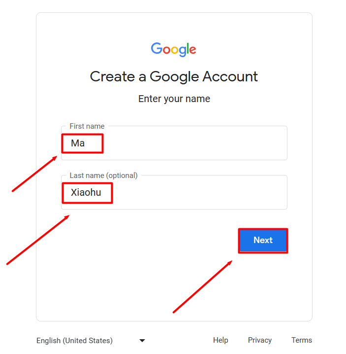
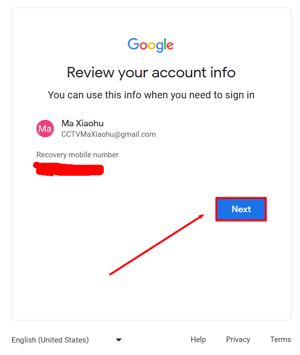
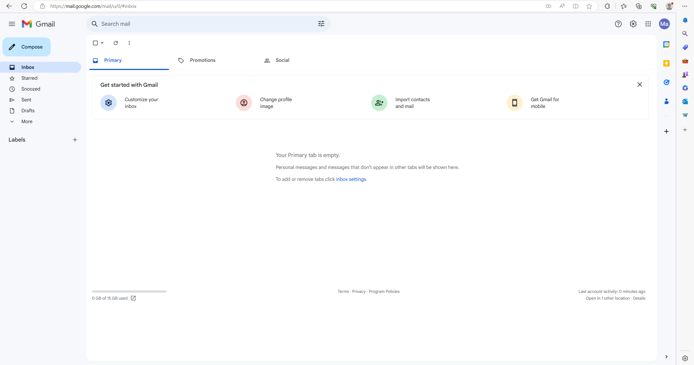

# Google账号的注册教程

> 本部分基于[这篇文章](https://blog.csdn.net/qq_45138120/article/details/131347452#/)进行编辑，致敬

1. 首先打开浏览器，然后进入设置把浏览器设置成英文语言，来提高成功率

特别说明一下，是浏览器的总语言，在浏览器设置里，而不只是设置当前页面的语言

1. 我们使用浏览器打开谷歌邮箱官网（http://gmail.google.com/ ），进入谷歌邮箱的登录主页，我们点击左下方的创建账号按钮，选择个人用途（为我自己）

3. 在进入的界面我们不要着急填写资料，我们先修改语言，点击左下方的简体中文。这个时候，会弹出国家语言列表，我们选择“English（United States）”。

4. 这个时候，界面会变成英语。输入姓氏和名字，点击 Next

4. 选择月份、日、年、性别，点击Next

5. 选择Gmail邮箱地址，前两个是随机出的邮箱地址，可以勾选第三个自定义邮箱地址，输入邮箱地址后，点击 Next

6. 输入密码，确认密码后，点击 Next

   

7. 添加恢复电子邮件，账号异常或锁定时，Google 可以通过恢复电子邮件联系您。直接点击 Skip 跳过

8. 选择中国，填写自己的手机号，点击Next

关于手机号无法用于验证的问题，可以看这一位大佬的帖子：https://blog.csdn.net/qaqwqaqwq/article/details/130442226#/

这个问题与我一开始写的第一步相呼应，开头切换英文主要就是为了解决这边

9. 确认账户信息页面，没问题的话，点击 Next

10. 隐私条款确认，拉取到底部，点击 I agree 我同意

11. 如图，出现此界面，说明 Google 邮箱创建成果

注：创建失败时

- 手机号码已经注册过
- 在注册时，将语言设置为英语，成功率高
- 切换节点
- 过会再试试