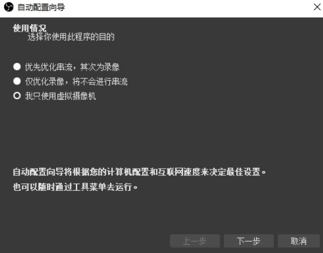
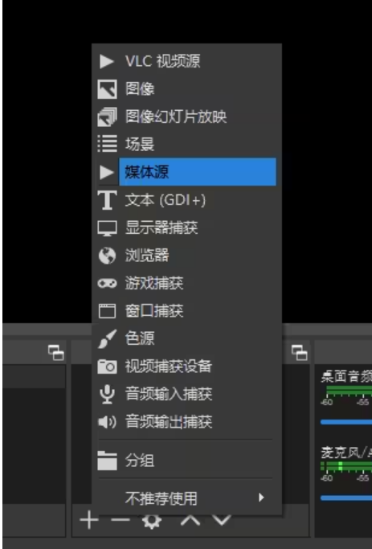
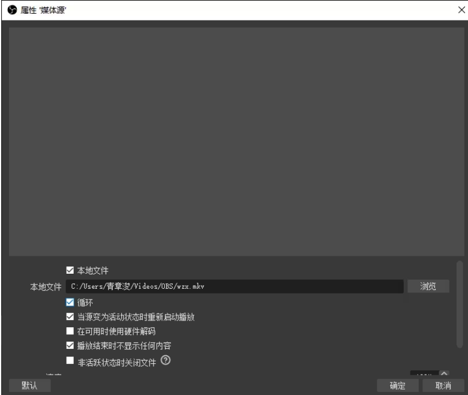
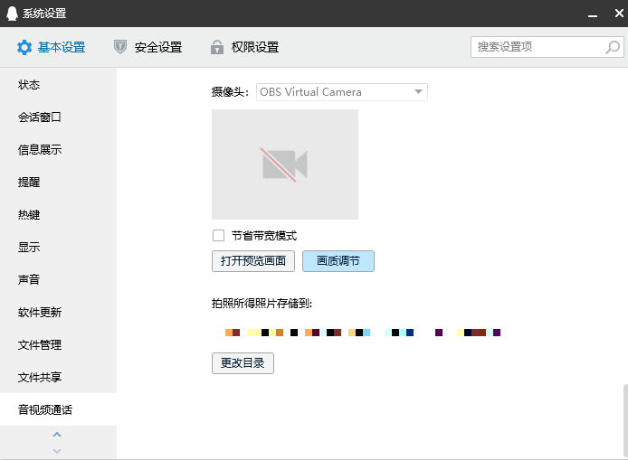
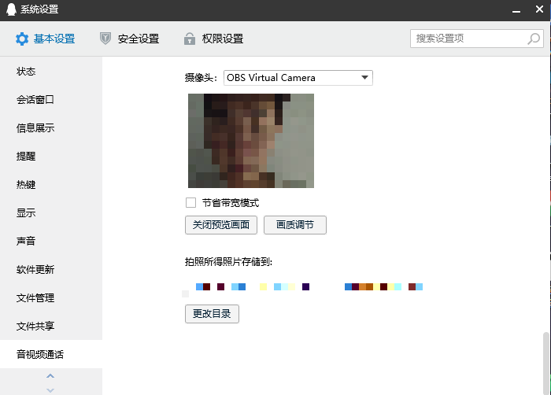

> 本教程基于B站https://www.bilibili.com/read/cv11603378/编写

# 零、前言说明

**本教程仅适用于最新版OBS，主版本号30（版本26基本与此一样）**

# 一、下载安装 

1. 下载方式有两种：

2. - **官网下载：**https://obsproject.com

     服务器在国外，**速度可能较慢**，你可以尝试使用下面的方法下载。

   - **国内镜像：**https://mirror.tuna.tsinghua.edu.cn

     清华大学TUNA镜像站，右侧栏**“获取下载链接”--应用软件--OBS--选择合适的版本下载**即可（注意选择那个**带有“Installer”字样的**，括号里是exe，那个是安装包，zip是便携版）。

3. 打开安装包，一路下一步安装就行，与普通软件安装没什么两样，安装位置任意选。

# 二、OBS的简单配置 

打开OBS Studio软件。

- 可以使用自动配置向导，选择最后一项**“我只使用虚拟摄像机”**即可。

  注：OBS 26版本无此选项，此时你应该选择“取消”

之后选择**“下一步”--“应用设置”**

- （可选步骤）修改虚拟摄像头的输出大小

  在OBS主程序菜单栏左上角**“文件”**中，找到**“设置”**

  你可以在“设置”窗口的“视频”选项卡中找到输出分辨率和帧率的设置

  电脑配置较差的用户可以参考我的设置

**不明白各参数什么意思的可以直接照搬我的设置，或者保持默认不动。**

# 三、准备虚拟视频 

实现录制一个视频，用来虚拟化

注意此视频将会用作虚拟视频效果

# 四、编辑和启动虚拟摄像头 

- 回到主界面，在下方的**“来源”栏下点击“+”**加号，添加一个**“媒体源”**

- **点击“浏览”，选择刚才录制好的视频文件**

选择好文件后，**一定记得勾选“循环”！**

此时上方可能不会立刻出现视频的预览，**点击“确定”，视频就出现了**。

如果没有视频显示在预览的画面里，尝试修改**“在可用时使用硬件编码”**这一选项

注：如果想再次调出这个界面，双击“来源”栏里的“媒体源”即可。

- 理论上的视频应该是铺满画面的，如果没有，那就**右键视频的画面--变换--比例适配屏幕**。

- 下面来启动虚拟摄像头

  单击主界面**右下角“控件”一栏里的“启动虚拟摄像机”**

# 五、在第三方软件里使用虚拟摄像头

这里以**QQ**电脑版为例

- 在**QQ**里找到**“设置”**

- 在“视频”选项卡里找到**“摄像头”**，设置为**“OBS Virtual Camera”**
- 打开预览画面

此时上面应该能显示出你在OBS中设置好的画面，关闭设置界面即可。

此时大功告成了，QQ视频里会循环播放你录制好的视频

- 如果出现如下画面，请检查是否**在OBS内“启动虚拟摄像机”**

- 如果卡了，没画面，则需要打开obs的设置

  

  

改为800*600比例

 

其他软件将默认摄像头设备改为“OBS Virtual Camera”即可。