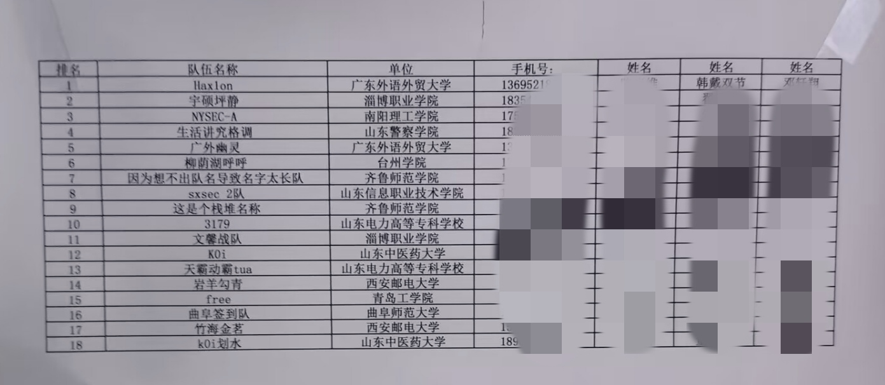

30个队伍排名第18还行，有一个队伍弃权没来，两个队伍作弊被ban了，顺延2名，最终第16，广外和南理的师傅太强了，山警的大哥被ban了不然也是前三
11月24就已经打完了，一直没来得及写心得

可能是因为团队赛吧
感觉比科来打的好点
有好几个题都是差一点
我交了两个简单题，逆了一个misc的pyc，也是没拖后腿
misc这个题是很有意思的，压缩包有密码，可以暴力破解出来，然后三个附件，其中一个是一首诗，很有意思，但是不知道这首诗是有什么用，这题就差一点了，没做出来。
发现了自己还有很多东西没学没掌握好，re的花指令，动态调试，老东西直接秒了的题，我不会

见到了西邮的师傅

另外说一下对组委会的印象
评价是一坨稀烂
连个纪念品都没有，也没手提包，整场下来就给个参赛证，然后报告厅像个教室，甚至还不如我们的教室大（
进赛场之后桌子上一人一份伙食（一包奶一个面包一根火腿肠，我的天我们还以为这是早饭，没想到这是午饭）
中途上了一遍零食（好丽友＋一根火腿肠）爆笑如雷了，在济南都是组委包吃住，酒店随便吃的
还有更抽象的
上午10:30开赛，到时间准时开赛准时断电，布置赛场也偷工减料了吧，供电不足直接断电了，抢修了一个小时导致比赛延后了
然后中途上了一次电，信号屏蔽仪直接嘎嘣冒烟，当场炸了，还有好几位师傅的电源适配器给烧了（~~byd这才是应急响应是吧~~

这也是裁判长最忙的一次，山警大哥应该是比赛过程中询问wp，说的很含糊然后就ban了，还有带手机被听见了，但是没被逮住，辗优就在我隔壁，很强的一个热点信号

三等奖，也算是没白来，威海那个去了大概能拿个一等，他们组委举办的也还行，就是路费太高了，没奖金没报销
总的来说还是得练，师傅们觉得一把梭的题我要搞半天