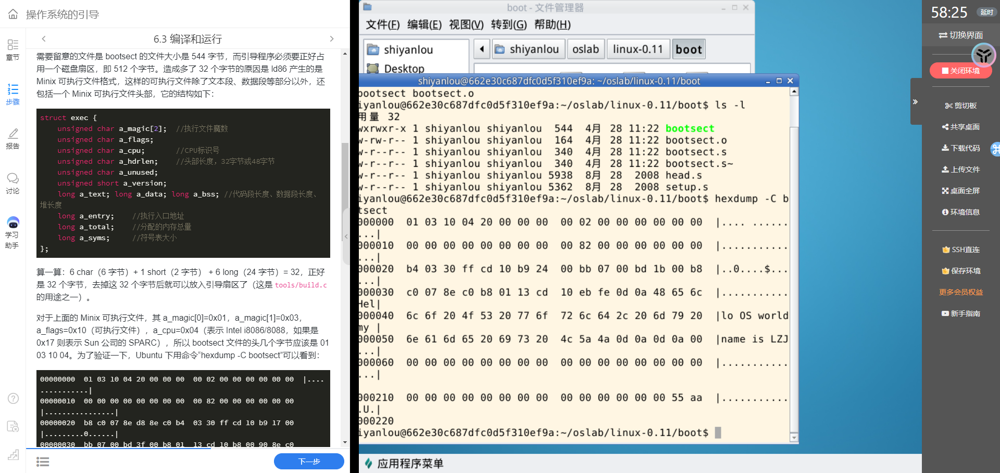
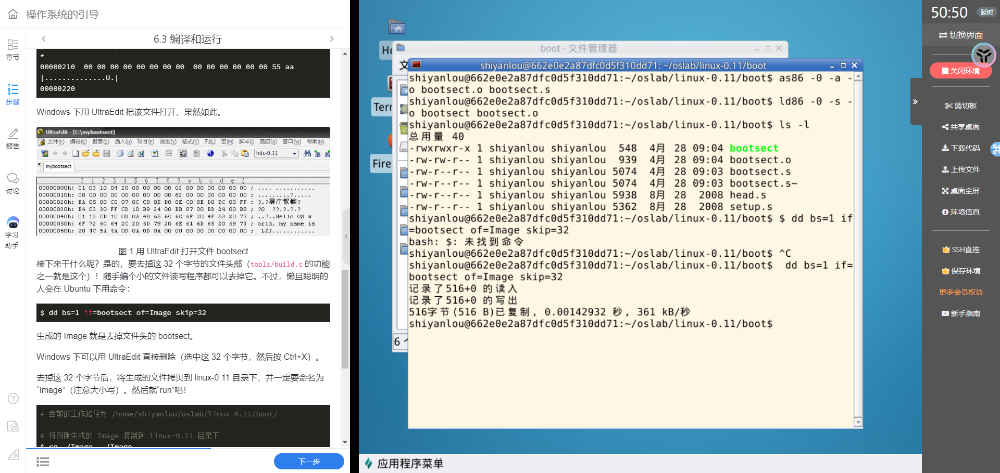

## 解压文件

```bash
tar -zxvf hit-oslab-linux-20110823.tar.gz \
  -C /home/shiyanlou/
```


## 开始实验

1.  修改字符串长度

    

2.  修改字符串内容

    

3.  编译

    

    

4.  去掉文件头部

    

5.  运行

    

6.  读入 setup.s

    

7.  再次编译

    

8.  注释 build.c

    

    

    

9.  显示获得的参数

    
