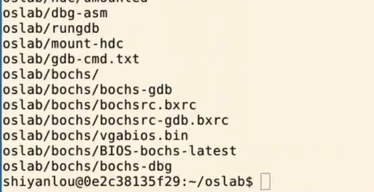
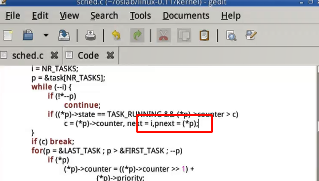
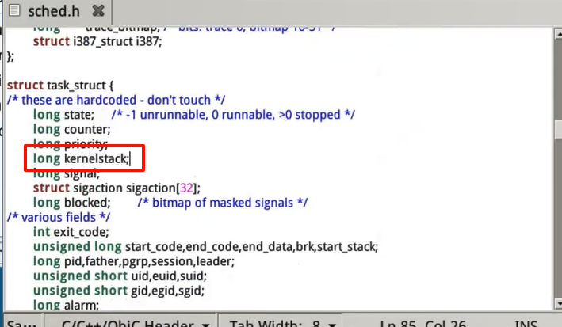
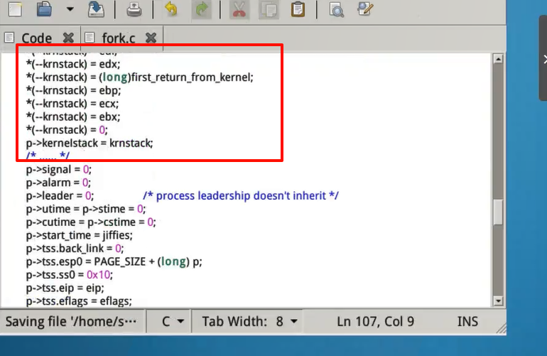
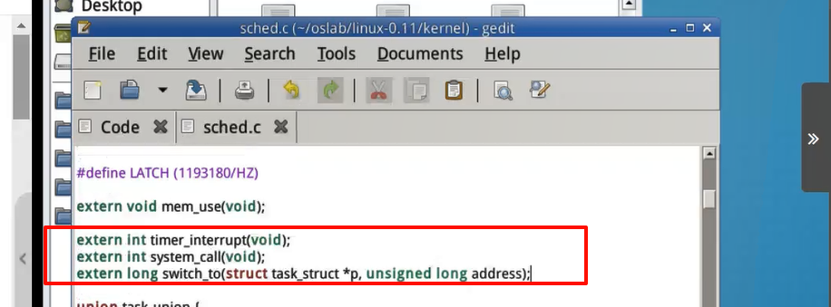
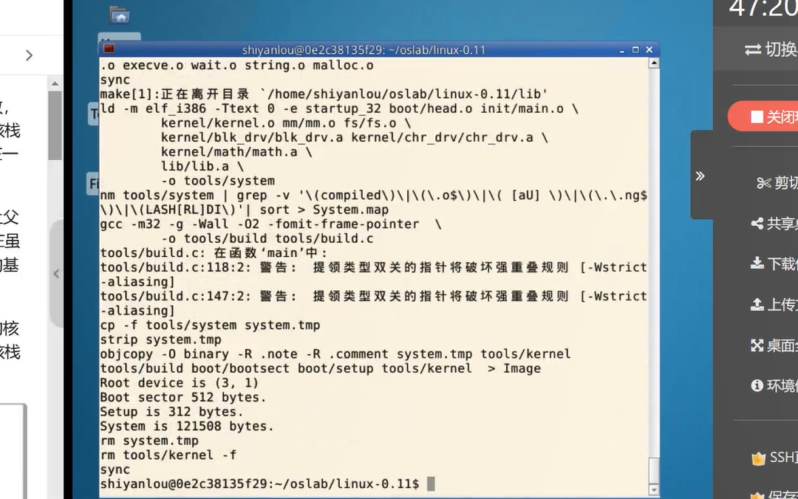

## 解压环境

## 编辑 kernel/sched.c

## 编辑 include/linux/sched.c

## 编辑 kernel/system_call.s

## 编辑 include/linux/sched.h

## 编辑 kernel/sched.c

## 编辑 kernel/system_call.s

## 编辑 kernel/fork.c

## 编辑 kernel/system_call.s

## 编辑 kernel/system_call.s

## 编辑 kernel/fork.c

## 编译

## 运行

