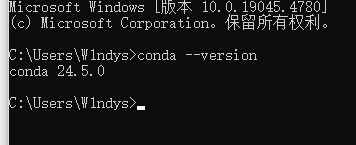
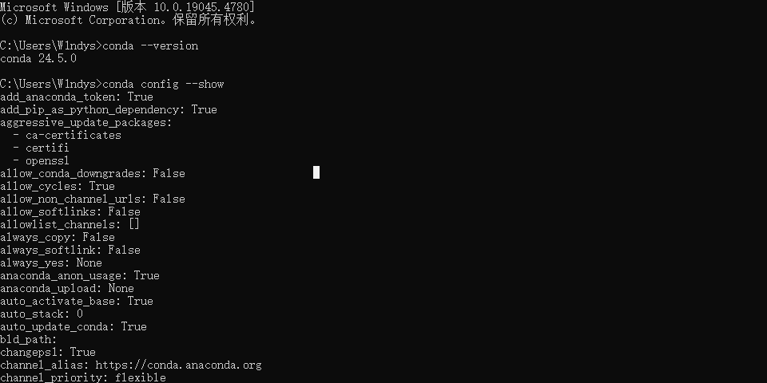
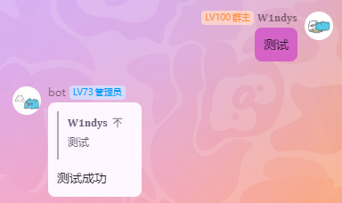
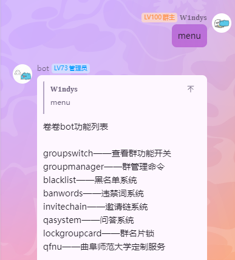

## 实验

### 环境搭建

### 配置镜像源

我一般直接是挂代理安装 pip 包，这里防止我本地环境搞乱不配置了，上面是 conda 的信息

### 代码

有现成的自己暑假写的项目，直接交了。

基于 Python 和 OneBot 11 的 QQ 机器人实现

开源地址：[W1ndys-bot/W1ndys-bot: 基于 Python 和 OneBot 11 的 QQ 机器人实现 (github.com)](https://github.com/W1ndys-bot/W1ndys-bot)

解释一下代码结构

根目录是放的一些常用的批处理脚本、docker-compose 索引文件、Git 配置文件、以及 pip 环境依赖索引文件

核心代码在 app 路径之下

- `app/main.py` 是程序入口，是启动文件
- `app/menu.py` 是菜单文件
- `app/secret.py` 是秘钥存放文件
- `app/switch.py` 是开关文件
- `app/config.py` 是配置文件
- `app/bot.py` 是机器人接收消息的核心代码
- `app/data` 是数据存放目录
- `app/hanndle_event.py` 是处理事件的核心代码
- `app/scripts` 是所有功能模块的存放目录
- `app/api.py` 是所有 API 的存放目录

### 功能演示

## 代码已实现功能

### 系统

- 机器人连接成功通知到 root 管理员 QQ
- 机器人断开通知到钉钉
- 机器人断线自动重连
- 菜单

### 群发消息

> 群发消息，私聊 bot

- 群发消息
- 添加群
- 删除群
- 查看群

### 群管系统

- 禁言
- 禁言自己
- 禁言指定用户
- 禁言随机用户
- 禁言指定用户指定秒
- 禁言随机用户随机秒
- 解禁
- 踢人
- 撤回消息
- 撤回指定消息
- 扫描邀请链
- 添加违禁词
- 移除违禁词
- 列出违禁词
- 启用违禁词检测
- 禁用违禁词检测
- 启用入群欢迎信息
- 禁用入群欢迎信息
- 启用邀请链功能
- 禁用邀请链功能
- 查看邀请链

### 邀请链记录

> 记录用户通过邀请链进入群聊的情况，并记录用户 QQ 号和入群时间，当有群内广告时，可以递归遍历邀请链，找到所有相关用户，不仅可以搜父子关系，还可以搜兄弟关系
>
> 例如：A 邀请 B 进入群聊，B 又邀请 C 进入群聊，C 又邀请 D 进入群聊，那么邀请链就是 A -> B -> C -> D
>
> 再例如：A 邀请 B 和 C，B 邀请 D，C 邀请 E，那么邀请链就是 A -> B -> D 和 A -> C -> E，当 E 发送了违规广告时，可以递归遍历邀请链，找到 A、B、C、D、E 所有相关用户

- 开启邀请链记录
- 关闭邀请链记录
- 查看邀请链记录

### 黑名单系统

> 黑名单系统，可以对指定用户进行拉黑，拉黑后，用户将会被踢出群聊，并且拒绝该用户再次进入群聊
>
> 支持艾特添加，支持 QQ 号添加

- 添加黑名单
- 删除黑名单
- 列出黑名单
- 禁用黑名单
- 启用黑名单

### 群名片锁

> 群名片锁，可以对指定用户进行群名片锁定，锁定后，用户将会被锁定在当前群名片，若发现用户修改群名片，将会重新锁定

- 修改群名片
- 添加群名片锁
- 删除群名片锁
- 禁用群名片锁
- 启用群名片锁

### 软封禁系统

> 指不禁言，但是会撤回每条消息

- 添加软封禁
- 删除软封禁
- 查看本群软封禁

### 关键词回复

> 关键词回复，当用户发送了关键词时，机器人将会回复指定内容

- 添加关键词回复
- 删除关键词回复
- 查看关键词回复
- 批量添加关键词回复

### 知识库问答系统

> 知识库问答系统，引入了 jieba 分词和 Levenshtein 距离算法，支持关键词识别，问题识别，可以实现模糊匹配，支持批量添加知识库
>
> 数据量越大，匹配结果越准确

- 开启知识库
- 关闭知识库
- 添加知识库
- 删除知识库
- 查看知识库
- 批量添加知识库

### Crypto

编解码系统

- 支持私聊编解码
- 支持群聊编解码
- base64 编解码
- MD5 编码
- 进制转换
- hash 计算
- 密码生成

### Tools

> 工具系统，提供一些常用的工具功能，主要以接入第三方 API 为主

- IP 地址查询
- 快递查询

### 曲阜师范大学网站监控

> 曲阜师范大学网站监控，每五分钟检查一次，当教务处和资产处网站有更新时，会通知到开启的群聊

- 教务处监控
- 资产处监控
