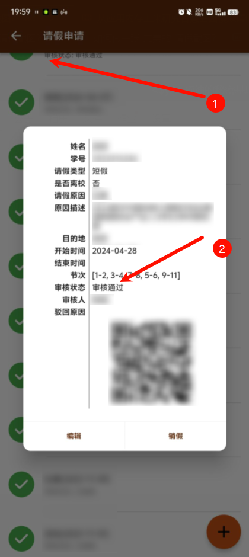
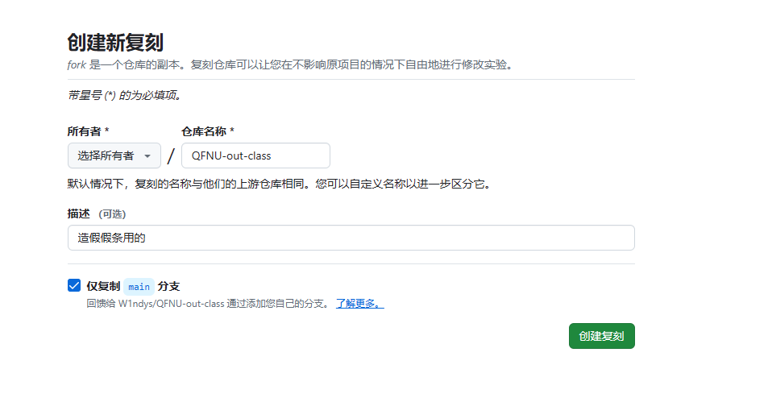
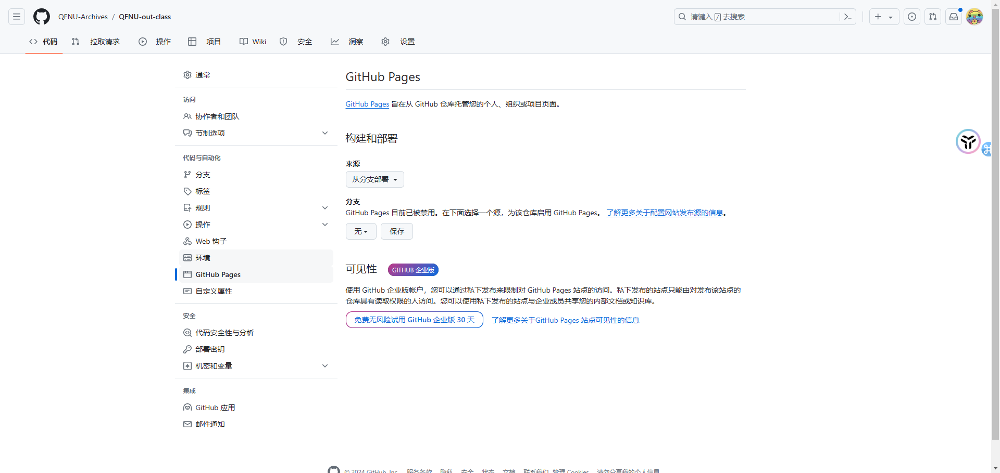

请在遵守校规校纪的前提下，摈弃所有杂念阅读本文，切勿传播、转载、上传至任何平台，违者后果自负，本教程仅用作技术交流，所有后果将由使用者承担！

# 如何做一张“完美的”请假截图？

没有完美的

常在河边走哪有不湿鞋

## 操作流程

### 准备材料

1. 智慧曲园APP

2. 醒图APP

3. 手机/Pad
  
   有Pad的同学尽量用Pad，效果会更好

进阶：

4. Github账号

5. 网址转二维码工具

### 步骤

1. 打开智慧曲园APP，先请个假，请完假之后点开**截个图**，迅速撤销掉这次请假。

    

2. 找一张你之前请过的假条，<strong>必须带有：审核通过</strong>的字眼（如果没有，就考验你的P图技术了，自己P一个），需要滑动假条列表，定位到一次绿色的假条在屏幕顶部，遮住时间日期部分，点开符合条件的历史假条，截图

    

3. 打开醒图APP，导入第二步截的图作为底图，添加第一步截的图，适当裁剪，把新日期的裁剪出来，覆盖底图对应的地方，然后根据实际情况微调即可

    成品：

    

### 进阶操作

替换二维码

> 既然你都看到这里了，基本的照葫芦画瓢能力还是有的。

1. 扫描一个正常的假条（真假条），获取页面地址

2. 在电脑上进入这个地址

   

    其实这里用手机也行，只是用手机会很麻烦，你需要在地址前面加上`view-source:`来查看网页源代码

3. 查看网页源代码

    

4. 现在你有两种选择来部署，一种用我提供的模板，更傻瓜式，另一种是把这个源码down下来，需要很少的前端基础

   第一种：

    1. 点击[复刻链接](https://github.com/W1ndys/QFNU-out-class/fork)创建复刻版本，配置默认即可

        

    2. 点击`index.html`文件，编辑内容，替换掉你需要修改的内容，保存即可

        

    3. 点击`Settings`，进入设置，把Github pages的分支设置为`main`，保存即可

        

    4. 在仓库关于把链接换成Github pages的链接即可

        

    5. 打开链接，你就能看到你修改后的页面了

        

    6. 最后一步，把这个地址转换成二维码，糊到原图上即可，网址转二维码工具网上一搜有的是

        

   第二种：

    1. 下载源码然后上传到你自己的repository存储库，之后的步骤和上面一样，你都看到这里了，我觉得你也有能力自己解决
