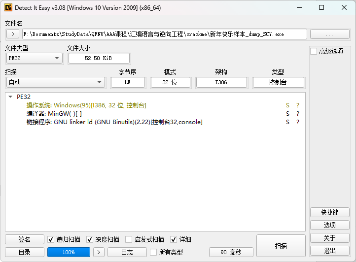

## 曲阜师范大学教务系统成绩监控

曲阜师范大学教务系统成绩监控，检测到新有成绩出来之后会上报，利用 Github action 运行，无需服务器

### 效果

## 使用方法

### fork 项目

[W1ndys/QFNUScoreReminder: 曲阜师范大学教务系统成绩监控，检测到新有成绩出来之后会上报](https://github.com/W1ndys/QFNUScoreReminder)

点击链接进入 Github，fork 本项目到自己的仓库

### 新增钉钉机器人

去钉钉新建一个自己的群，去群设置 > 机器人，添加一个自定义 webhook 机器人

记录配置的 `webhook` 和 `secret`（不要泄露），如果你的 webhook 是 `https://oapi.dingtalk.com/robot/send?access_token=xxx` ，那么 `DD_BOT_TOKEN` 就是 `xxx`，`DD_BOT_SECRET` 就是 `secret`，下面要用

### 配置环境变量

进入设置配置环境变量

分别配置 `DD_BOT_SECRET` 和 `DD_BOT_TOKEN` 、`USER_ACCOUNT` 和 `USER_PASSWORD` 环境变量

`DD_BOT_SECRET` 和 `DD_BOT_TOKEN` 是钉钉机器人配置的 `webhook` 和 `secret`

`USER_ACCOUNT` 和 `USER_PASSWORD` 是教务系统账号密码

### 运行

点击 `Run workflow` 按钮，运行项目，如果配置正确，会收到钉钉消息

收到钉钉消息，说明配置成功并且初始化成功

到这里已经可以正常运行了，程序会每小时检查一次成绩，有新成绩会发送钉钉消息
