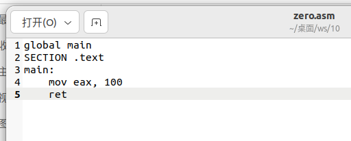
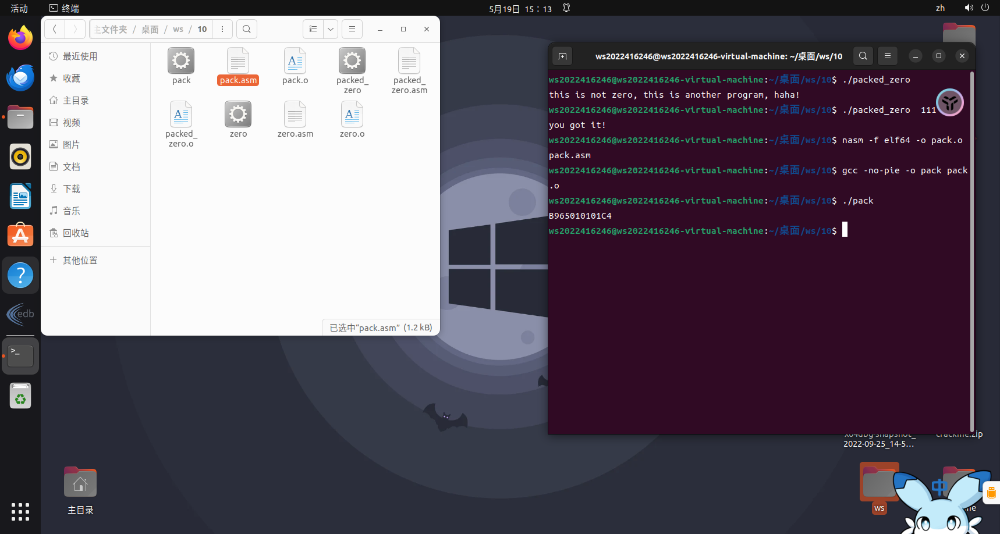

## 搭建实验环境

安装 nasm 和 r2

```bash
sudo apt install nasm
```


```bash
git clone https://github.com/radareorg/radare2.git
cd radare2
sys/install.sh
```

## 实验内容


然后建立 zero.asm 文件。将编译好的程序输入



对文件进行编译


通过 r2 看到对应的汇编指令和二进制指令


新建一个 pack.asm 文件，对刚刚的程序进行加壳操作将二进制指令加密。



新建 pack_zero.asm 文件对刚刚加壳的程序进行脱壳，得到原始二进制指令。


对文件进行编译。输入./pack_zero 111 脱壳成功。


