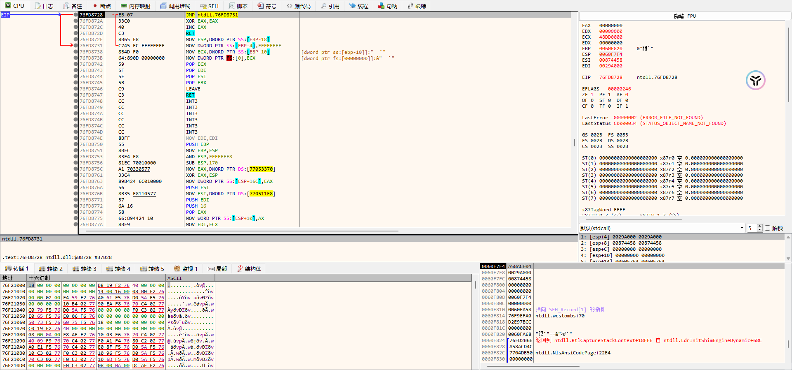
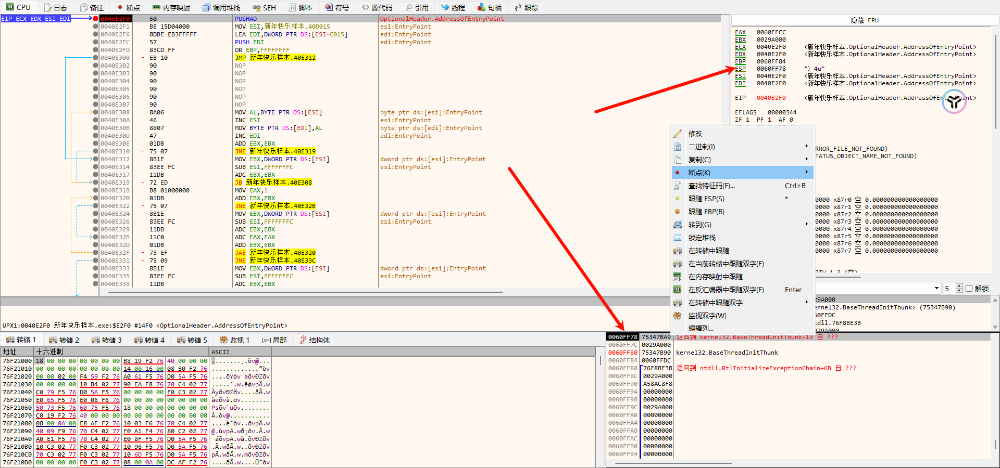
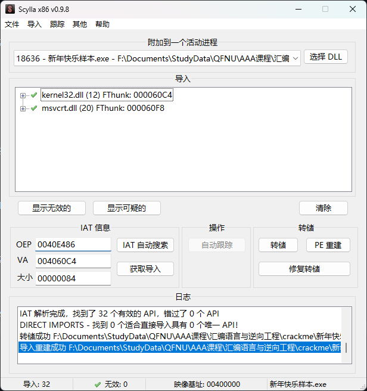
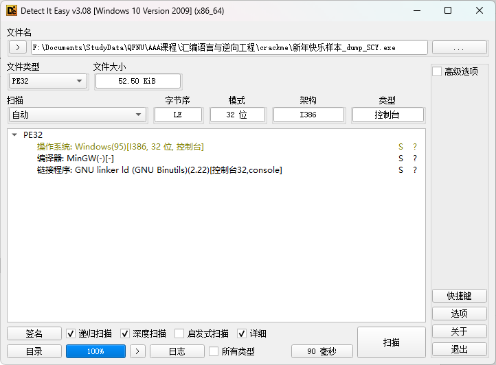
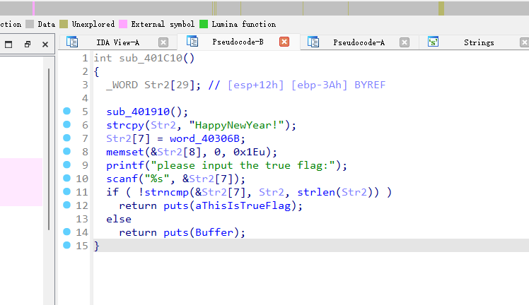

## 查壳

是 upx 工具的壳

## 手动脱壳

1. OD 打开

   

2. 定位到 PUSHAD

   

3. ESP 定律，下个断点

   

4. 找到 POPAD，找到入口点 OEP

   

5. Dump 出 exe 文件

   

6. 修补 IAT 表

   

7. 成功脱壳

   

## 工具脱壳

工具：[UPX](https://upx.github.io/)

可以使用 upx -d xxx.exe 直接脱壳

## 反汇编

找到关键函数

> 分析可得 flag: HappyNewYear!
