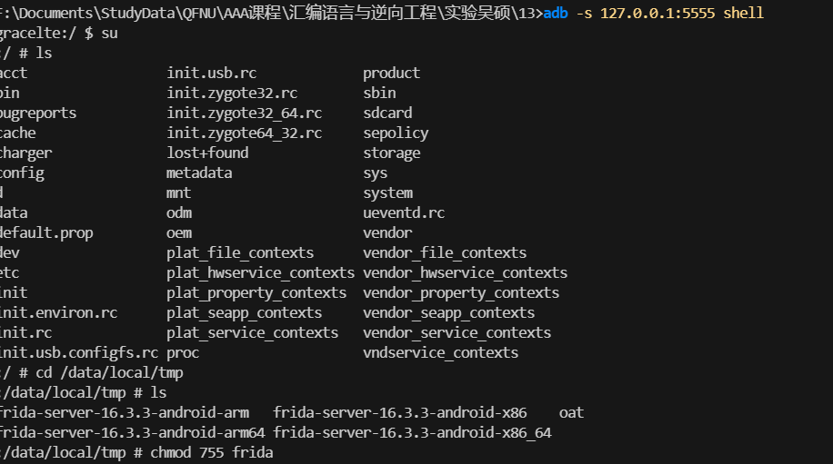
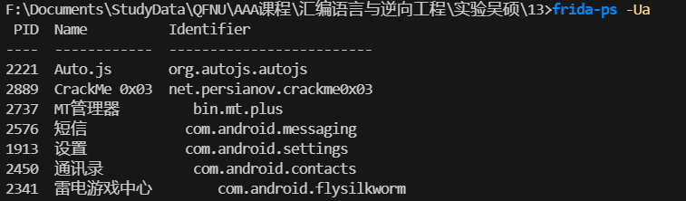
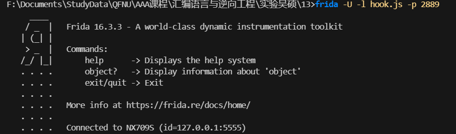

## 配置环境

1. 安卓模拟器上传 Frida-server

   

2. Windows 连接安卓模拟器

   

3. 运行 Frida-server

   

## hook

1. 查看 PID

   

2. 连接进程

   

3. hook 函数拿到 flag

   

## exp

```javascript
Java.perform(() => {
  const data = Java.use("net.persianov.crackme0x03.Data");
  const f = data.isPasswordOk;
  f.implementation = function (arg) {
    console.log(arg);
    return true;
  };
});
```

```javascript
Java.perform(() => {
  const fg = Java.use("net.persianov.crackme0x03.FlagGuard");
  console.log(fg);
  console.log(fg.$new().generate());
});
```
