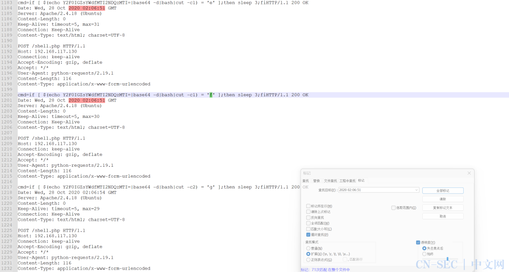

> 原文始发于微信公众号（山警网络空间安全实验室）：[科来杯第十届山东省大学生网络安全技能大赛wp](http://mp.weixin.qq.com/s?__biz=MjM5Njc1OTYyNA==&mid=2450786565&idx=1&sn=ecd301d5f308bc7e4f5901f6187beb8e&chksm=b104f8228673713458801f4e84e0726a382df97bb09be1ae1750073b40483d9c79812ae35a38&scene=126&sessionid=1698029627&key=47ecebb9f9a1a9ab37c23e2ab716e98f757cd43b66b9ad462906ba0d95aa0c311338df2b6a7be5217c18b6f8e0ecc3fe0b3593d1d83e569f93e61662305bc67a41fa74f80d8ba959eb1beacdb48156642618c50bfeecdf568ee4e32fd7bf89f0aeafe201cfc09580e84c5ed97ece0d93b923605a9b90ec6157a83efc7ab9b32a&ascene=15&uin=NTY2NTA4NjQ%3D&devicetype=Windows+10+x64&version=63060012&lang=zh_CN&session_us=gh_544c8c38eeaf&countrycode=AL&exportkey=n_ChQIAhIQTgqEnpI5i9%2FUgoicLHi%2BDBLuAQIE97dBBAEAAAAAAAn6Da%2FhwEkAAAAOpnltbLcz9gKNyK89dVj0n9PVNOKQBdN8rFDq8A9WHKDE7wDDJw1sWdUYSzYiQ48kYwjfuTQa3OR8YYoUe0NrX35xA%2BmChNNxZFcZC51KYRhk%2FSiovCpzuXNc0DbIZCC3PaiSPNEY1FpsLPksd9Q%2FAAPZATi0k7TjwBb5HTVpyn4qJxyoNe2ehnJ%2BU%2Fn%2FkLQVFEklAE8UOxh1EVUNMUECRQItPitOSLpXdVq6fq%2Bl5ucDwa0M9Sfvx2MDNscY6GTwoY%2B0HK6Lbc5UobrfYhWM0HjKfGP9Eec%3D&acctmode=0&pass_ticket=tg1T215QyFg8xQQl%2BCQeEL%2BQWFNoq2hjb6qpAGBy38ocTI5ZUM9OXfIibItwtoRN&wx_header=0&fontgear=2)

## 前言

赛制还是一如既往的奇葩，由于每人的方向不同，在赛后结合团队赛道和爱好者赛道社团成员的wp，共同完成了本文。

@挽歌 @sp4c1ous @Charshark @Mu.Chen

Mu.Chen内心os：

(理论题真的真的真的真的好重要啊呜呜呜呜

- 前言

- Misc

  - 简单编码

  - 神秘的base
  - 签到

- Stego

  - 我应该去爱你
  - 数独
  - 莫生气

- 取证

  - 金刚大战哥斯拉
  - 啊吧啊吧的数据包
  - 小刘的硬盘

- Web

  - uns

- Crypto

  - 小试牛刀
  - easyrsa

- re

  - 人生模拟


## Misc

### 简单编码

二进制和八进制

```python
import re

flag=''
a = ['1010010','110001','1101011','0172','1010010','1000101','061','0132','0127','1101100','0144','1001000','1010010','1010100','0116','0105','0124','110000','110100','0172','1010001','110000','0144','1001110','1001101','110001','1010010','0110','1010100','0154','1110000','1011000','0122','060','110001','0141','1010110','0105','0144','1001110','0127','1101100','1010110','1001000','1010111','0124','0112','0125','1010010','110000','110101','0113','1010110','1000101','0144','0116','0127','0154','0122','1000010','1010100','0154','1001010','1010111','0122','110000','061','0141','1010110','1000101','110001','0117','0125','1101100','0122','0110','0123','0124','0116','0105','0124','0125','065','1010011','0126','060','0144','0132','1010111','1101011','1010010','1001000','1010100','0154','0112','0125','1010011','1000101','0126','0141','1010110','1000110','1000110','1001110','0127','1101100','1001110','0110','0127','0124','1001110','1000101','0122','110000','110101','1001011','1010110','0105','0144','0102','1010111','1101100','1010010','0124','1010100','0126','0160','0125','0122','110000','110000','060','0126','1000101','061','1001110','0125','0154','1010010','0110','0124','0126','1110000','0125','0123','060','110001','1100001','1010111','1101011','0144','1001110','1010111','0154','0122','0116','1010100','1010110','0112','0131','1010100','0126','0105','071','1010000','0124','110000','111001','0120','1010100','110000','075']
for i in range(len(a)):
    print(len(a[i]))
    if len(a[i])==4 or len(a[i])==3:
        flag+=chr(int(a[i], 8))
    else:
        flag += chr(int(a[i],2))
print(flag)
```

### 神秘的base

换表base爆破

```python
import base64
import string
import itertools


string1 = 'ABCDEFGHIJKLMNOPQRSTUVWXYZabcdefghijklmnopqrstuvwxyz0123456789+/'  #标准base64编码表

strings = "ivOY50"
all_colors = (itertools.permutations(strings, 6))
for i in all_colors:
    tmp = ''.join(i)
    string2 = f'xbQTZqjN8ERuwlzVfUIrPkeHd{tmp}LK697o2pSsGD+ncgm3CBh/Xy1MF4JAWta'  # 换表后base64编码表
    encode = 'EvAzEwo6E9RO4qSAHq42E9KvEv5zHDt34GtdHGJaHD7NHG42bwd='
    decode = base64.b64decode(encode.translate(str.maketrans(string1, string2)))
    if 'flag{' in str(decode) and '}' in str(decode):
        print(decode)
```

### 签到

```python
let r = "ABCDEFGHIJKLMNOPQRSTUVWXYZabcdefghijklmnopqrstuvwxyz0123456789+=";
let cars = [25, 38, 49, 33, 25, 55, 45, 37, 12, 22, 24, 50, 12, 51, 24, 51, 13, 3, 16, 52, 13, 38, 25, 38, 13, 54, 4, 52, 13, 19, 20, 55, 12, 38, 8, 51, 12, 38, 16, 49, 14, 22, 8, 54, 13, 35, 37, 33, 12, 55, 52, 63];
let ff = "";
for (var iii = 0; iii < cars.length; iii++) {
ff = ff + r[cars[iii]];
}
/*this is flag*/
console.log(ff)
```

直接运行 解码base64即可

## Stego

### 我应该去爱你

频谱图


### 数独

先填数独，得到4132234132141423

因为是隐写题，考虑有密码的隐写，只有LSB

```
C:UsersAdministratorDesktopmisc脚本收集cloacked-pixel-master>python2 lsb.py extract C:UsersAdministratorDesktopmisc脚本收集cloacked-pixel-mastershudok.png-stego.png 1.txt 4132234132141423
```


### 莫生气


提取出png，补上文件头，然后双图盲水印


## 取证

### 金刚大战哥斯拉


```php
<?php

function encode($D,$K){
    for($i=0;$i<strlen($D);$i++){
        $c = $K[$i+1&15];
        $D[$i] = $D[$i]^$c;
    }
    return $D;
}

$pass='DASCTF';
$payloadName='payload';
$key='9c2ffaf6a14493bf';
$data = 'fLluZmFmNmExNJEhWBG1b1XhCY%2BtGO2uCp6t3zK69FxYTKJQssNT1y5Cf45Hu3u%2Fivq08xw%2FbzMVDb2iVURKKXEgFjxjZzQ6kQjmUHpg8t9m09mKOdTLyE5V%2B%2Bzw83kQjtK%2Bl9yBKvzGCdNluDokRoC4jvtek8KVLXnlU3K366szlCn4XS%2BxolAu%2FzspbXO1wRZkj15en%2BXvDcX%2BrfySQnxMFJKl2bgedSVozzyNwPBUFxcUX3V2E%2FGyFHezDWxnihBUXutJRvu%2FuHjZwHGhu%2BpybShnSwTgYLjybXZRZC3M%2BmD04BA6ancVF5lirsWZ3gsqB3h9rvKzDvtwG3FoCM6ObODAYOcpOLtSO8xuGMciws40NV81hhXQV7ViZG9At06ypufihH4bSJ0xy1aL1T6WCPL6fcRbCaVn%2F7BYmCuoy3LzMlI3CHA0OXbds4Itwg7X0dQnKp7eiJKtV0MjJAMqAN50O9LVDaJnbQg%2Bgz2iJLLoMSCnR3v%2BbLMZAid5ESm8JoIgZk5BNpVZ5xOdquNNWFz%2BpLOR9W%2Fe%2BhjwxCiwdtfdaQj0QiC18L6TbTSMhl2qQWqZrd97KZDOI4gJ6ar1QWIgDk3D%2BO5oRFYMWRthsKfGFB38Hcn%2BqMDyOLrLqBFJXaw0Yv1YQaHyn9ycRJ7DEoWfsdCyOuH5HtW4MNp2Y72ptdqCI4RHgZryK142ucH2BCmN0oxVZr4zcMISfKEwXmyzwrX27r%2BZoYUqTwN%2FJ2NCE1%2FWNgPkChD08LLZKbS0dzIlZ3xFL2h7kbP%2FOHn8ceocxTV3q%2F%2BPjOrpsORuwQOj6pMoYB%2FSD5rUGN0KGeerrZQhUaw2u5%2FiZMj9rnlFiF3gyOtb3mTLt%2FN09poaFr9TidOFisTtU%2FnryDLT2GnIfIveQwKcwliQhVGLvWiEgIweDe3OmDeFYT8U68LU09%2BMrxGD2lYdh4tlvx9h2IttzPAc3yZna5tP%2BiZJJruPGgY40GVc9p%2Fw1%2Bixk%2F68RoLtOscCL%2FERCXz22P8xWmk9utDwSA8dyeCgj3hBQsr24nSbWJFu0%2FOSM5dOK00yD%2F8GE4fyxQ7U0IVVZ1rjdccA44j0Tt7ArMzs4d1a6k3SK2GiKM2X3dqqysh9oJ96r2iJA2R0jHvYwbKTSSLyhDT%2BpZc5Hl%2Fp6e6L5wTKuRZnhKxIDqpzpw%2BwQe6pVq0BuI5FoXQ%2F3mPydT2nkEjcLnLaxBDoVQSUd6Ba92MYcesUpZ13yAAgi%2F79ZKgithRVuwhrTCtNXAp5j6p7%2BBJdzJGV%2Bl2s33UnBjVeKqrAUATX9yY7NIql2E4SOWp4loycxh2nwR3Qe9Zi%2BKBaSmBHVy5liSgUFGOlmsWgM%2FstzXc%2F9SNQyUXALbOxa7s17A%2BDOkgUGLIBM7M6Va0Aa8A2xTnyr0SHwyQpUjE5E1x1t24X4MSADqqMIkQSEHPkgttSbALFUOd32Gko8djwakoi7rmXWAEKojSlDZffyPLwMJQjI%2B5%2FiXFfSasJP1zCbr5nl%2FKFBcomDDFy8gnLMG2zwvLRIrfDquVIhlTgF6Giq4JqWmI9ZSJG8ATh2y%2F9uXExyhdQ33b4O%2B4a9OJv%2F1MWz%2BYQqCLu9DhObYTQQThBtUcxAyF3hOD9B1Q0DWQNPu7UDMuLX57ThBw8CulWsahG7QBGOamGf23KVji%2FaQdKeXYGQohkA1oN%2FSOleQWuIJvSk1KrBDtQRU6AWG6WNqnl33Z%2B0cgBYUcg8noLHMByMkRefpLMqm%2BGH2zrdGpNgEcaCzk5ulYd9pHMdiYDfTp3sFjdsR%2FxplFSP4VfnbWpF7WsiT7WGZoPXtv%2F4gWI60ftEnJ1peYtXUlLDuv2tYt2wmpafCClt1Y0tfB51iBFGhUy7Bw%2FdbjtVxZJHB8FvsEzEGj5BWp45LAGFxpOUsKuUVdioTfyjp01%2F%2FIAsu%2FUG%2FxSpHdfR5TlGRLw0WNef7CnYxLURPTbp0ZF9MglFQGkN58Iq7RR4EFt4s4fP32AmuTUgyz7WNgqv0nswP0mPzMHiZwxBSIZTitjQ5QYbd1BlOX1cAM0TZRE2bOiDQnPjhvEC3jEp9L3ktZ1A%2BVcuXnAhInoy4Dq1%2F0%2FO5KITcyi0NR1ftNMsjzMwUZETqEcCyxr1d23lSNBEFTf4A4FJaCIfcvD0tbHoceynhSdHkRJBiUu8DULyBdcTeFFRq9jA3jwpjrbBmvYfvSBoNqYKbbPq2tErzqOA2fiPYHJkMiAPVsamUIDG4%2FzMD4SqKu6Uoj836CsY%2Fz7znvX5zh6LzB7vPoL8QUGmEd5E0SXk4vKieQkHX4vlQM%2FToQKpQRkdaMrOIs0LQFIp0D4vvEhdwJ7eK%2FmClCgCOPEpU%2F3zJhVfIZfUHgDrkUK4HOfT4piF4STR7SZCleaGDwHUkYRiLWNGrEiiNqwNPJhQ63gStGcBVIYFk%2B3F1neK32xH506xzsqjhFJnDHAbMPC47x6hXmMsm%2BTMBQNfgYyzmDyxERG3o9IuLB%2B3vzTJfaLv9bZ4aNTef%2BMwQDLojDSIiEK%2FDvw%2BuOHt5%2Fwk7cNiXWBhKCjULlR8Daukh7MFlCklEs3srvkifaW4VbF85SckpUhIjOTVTYZ4EgK1VYQ%2BK52O7kKt%2BT2kOkLDDE5JiDXApezQtbnw5yPM8WDh5c1DTaRqLsWxUTPWtVlcbzyge5D4VYWXJ0ICPpVfbeEQXutk0tMKBfY0q20%2Bo8CD6oHnm3wy5ELMeLsmXrspAmhwk2wr8d64CHizraARwvNAAX71VCPIUukAvgtEBblKi9EsFr4Or6s%2Fz1RtnxlaufSdlTCCwWTAe%2FeBK%2FKdehF4gIQ91hCWyrI6jJchH%2F5VA0sXxqVe1sBsZulTMJJJo3VZsFutboAetPCdcmEzqqIYUEuSuJf%2F5tXJm5hujq6EJ6rZbBXqnCeLDVWyhhZvy4kL9jKcF2Hp9ItvRBHP6hI%2FAEzBH%2B89XwS07WJsmlYkiQmHDYavnLbbm8sEAbGwbxCbTUJU7qKgTZff%2BWEBuQ%2BTg4mRab4%2B8SpRklCHU3QCeS1nIHPuJrdyOwMMGQ%2B%2BWEG0hDsiReJbkcG9f9mORbZpLegR5HDbiT0oYJG6GcvKxTNS6voIrE94nva0%2FeQvEgokgbBQQQoejcj1h7oStaWk5OdeWhBJaAgnFmtfGW6lyA0OQ%3D%3D';
echo base64_encode(gzdecode(encode(base64_decode(urldecode($data)),$key)));
```


### 啊吧啊吧的数据包


命令的时间盲注，写脚本有点麻烦



不如简单处理一下，然后手撕


flag{3563bdb1a59309e1a4e93b65152bfbba}

### 小刘的硬盘

取证大师提出个压缩包，备注是名字+生日，掩码爆破


## Web

### uns

payload：

第一层

大写S用十六进制进行绕过，利用数组传参，原生类读文件

```
test=O:4:"Test":1:{s:5:"check";S:6:"73dnisc";}&class[/flag]=SplFileObject
```

第二层

反序列化逃逸

```
?a=******************************&b=";s:5:"bbbb2";O:3:"Mid":1:{s:3:"mid";O:4:"High":1:{s:4:"high";s:8:"flag.php";}}}";}
```

## Crypto

### 小试牛刀

变异凯撒

```
enc = "ipfm\x82Kj]p~l?\x82ogw\x85mt[K\x8br\x97"
k = 3
flag = ""
for i in enc:
    flag += chr(ord(i) - k)
    k += 1
print(flag)
```

### easyrsa

中国剩余定理+coppersmith

```python
from Crypto.Util.number import *
from gmpy2 import *
from functools import reduce

c=16054555662735670936425135698617301522625617352711974775378018085049483927967003651984471094732778961987450487617897728621852600854484345808663403696158512839904349191158022682563472901550087364635161575687912122526167493016086640630984613666435283288866353681947903590213628040144325577647998437848946344633931992937352271399463078785332327186730871953277243410407484552901470691555490488556712819559438892801124838585002715833795502134862884856111394708824371654105577036165303992624642434847390330091288622115829512503199938437184013818346991753782044986977442761410847328002370819763626424000475687615269970113178
n=23074300182218382842779838577755109134388231150042184365611196591882774842971145020868462509225850035185591216330538437377664511529214453059884932721754946462163672971091954096063580346591058058915705177143170741930264725419790244574761160599364476900422586525460981150535489695841064696962982002670256800489965431894477338710190086446895596651842542202922745215496409772520899845435760416159521297579623368414347408762466625792978844177386450506030983725234361868749543549687052221290158286459657697717436496769811720945731143244062649181615815707417418929020541958587698982776940334577355474770096580775243142909913
Divisor=[205329935991133380974880368934928321273, 274334866497850560640212079966358515253, 264739757264805981824344553014559883169, 314495359937742744429284762852853819407, 197513216256198287285250395397676269263, 194633662721082002304170457215979299327, 320085578355926571635267449373645191637, 310701821184698431287158634968374845899, 198238777199475748910296932106553167589, 292201037703513010563101692415826269513, 332238634715339876614712914152080415649, 334257376383174624240445796871873866383]
Result=[108968951841202413783269876008807200083, 29053101048844108651205043858001307413, 243503157837867321277650314313173163504, 160933173053376016589301282259056101279, 53063624128824890885455759542416407733, 34980025050049118752362228613379556692, 132553045879744579114934351230906284133, 160998336275894702559853722723725889989, 87211131829406574118795685545402094661, 36445723649693757315689763759472880579, 11133325919940126818459098315213891415, 1404668567372986395904813351317555162]

def basic_CRT(ai,mi):
    assert reduce(gmpy2.gcd,mi) == 1
    assert len(ai) == len(mi)
    N = reduce(lambda x,y:x * y,mi)
    ans = 0
    for a,m in zip(ai,mi):
        t = N // m
        ans += a * t * gmpy2.invert(t,m)
    return ans % N,N
result = basic_CRT(Result,Divisor)
print(result)
```

先通过CRT求出p_2

```python
p_high=157397749849472741302651922559110947585741898399548366071672772026799823577871183957882637829089669634665699886533302712057712796808672023827078956556745522749244570015492585747076324258912525658578733402979835176037760966294532155059241756382643278063578661030876735794467422919824463419065126688059515994112

PR.<x> = PolynomialRing(Zmod(n))
f = x + p_high
roots = f.small_roots(X=2^128, beta=0.4)
if roots:
 p = p_high+int(roots[0])
 print("n="+str(n))
 print("p="+str(p))
 print("q="+str(n//p))
```

然后再梭个coppersmith

最后正常解RSA就是了

完整脚本：

```python
from Crypto.Util.number import *
from gmpy2 import *
from functools import reduce

c=16054555662735670936425135698617301522625617352711974775378018085049483927967003651984471094732778961987450487617897728621852600854484345808663403696158512839904349191158022682563472901550087364635161575687912122526167493016086640630984613666435283288866353681947903590213628040144325577647998437848946344633931992937352271399463078785332327186730871953277243410407484552901470691555490488556712819559438892801124838585002715833795502134862884856111394708824371654105577036165303992624642434847390330091288622115829512503199938437184013818346991753782044986977442761410847328002370819763626424000475687615269970113178
n=23074300182218382842779838577755109134388231150042184365611196591882774842971145020868462509225850035185591216330538437377664511529214453059884932721754946462163672971091954096063580346591058058915705177143170741930264725419790244574761160599364476900422586525460981150535489695841064696962982002670256800489965431894477338710190086446895596651842542202922745215496409772520899845435760416159521297579623368414347408762466625792978844177386450506030983725234361868749543549687052221290158286459657697717436496769811720945731143244062649181615815707417418929020541958587698982776940334577355474770096580775243142909913
Divisor=[205329935991133380974880368934928321273, 274334866497850560640212079966358515253, 264739757264805981824344553014559883169, 314495359937742744429284762852853819407, 197513216256198287285250395397676269263, 194633662721082002304170457215979299327, 320085578355926571635267449373645191637, 310701821184698431287158634968374845899, 198238777199475748910296932106553167589, 292201037703513010563101692415826269513, 332238634715339876614712914152080415649, 334257376383174624240445796871873866383]
Result=[108968951841202413783269876008807200083, 29053101048844108651205043858001307413, 243503157837867321277650314313173163504, 160933173053376016589301282259056101279, 53063624128824890885455759542416407733, 34980025050049118752362228613379556692, 132553045879744579114934351230906284133, 160998336275894702559853722723725889989, 87211131829406574118795685545402094661, 36445723649693757315689763759472880579, 11133325919940126818459098315213891415, 1404668567372986395904813351317555162]

def basic_CRT(ai,mi):
    assert reduce(gmpy2.gcd,mi) == 1
    assert len(ai) == len(mi)
    N = reduce(lambda x,y:x * y,mi)
    ans = 0
    for a,m in zip(ai,mi):
        t = N // m
        ans += a * t * gmpy2.invert(t,m)
    return ans % N,N
result = basic_CRT(Result,Divisor)
print(result)

p_high=157397749849472741302651922559110947585741898399548366071672772026799823577871183957882637829089669634665699886533302712057712796808672023827078956556745522749244570015492585747076324258912525658578733402979835176037760966294532155059241756382643278063578661030876735794467422919824463419065126688059515994112

PR.<x> = PolynomialRing(Zmod(n))
f = x + p_high
roots = f.small_roots(X=2^128, beta=0.4)
if roots:
 p = p_high+int(roots[0])
 print("n="+str(n))
 print("p="+str(p))
 print("q="+str(n//p))
n=23074300182218382842779838577755109134388231150042184365611196591882774842971145020868462509225850035185591216330538437377664511529214453059884932721754946462163672971091954096063580346591058058915705177143170741930264725419790244574761160599364476900422586525460981150535489695841064696962982002670256800489965431894477338710190086446895596651842542202922745215496409772520899845435760416159521297579623368414347408762466625792978844177386450506030983725234361868749543549687052221290158286459657697717436496769811720945731143244062649181615815707417418929020541958587698982776940334577355474770096580775243142909913
p=157397749849472741302651922559110947585741898399548366071672772026799823577871183957882637829089669634665699886533302712057712796808672023827078956556745522749244570015492585747076324258912525658578733402979835176037760966294532155059241756382643278063578661030876735794708282102407491782299777228899079176117
q=146598666145389487374076474702380241089893944436923994466470555513748278755568038863819188404588602962888679358728628069490879689376996830110571995521814075973422513105805715524894550773219606972944401957227665252279176873209924236114228003156706532596699592716796867748104565680326123749660658940264843181589

e=65537
phi=(p-1)*(q-1)
d=invert(e,phi)
m=powmod(c,d,n)
print(long_to_bytes(m))
#b'flag{2233747d3bf06f070048e80300dac75f}'
```

## re

### 人生模拟

找到加密逻辑，跟着跑一边就是了


```python
v15=[0]*38
v15[0] = 432;
v15[1] = 408;
v15[2] = 429;
v15[3] = 438;
v15[4] = 452;
v15[5] = 246;
v15[6] = 243;
v15[7] = 417;
v15[8] = 423;
v15[9] = 444;
v15[10] = 240;
v15[11] = 231;
v15[12] = 203;
v15[13] = 447;
v15[14] = 207;
v15[15] = 435;
v15[16] = 253;
v15[17] = 224;
v15[18] = 204;
v15[19] = 443;
v15[20] = 419;
v15[21] = 248;
v15[22] = 442;
v15[23] = 241;
v15[24] = 203;
v15[25] = 251;
v15[26] = 445;
v15[27] = 239;
v15[28] = 441;
v15[29] = 254;
v15[30] = 417;
v15[31] = 246;
v15[32] = 203;
v15[33] = 245;
v15[34] = 255;
v15[35] = 445;
v15[36] = 248;
v15[37] = 478;
for i in range(len(v15)):
    print(chr((v15[i]>>2)^0xa),end='')
```


> 原文始发于微信公众号（山警网络空间安全实验室）：[科来杯第十届山东省大学生网络安全技能大赛wp](http://mp.weixin.qq.com/s?__biz=MjM5Njc1OTYyNA==&mid=2450786565&idx=1&sn=ecd301d5f308bc7e4f5901f6187beb8e&chksm=b104f8228673713458801f4e84e0726a382df97bb09be1ae1750073b40483d9c79812ae35a38&scene=126&sessionid=1698029627&key=47ecebb9f9a1a9ab37c23e2ab716e98f757cd43b66b9ad462906ba0d95aa0c311338df2b6a7be5217c18b6f8e0ecc3fe0b3593d1d83e569f93e61662305bc67a41fa74f80d8ba959eb1beacdb48156642618c50bfeecdf568ee4e32fd7bf89f0aeafe201cfc09580e84c5ed97ece0d93b923605a9b90ec6157a83efc7ab9b32a&ascene=15&uin=NTY2NTA4NjQ%3D&devicetype=Windows+10+x64&version=63060012&lang=zh_CN&session_us=gh_544c8c38eeaf&countrycode=AL&exportkey=n_ChQIAhIQTgqEnpI5i9%2FUgoicLHi%2BDBLuAQIE97dBBAEAAAAAAAn6Da%2FhwEkAAAAOpnltbLcz9gKNyK89dVj0n9PVNOKQBdN8rFDq8A9WHKDE7wDDJw1sWdUYSzYiQ48kYwjfuTQa3OR8YYoUe0NrX35xA%2BmChNNxZFcZC51KYRhk%2FSiovCpzuXNc0DbIZCC3PaiSPNEY1FpsLPksd9Q%2FAAPZATi0k7TjwBb5HTVpyn4qJxyoNe2ehnJ%2BU%2Fn%2FkLQVFEklAE8UOxh1EVUNMUECRQItPitOSLpXdVq6fq%2Bl5ucDwa0M9Sfvx2MDNscY6GTwoY%2B0HK6Lbc5UobrfYhWM0HjKfGP9Eec%3D&acctmode=0&pass_ticket=tg1T215QyFg8xQQl%2BCQeEL%2BQWFNoq2hjb6qpAGBy38ocTI5ZUM9OXfIibItwtoRN&wx_header=0&fontgear=2)