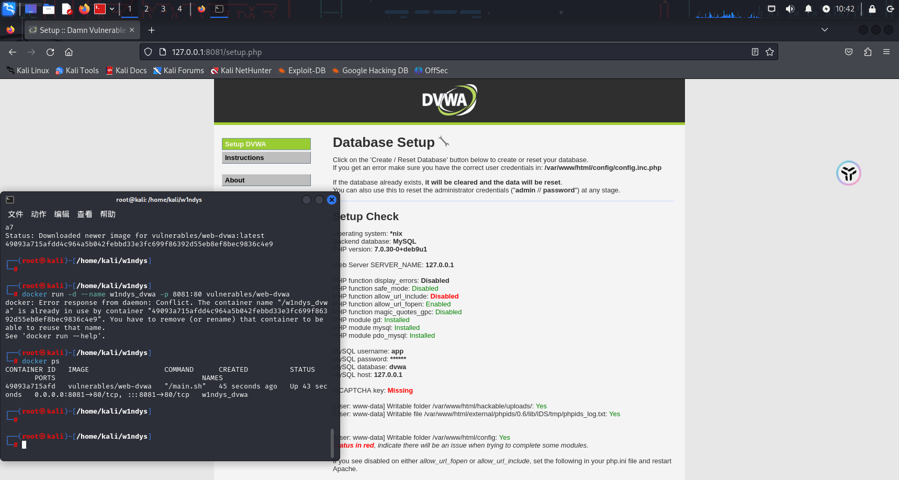
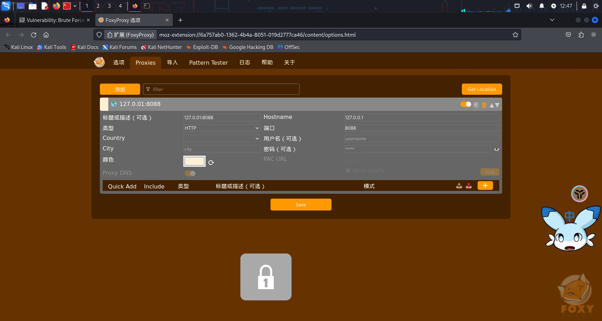
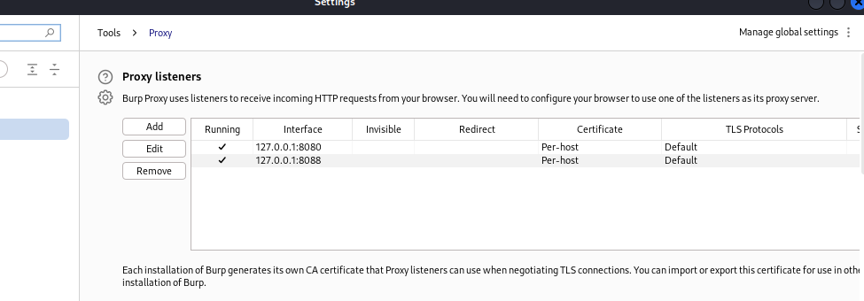
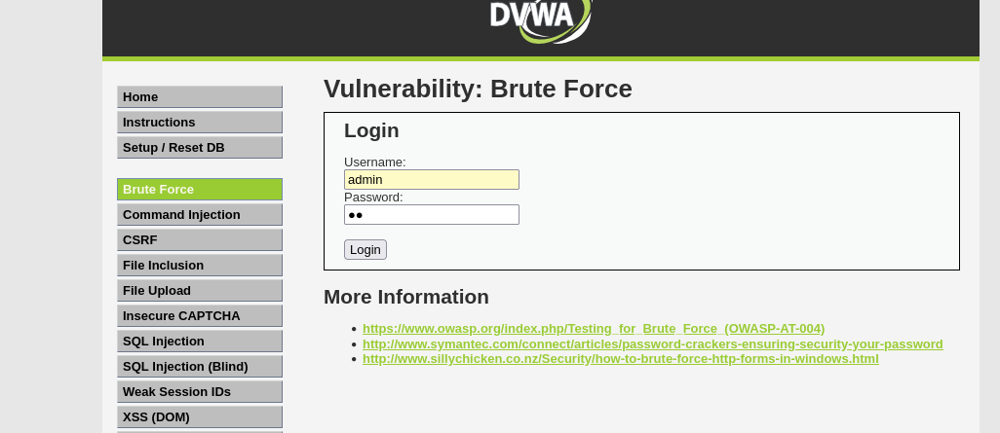
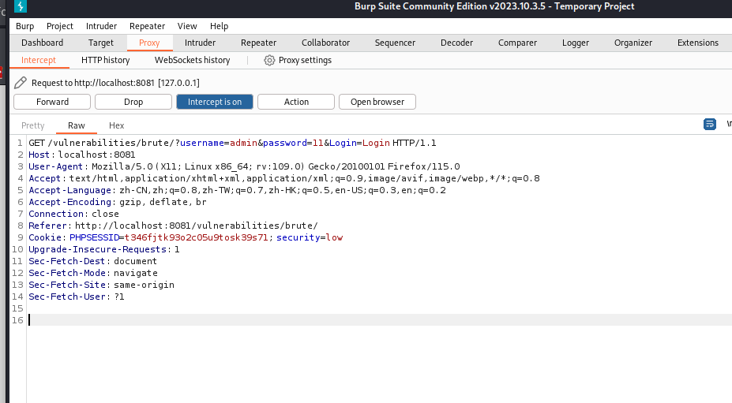
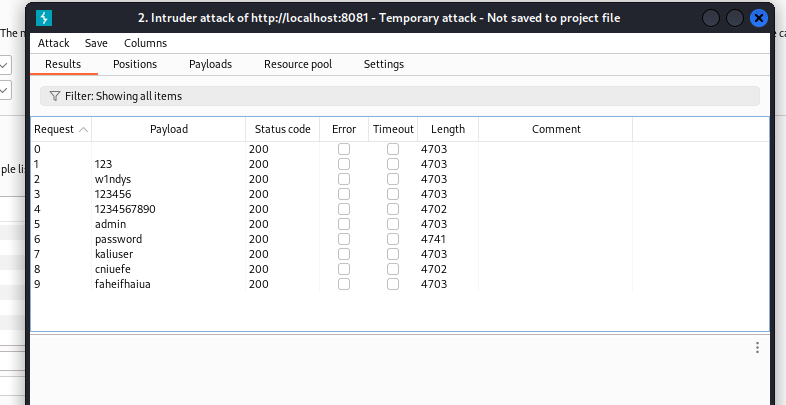

# 实验环境

虚拟机：Kali_Linux_VMware_Workstation_16_Player_Edition
工具：FoxyProxy、BurpSuit

# 实验步骤

## 安装 docker

1. 打开 Kali Linux，在终端输入以下命令安装 docker：

   ```
   sudo apt-get update
   sudo apt-get install docker.io
   ```

2. 检查安装是否成功：

   

## 部署 DVWA

1. 打开 Kali Linux，在终端输入以下命令部署 DVWA：

   ```
   docker run -d --name w1ndys_dvwa -p 8081:80 vulnerables/web-dvwa
   ```

2. 打开浏览器，输入`http://127.0.0.1:8081`访问 DVWA。

   

## 登录 DVWA

1. 输入用户名`admin`和密码`password`登录 DVWA。

   

2. 设置`DVWA Security`为`Low`，并点击`Start`启动 DVWA。

   

## FoxyProxy

1. 安装 FoxyProxy。

   

2. 配置代理

   

   

## BurpSuit

1. 设置代理

   

2. 开启拦截

   

3. 回到 DVWA，点击`Login`按钮，查看请求。

   

4. 抓到包信息

   

5. 添加单点爆破

   

6. 添加字典

   

7. 开始爆破

   

   观察到 password 的 length 与其他不同，疑似正确密码。

8. 尝试登录

   

## 结论

通过 FoxyProxy 和 BurpSuit 的组合，成功爆破 SSH 密码。
