## 安装 Java 环境

### 下载 Java

验证 Java 环境是否安装成功：

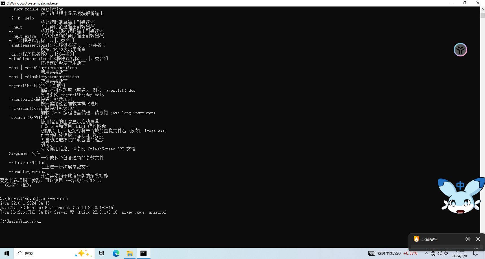

### 配置环境变量

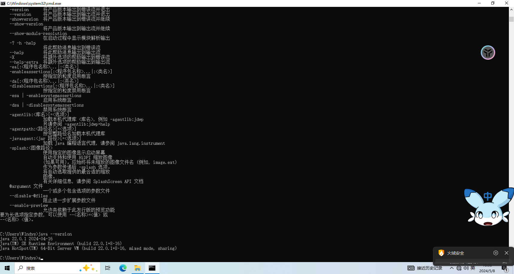

## 安装 Tomcat

### 提权

### 环境变量

### 新建系统变量

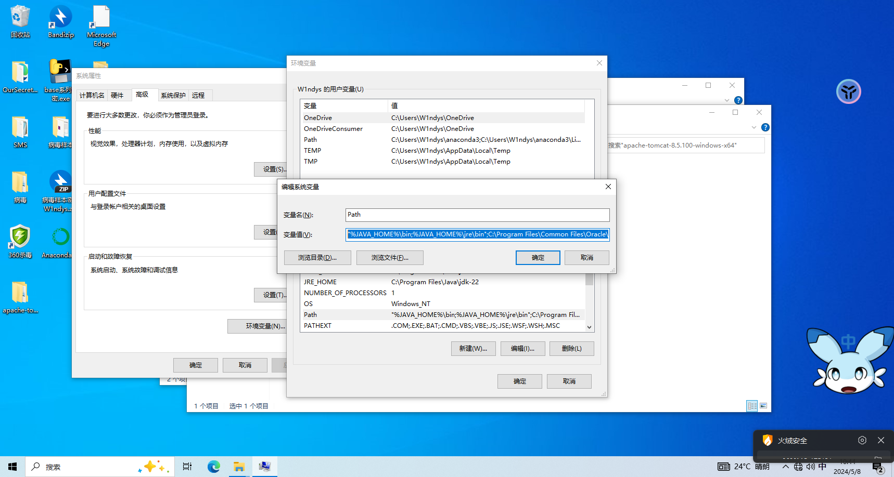

### 验证 javac

### 启动 Tomcat

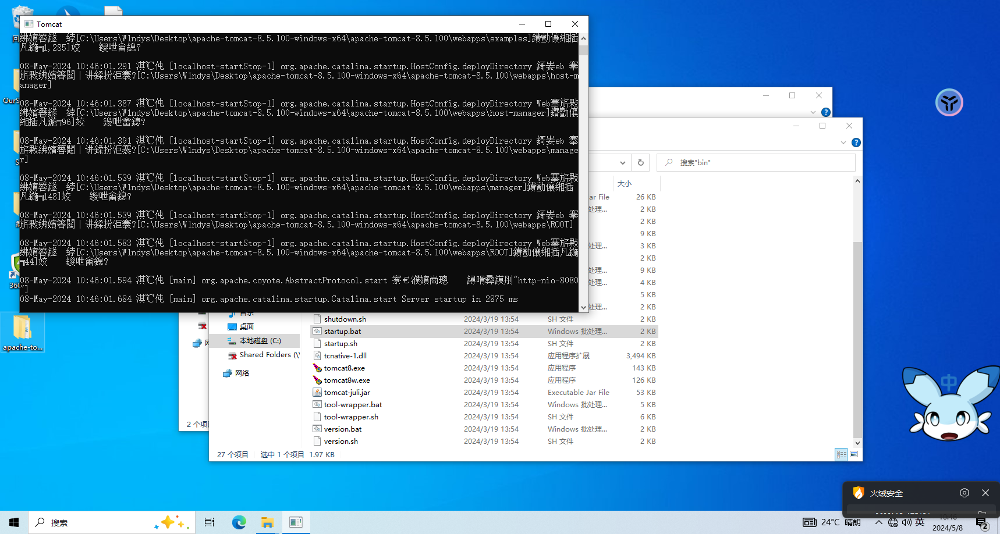

## 靶机安装 MySQL

### 安装

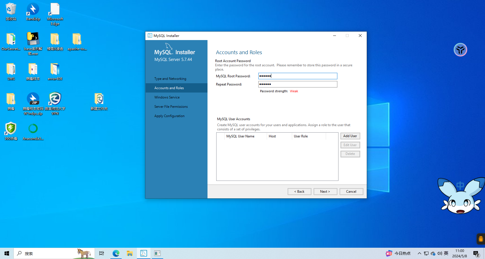

### 安装成功，启动数据库

## Navicat 安装、激活及连接

### 安装

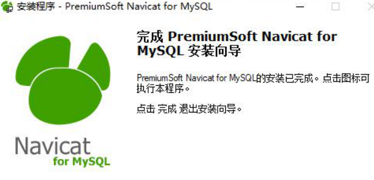

### 激活 Navicat

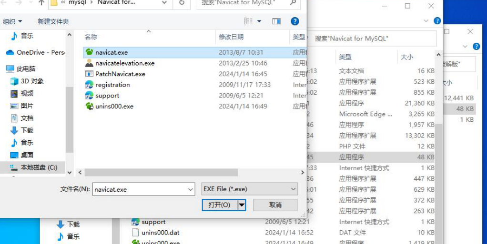

### 打开桌面的 Navicat，连接数据库，密码是 123456

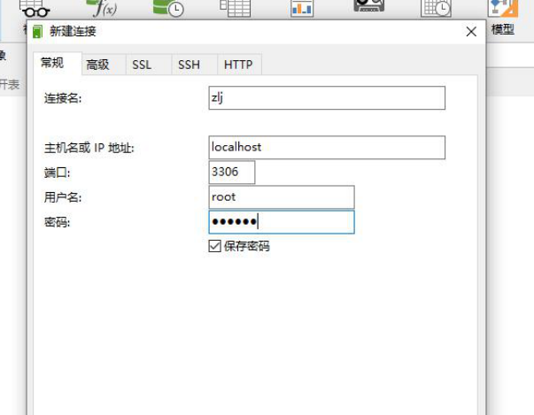

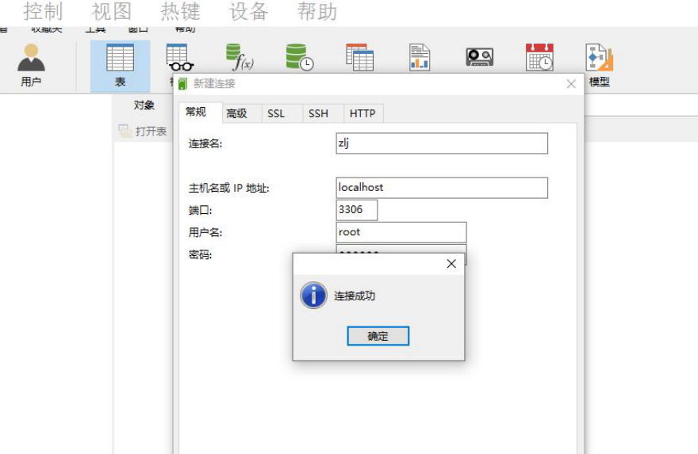

### 确认连接

### 新建数据库

## 目录部署

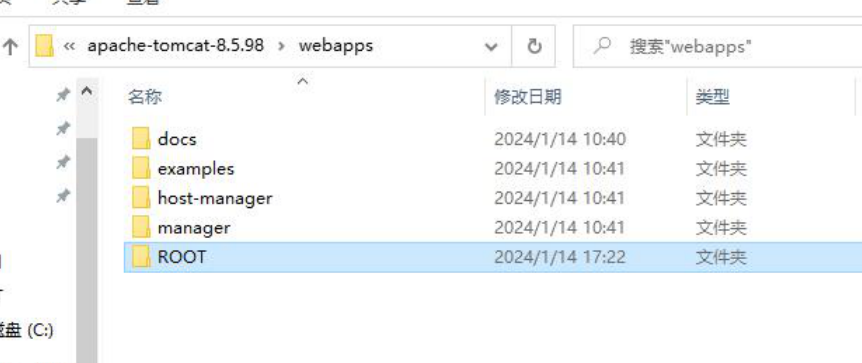

## 运行 SQL 文件

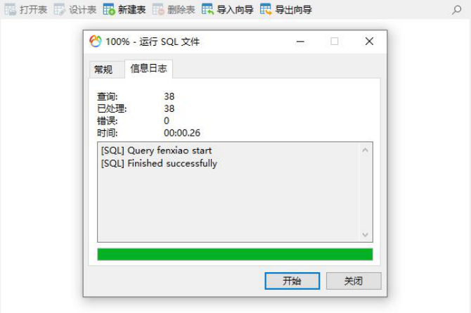

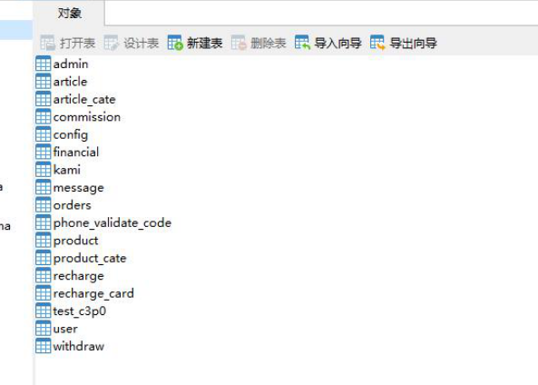

## 重启 Tomcat

## 下载安装 AWVS

### 安装完成

### 运行激活软件	

### AWVS 登录

### 进行许可证激活

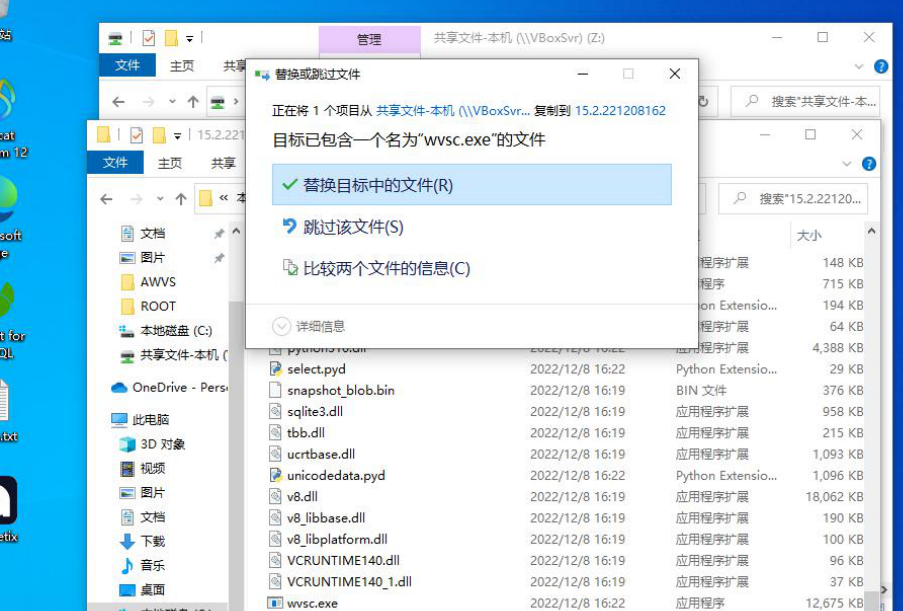

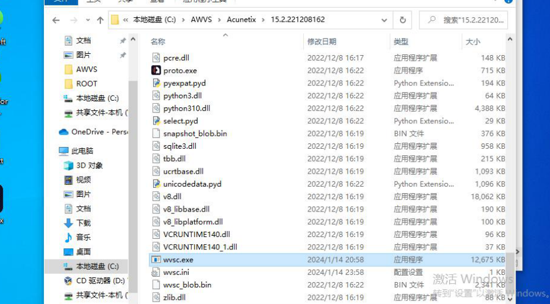

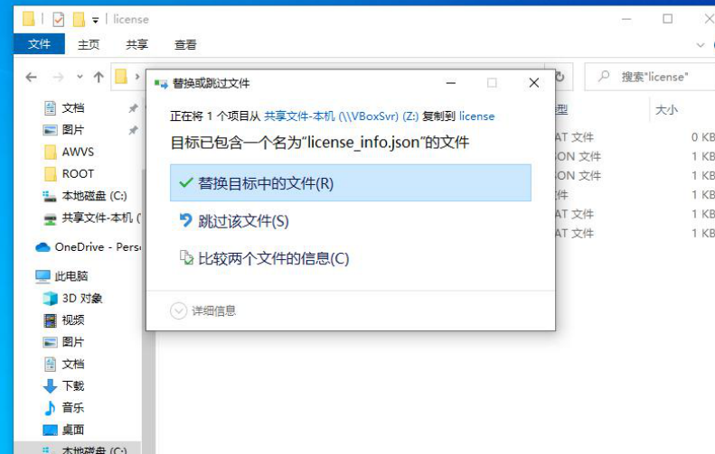

### 输入命令

以管理员身份运行 cmd，输入以下命令
`cacls“C:\AWVS\shared\license\license_info.json” /t /p everyone:r`
`cacls “C:\ProgramData\Acunetix\shared\license\wa_data.dat” /t /p everyone:r`

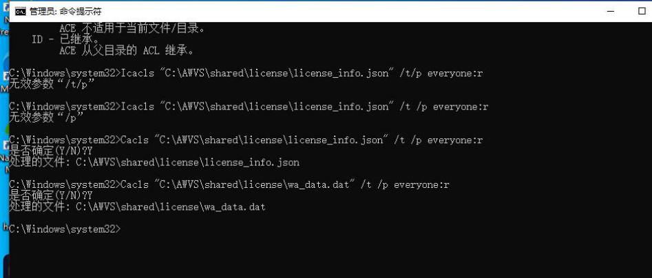

### 成功登录

## 打开 Acunetix，添加目标

### 查看本机地址

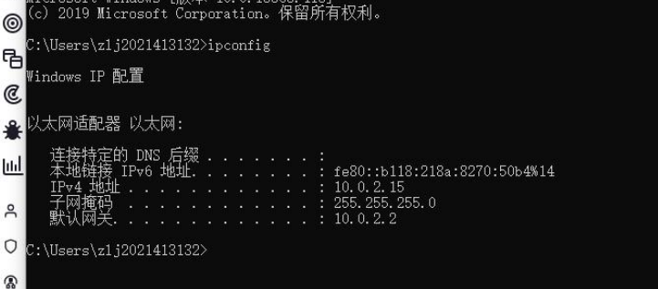

### 添加目标	

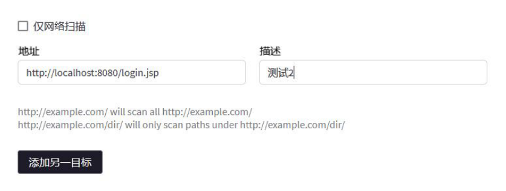

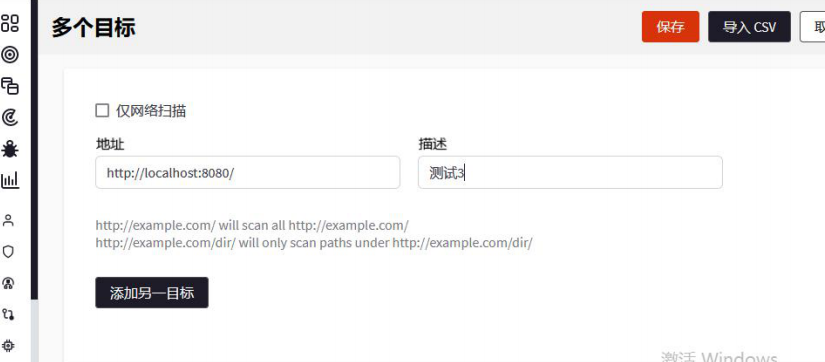

### 开始扫描

### 扫描结果出现威胁

### 导出漏扫报告

## 攻击机安装 Python

### 利用 Torshammer 攻击

#### 安装 Torshammer

#### 开始攻击

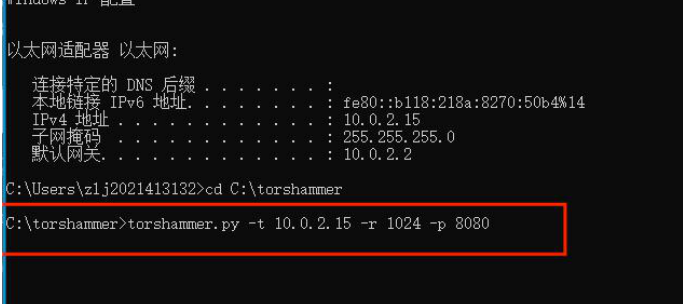

> 此时，在地址栏输入目标网站地址，已无法对该网站进行正常访问
>
> 停止 torshammer.py 攻击进程后，即可恢复目标网站的正常访问关闭 cmd 命令窗口后，出现界面
