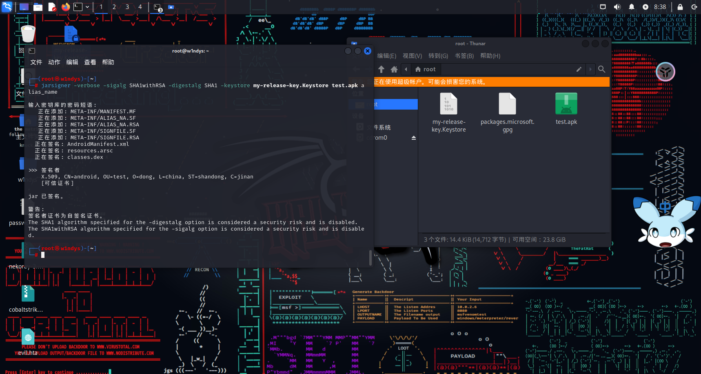

## 查看 Metasploit 工具中可以在 Android 系统下使用的 payload 类型


- 这些 payload 可以作为我们后面攻击的软件的生成工具

## 端口映射问题

- 如果我们的手机与使用的计算机处在同一局域网，但是虚拟机使用的是 NAT 模式。那么只有我们使用的计算机才可以访问到该虚拟机，其他设备都是无法访问该虚拟机的。那么就需要端口映射了

- 假设计算机的 IP 为（192.168.1.100）。Android 手机的 IP 为（192.168.1.*）。虚拟机的 IP 为（192.168.169.130）：

- 第一步：打开 VMware 虚拟机网络编辑器


- 第二步：设置端口的映射（设置之后，凡是发往计算机 9999 端口的流量都会转发到虚拟机的 9999 端口上，这样虚拟机就能够接收到 Android 的连接了）

## 远程控制 Android 手机演示

- 本案例中，Linux 采用桥接模式，与 Android 手机连接在同一局域网中

### 使用 msfvenom 命令生成被控端 payload

- 第一步：下面我以“android/meterpreter/reverse_tcp”类型的 payload 为例，然后查看该类型需要的参数（图片显示需要 IP 和端口）


- 查看完参数之后，退出 Metasploit

- 第二步：生成 payload（msfvenom 命令中默认没有 apk 这种格式的文件。此处使用 R 来替代-f 和-o）


### 为软件签名

- 第一步：使用 keytool 生成一个 key 文件。会让你输入该 key 的名称、单位、地址等等信息，最终生成一个 key 文件


未找到命令

安装一下

```
apt-get update

apt-get upgrade

apt-get install openjdk-11-jdk-headless
```




### 开启主动端，等待被控端连接

使用msfconsole开启Metasploit

主动端使用handler

为handler设置参数（payload版本类型、IP地址、端口）

开启监听（等待被控端接入）


#### 远程控制Android手机拍照


#### 远程控制Android手机录视频


#### 远程控制Android手机录音


#### 查看Android手机是否已经执行root权限


#### 导出Android手机的电话本

我的模拟器没有联系人所以没有


#### 导出Android手机的短信记录

同上


#### 远程控制目标手机发送短信


#### 对目标手机进行定位，查看目标手机位置信息


