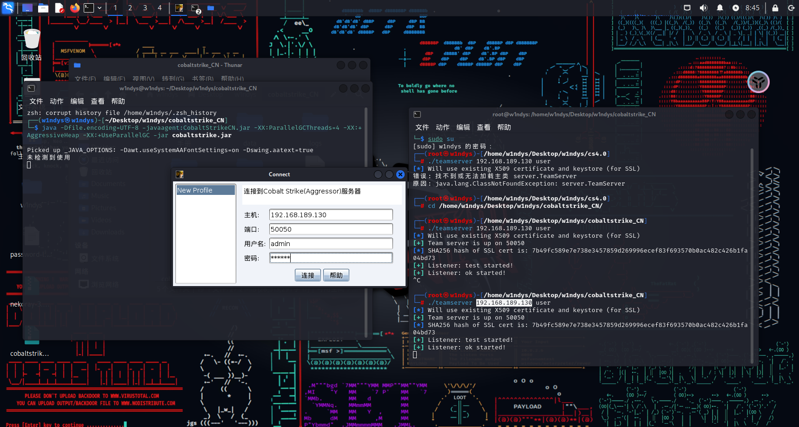
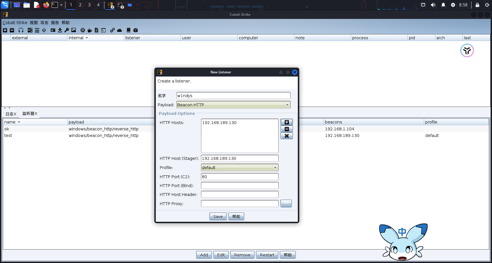
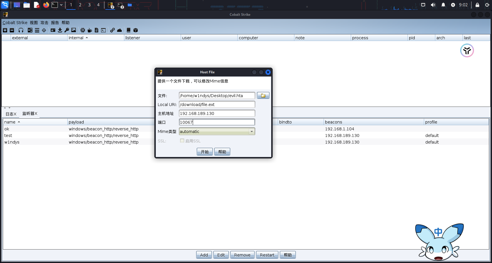
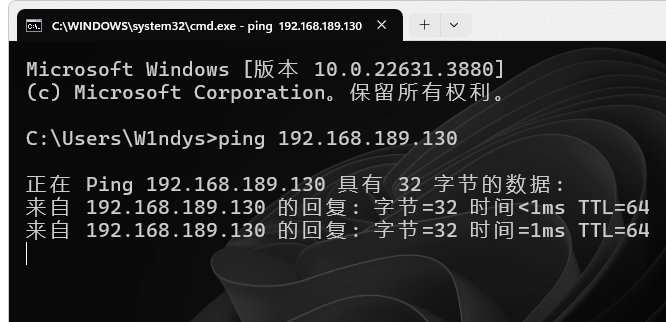
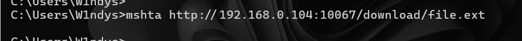
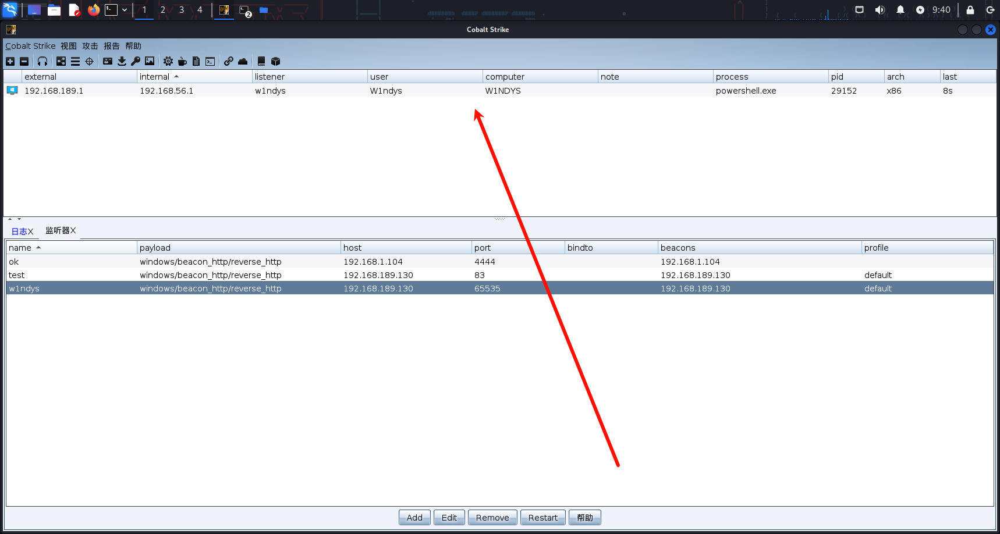
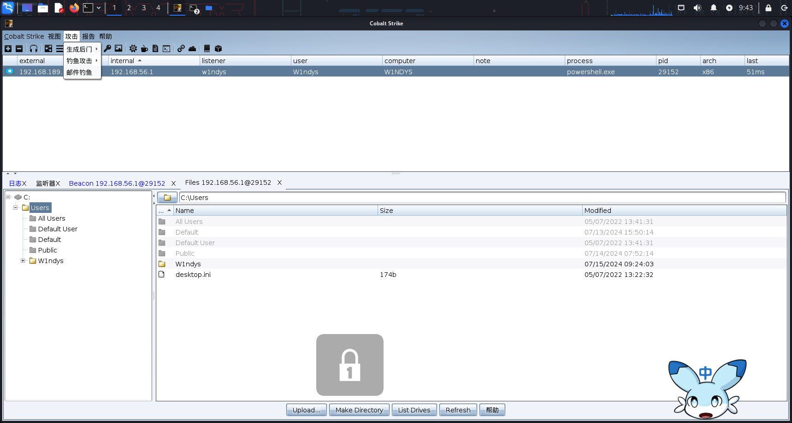

## 下载 CS

我这里之前网络安全协会讲座测试环境的时候装过一次汉化版，考虑到实验环境，再下个老师给的 CS


## 运行服务端

```bash
给予服务端程序 teamserver 执行权限（在 linux 中复制进来的文件默认是没有执行权限的）
chmod +x teamserver
 
# 可以查看 kali 的 IP 地址（可选）
ifconfig eth0
 
# # 运行服务端程序，192.168.0.104 是本机 IP，user   是要设置的连接密码（可改）
./teamserver 192.168.0.104 user
```


报错了，搜了一下，配置 java 环境变量：[java 安装常见问题之 Kali 永久配置环境变量_kali 环境变量-CSDN 博客](https://blog.csdn.net/woaipdd/article/details/130437412#/)


好吧还是不行，用我之前的版本的


新建配置文件，连接 CS 服务器 

```
java -Dfile.encoding=UTF-8 -javaagent:CobaltStrikeCN.jar -XX:ParallelGCThreads=4 -XX:+AggressiveHeap -XX:+UseParallelGC -jar cobaltstrike.jar
```

admin

user




创建一个新的监听器 -> 填写监听器名称（随便写，不重复就行）-> 选择有效载荷/攻击模块/攻击方式



添加 HTTP 主机


添加要在开启监听的 HTTP 端口：*0-65535*  在这个取值范围中 1023 以下的端口已经分配给了常用的一些应用程序，建议往大的填，避免端口被占用（重复）--> 最后保存即可


## 攻击目标机器

- HTML Application（生成 **hta** HTML 应用程序）

### 生成 hta 文件 （木马文件）


### 文件下载



我直接用本机测试了





### 攻击目标机器 - 操控目标机器

当有目标主机以任何方式运行了生成的被控端，出现在主机列表。

选中要操作的目标主机 **->** 鼠标右键 **->** 进入 beacon（交互命令界面），在此使用 Beacon Commands 对目标主机执行各种操作。




图形界面


查看 IP


使用文件管理



#### 获取目标的进程


### 生成后门木马 - Office 宏病毒

##### **创建** Office 宏病毒 代码


成功上线


