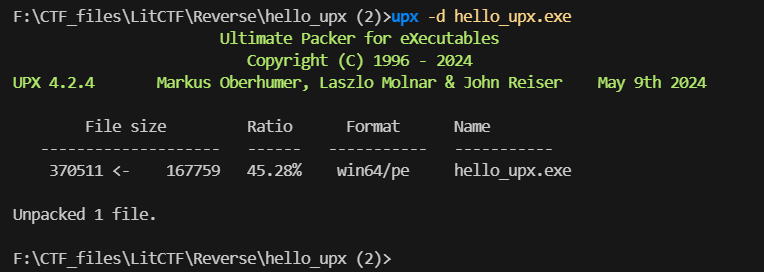

# 记一次不一样的 UPX 脱壳

## 前言

今天早上打 LitCTF 的时候有个 hello_upx 题，一开始以为只是简单的工具脱壳，没想到 `upx -d` 没成功，报错 `upx: hello_upx.exe: CantUnpackException: file is possibly modified/hacked/protected; take care!`

然后就搜了一下这个报错，找到了这篇文章：[记一次没遇到过的 UPX 脱壳](https://blog.csdn.net/hanxuer_/article/details/106549548#/)

长知识了，原因是 UPX 加壳的文件被修改了，导致无法正常脱壳

## 脱壳过程


一开始脱壳失败，经过查资料发现解法

拉进 winhex 发现文件被修改


正常的文件应该是大写的`UPX`

修改之后保存文件

再用工具`upx -d` 脱壳即可



## 解密


分析可得，flag 就是 v4+i

EXP:

```python
v4 = "Lhr@PAup+cY%aXQe NZ\x1E`N^Oe"
v5 = ""
for i in range(0, 25):
    v5 += chr(ord(v4[i]) + i)
print(v5)
```
