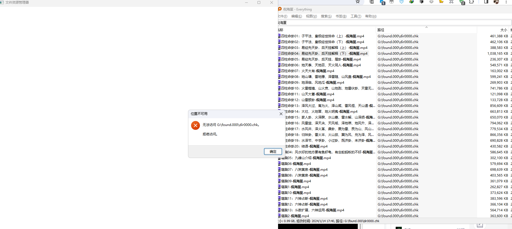
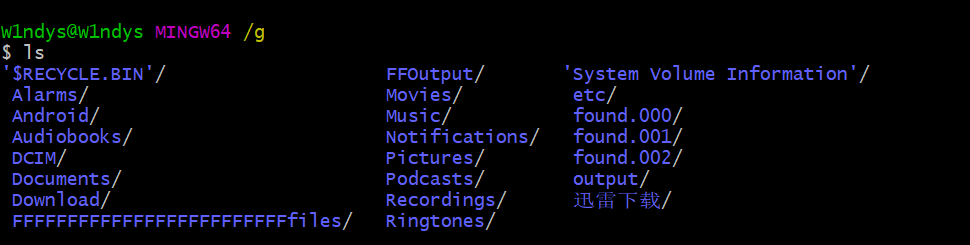
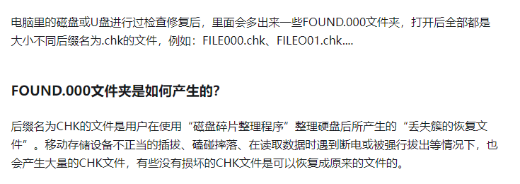

今天晚上刷 Python 题的时候突然想找出视频来看看，打开硬盘发现找不到文件在哪， 忘记放哪里去了

拿出 everything 搜一下，发现全进了一个名为 `found.000` 的文件夹，直接打开显示拒绝访问，那就是权限不够呗，准备提权



我也不知道文件为什么被塞进隐藏文件夹了，既然直接访问没权限。首先试一下能不能把隐藏目录给整出来

浏览器里看一下是可以看到存在三个隐藏文件夹的，至于另外三个，也是被隐藏了，但我还没察觉到，不知道是什么文件


看一下三个文件的修改日期

```
| [found.000/]() |      | 2024/1/18 20: 09: 12 |
| [found.001/]() |      | 2024/1/23 15: 53: 30 |
| [found.002/]() |      | 2024/1/24 12: 56: 30 |
```

看来不是同一次出现的。

直接进看不到任何文件，浏览器的权限也不够


bing 查一下用 bash 应该可以

bash 带管理员模式启动，看了一下可以扫到隐藏文件夹



先把文件复制出来再说

```
 cp found.000  recovery -r
```

关于 Linux 的 cp 命令

https://www.runoob.com/linux/linux-comm-cp.html#/

文件应该是都拿出来了，把原来的文件夹删掉就行了。

、

搜了一下为什么会生成这些文件



还好不是碎片化文件，看来物理存储介质也不是万无一失的

所以到底是为什么数据会产生这些情况

我想起来前几天电脑会突然响设备断连的警报声，可能是我的拓展坞不太行，但是绿联的问题应该不大吧。以后直接在电脑 TypeC 口插着吧，拓展坞不能用来数据传输，不太安全。

最后把那些文件复制出来，看了一下也没啥用，先留着

直接 rm -rf 把隐藏的文件给删掉了，省的占用空间


最后也是虚惊一场，50个G的文件差点没了


