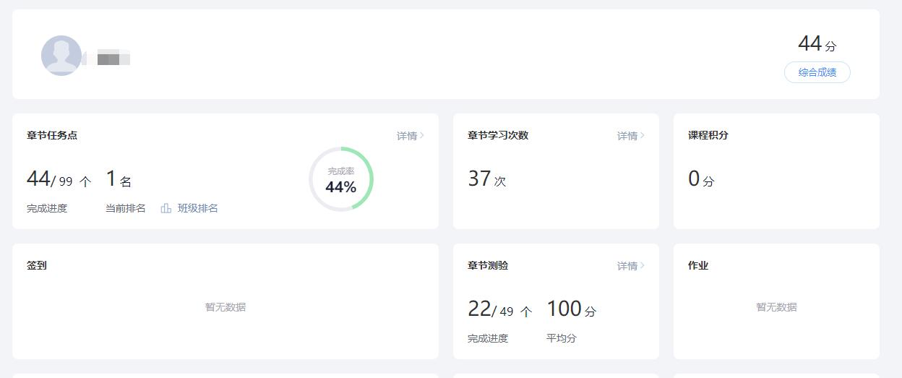

> 前言：使用本工具请自觉遵守国家法律法规，下载后请 24 小时之内删除，本教程来自 www.w1ndys.top
>
> <u> 使用 </u> 本教程即代表用户同意本教程 [用户协议](#用户协议)，使用本教程造成的  一切后果由个人承担 ，<u> 作者 </u>  概不负责 
>
>  请注意：本教程所涉及脚本工具开发者并不是博主本人，内涵涉及收费的内容，请酌情考虑 
>
> 本教程编写于 2023 年 11 月 3 日，距离时间过长可能脚本已失效，请铭记
>
> 本教程旨在节省大家时间，让大家去做更有意义的事情，请勿用于违法用途，请勿倒卖，否则将追究法律责任

本教程编写耗时  160 分钟  且浏览完全免费，且看且珍惜

 

 更新：如果本文章使用次数耗尽而且不想买，又或者也有知到智慧树相关需求， 可以移步 [智慧树/知到/刷课脚本安装教程](https://w1ndys.top/2023/11/03/zhs-plus/#)，可继续获得 100 次免费答题

 

# 作者建议

建议在阳间的时间刷课，后台可以看到浏览时间的

# 工具准备

1. 一台能上网的电脑

2. Google Chrome（推荐）

   没有 Google 的可以用 Windows 自带的 Edge 浏览器（

3. 脚本猫（用篡改猴也行，本教程以脚本猫为例

   详情：[脚本猫使用文档](https://docs.scriptcat.org/docs/use/#/)

4. 一个魔法工具（梯子）

    需要特别注意的是，使用本工具有一定的流量计费，3.8-38.8 不等，根据自己需要选择 ，此费用也不是我本人收取，而是流量的提供方收取，特别注意这点  如果你介意此费用，你可以关闭此页面退出阅读了。  如果你自己有梯子可以忽略这一步  具体注意事项下面会提到

5. OCS 客户端

6. 一个懂的百度的大脑（不是

7. 一双灵敏的眼睛（不是

8. 一个耐心看教程的好习惯（不是

9. 一颗真诚的心和  良好的态度 ，有问题 [联系博主](https://qm.qq.com/q/9n506oZ8Ri&personal_qrcode_source=4)

   （实在懒得弄可以找我低价代刷

# 开始操作

有了这个工具，你不只是能进 ai，还可以高速浏览 GitHub 等网站，以及............

## 爬墙工具的介绍和安装使用

如果你自己有梯子可以忽略这一步

如果你自己有梯子可以忽略这一步

如果你自己有梯子可以忽略这一步

如果你自己有梯子可以忽略这一步

有了这个工具，你不只是能进ai，还可以高速浏览GitHub等网站，以及............

### 工具介绍

这些你都不需要记，看看就行

​        虚拟专用网络(Virtual Private Network，VPN)是专用网络的延伸，它包含了类似Internet的共享或公共网络链接。通过VPN可以以模拟点对点专用链接的方式通过共享或公共网络在两台计算机之间发送数据。

　　如果说得再通俗一点，VPN实际上是"线路中的线路"，类型于城市大道上的"公交专用线"，所不同的是，由VPN组成的"线路"并不是物理存在的，而是通过技术手段模拟出来，即是"虚拟"的。不过，这种虚拟的专用网络技术却可以在一条公用线路中为两台计算机建立一个逻辑上的专用"通道"，它具有良好的保密和不受干扰性，使双方能进行自由而安全的点对点连接，因此被网络管理员们非常广泛地关注着。

　　通过虚拟专用网，我们在家就可以轻松安全的登录到公司的内部网络上，这样可以实现我们在家办公的梦想了。

### 账号注册

微信搜索公众号关注：  `W1ndys_Official`  点击下方菜单GPT可获取注册地址

输入邮箱密码注册账号，注册完成后登陆

然后点击左侧购买订阅

根据需求选择你合适的方案，如果你只是想尝鲜的话，毫无疑问，选最便宜的，能用就行

我本人用的是38.8巨量不限时，推荐这个，大约可以用2年左右，平均下来大约0.6/天

> 因为我不只有这一个需求，另外还有使用ChatGPT，bingai等的需求，所以这个是最划算的。

另外关于如何使用ChatGPT的教程以后有时间我会写，OpenAI官方的ChatGPT

买完之后点击左上方仪表盘可以看到你的已订阅

然后点击仪表盘下方的使用文档

选择你的系统安装客户端

安装完之后登陆客户端就可以看到这样

### 连接节点

目前为止已经基本结束了，点击连接，点进去选个绿色的节点，点全局，如果后续出现连接失败就换个节点

## 脚本安装

首先安装脚本猫，点击进入 [脚本猫使用文档](https://docs.scriptcat.org/docs/use/#/)

根据自己浏览器选择安装，这里以 Google Chrome 为例

（如果长时间进不去则需要  科学上网 ，由于种种原因这里不过多赘述）

进来之后点击图示右上角安装（由于我已经安装过了所以图示是 remove）

然后进入浏览器扩展中心可以看到已经安装好了，启用该扩展

然后点击获取脚本 [超星学习通脚本猫脚本](https://scriptcat.org/zh-CN/script-show-page/1127)

由于我已经安装完了，这里显示的是重新安装和更新

至此脚本已经安装完毕

## 脚本配置

接下来就是开始配置脚本

点击进入 [超星学习通官网](https://passport2.chaoxing.com/login?fid=&newversion=true&refer=https://i.chaoxing.com#/)

登录账号进入个人空间

点击对应课程

点击确定跳转到脚本页面

1. 首先任务设置全选就行
2. 自动提交也点
3. 题库 token 需要绑定 QQ
   1. 注意↓
   2. 一个 QQ 只能绑定一个账号
   3. 绑定成功可以获得答题次数赠送
   4. 如果 QQ 之前绑定过其他 token，绑定会失败，一个 QQ 只能绑定一个账号
   5. 绑定成功可以获得答题次数赠送
   6. 如果 QQ 之前绑定过其他 token，绑定会失败
4. 视频倍速自己酌情考虑
5. 正确率 0-100
6. 点击保存
7. 总开关默认是只看一集，闯关模式是连续刷，适合挂着不管
8. 点击任意开关即可开刷

> 在这里提一嘴，有关于脚本收费问题，QQ 号绑定会赠送 100 次答题次数
>
> 答题次数的收费标准是 1 元/200 题，5 元/2000 题，10/元 5000 题
>
> 有个纯白嫖的方法就是换 QQ 号绑定，官方的说法是每个 QQ 只能绑定一个 token，但没说每个 token 只能用一个 QQ 绑定
>
>  此收费项目与本人无关，酌情消费 
>
>  token 不要泄露！！token 不要泄露！！token 不要泄露！！ 重要的事情说三遍

## 结束

至此已经基本结束了

# 展示

放一下我自己的刷课记录

# 用户协议

1. 使用本教程即代表同意此用户协议
2. 使用本教程所带来的后果均由用户个人承担
3. 本教程所涉及的消费均与本人无关
4. 本教程未经本人允许禁止转载
5. 不要跟我杠，杠就是你对
6. 我本人有 **抑郁症** 病史，玩过小红书，若本人遭受任何形式的网络暴力 (包括但不限于发送淫 / 秽血 / 腥图片，问候我家人), 并出现极端行为。一切都是 **本人的错** 和大家无关
7. 本教程旨在节省大家时间，让大家去做更有意义的事情，请勿用于违法用途，请勿倒卖，否则将追究法律责任
8.  博主 W1ndys 享有最终解释权 